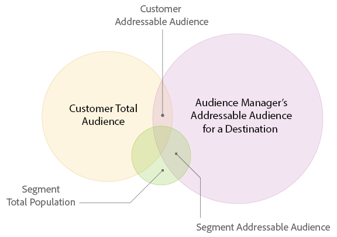

# [!UICONTROL Addressable Audiences] {#addressable-audiences}

[!UICONTROL Addressable Audience]功能和用例概述。

## 什么是 [!UICONTROL Addressable Audience]? {#addressable-audience-description}

[!UICONTROL Addressable Audiences]功能显示您在[!DNL Audience Manager]收集数据和选定目标的所有资产中看到的受众之间的重叠。 要帮助您了解此概念，请查看下图。 每个圆圈之间的重叠表示不同类型的可寻址受众。

| 量度 | 描述 |
|---|---|
| [!UICONTROL Audience Manager Addressable Audience] a  [!UICONTROL Destination] | 在报告回顾期间在平台级别与所有[!DNL Audience Manager]客户进行交互且可能与您选择的[!UICONTROL destination]匹配的所有设备的计数。   此量度非常有用，因为它会向您显示： <ul><li>[!DNL Audience Manager]可在特定目标[!UICONTROL destination]上访问的总[!UICONTROL addressable audience]的大小。</li><li>[!DNL Audience Manager]配置文件池对于定位平台的大小及其受众的大小。</li></ul> |
| [!UICONTROL Customer Total Audience] | 在回顾窗口期间，在您的资产上实现[!UICONTROL rule-based trait]或从离线文件实现[!UICONTROL onboarded trait]的设备计数。 |
| [!UICONTROL Addressable Audience Match Rate] | 在回顾窗口期间实现[!UICONTROL rule-based trait]或[!UICONTROL onboarded trait]的设备与已与所选[!UICONTROL destination]进行ID同步的设备的重叠计数，而不考虑同步时间。  此量度表示设备满足以下条件：<ul><li>在回顾窗口`AND`期间实现了[!UICONTROL rule-based]或[!UICONTROL onboarded trait]</li><li>与所选[!UICONTROL destination]进行ID同步，而不考虑同步时间。</li> |
| [!UICONTROL Customer Match Rate] | [!UICONTROL Customer Addressable Audience] ÷以 [!UICONTROL Customer Total Audience] 百分比表示。 |
| [!UICONTROL Total Segment Population] | 在报表回顾期间属于[!UICONTROL segment]成员的所有设备的计数。 |
| [!UICONTROL Segment Addressable Audience] | 在报表回顾期间属于[!UICONTROL segment]且在您的网站上具有活动ID同步的用户数。 [!UICONTROL Segments] 可以通过在Audience Marketplace中获取，包含您自己的第一方数据以及第 [!UICONTROL traits] 二方和第 [三方数据](../features/audience-marketplace/marketplace-data-buyers/marketplace-data-buyers.md)。  提示：当与1天回顾期一起使用时，此量度可以帮助您了解的当前状 [!UICONTROL segments]态。这是因为[!UICONTROL Segment Addressable Audience]量度表示在前一天中一直在[!UICONTROL segment]中的用户。 结合以下事实，即[!DNL Audience Manager]每天刷新[!UICONTROL Addressable Audiences]，将此量度与回顾期相结合可提供[!UICONTROL segments]的最新快照。 |
| [!UICONTROL Segment Match Rate] | [!UICONTROL Segment Addressable Audience] ÷以 [!UICONTROL Total Segment Population] 百分比表示。 |

## [!UICONTROL Addressable Audiences] 界面 {#addressable-audience-interface}

[!UICONTROL Addressable Audience]功能将此抽象概念转换为可量化的数据。 在[!DNL Audience Manager]中，此功能显示受众与数据可视化重叠，这些可视化图表以表格形式提供概览信息以及数字数据。

[!UICONTROL Addressable Audiences] 位于 **[!UICONTROL Audience Data > Destinations]**&#x200B;中。选择&#x200B;**[!UICONTROL Integrated Platforms > Device-Based]**&#x200B;可查看可寻址受众量度。

您可以在[!UICONTROL Addressable Audiences]登陆页面上看到的三个量度表示：

| 量度 | 描述 |
---------|----------|
| **[!UICONTROL Addressable Audience (Device)]** | 此量度表示最近30天的[!UICONTROL Customer Addressable Audience]（如上表所述）*。* |
| **[!UICONTROL Match Rate]** | 此量度表示最近30天&#x200B;*的[!UICONTROL Addressable Audience Match Rate]（如上表所述）*。 |
| **[!UICONTROL Lifetime Addressable Audience (Device)]** | 在报告回顾期间与平台级别的所有[!DNL Audience Manager]客户进行交互且可能与此[!UICONTROL destination]匹配的所有设备的计数。 有关更多信息，请参阅[平台级别量度](/help/using/features/addressable-audiences.md#platform-level-metrics)。 |

单击[!UICONTROL server-to-server destination]的名称可查看可寻址受众数据。 请注意，此功能仅返回[!UICONTROL server-to-server destinations]的数据，并且访问需要管理员权限。

查看此数据可帮助您：

* **预测和规划：** [!UICONTROL Segment Addressable Audience] 数据为您提供了更多粒度，可用于访问您计划发送到目标以进行受众定位和激活的区段。

* **性能回顾：** 该功 [!UICONTROL Addressable Audiences] 能也是一款故障诊断工具。它可让您查看营销活动效果、了解营销活动的范围，并在看不到预期结果时与定位/激活合作伙伴进行交叉检查。

### 使用第三方数据寻找客户及其对匹配率的影响

在为受众获取购买第三方数据之前，客户可以验证与其他数据提供商的重叠。 这有助于您在购买新数据之前做出明智的决策。 购买的第三方数据的ID同步不仅依赖于数据的重叠，还依赖于第三方提供商对所有其他[!DNL Audience Manager]客户的足迹。 您的[!DNL Adobe]顾问可以帮助您确定其他相关数据源，以优化潜在客户活动。

### 移动设备用户和匹配率

尝试连接没有第三方[!DNL cookies]的[!DNL Safari]或移动设备应用程序用户时，会出现一些差距。 这样，就很难与某些合作伙伴同步用户，因为已同步的第三方[!DNL cookies]的[!DNL Adobe] ID只在媒体投放日志中提供。 这是您可能看到[!UICONTROL destinations]的匹配率](../features/addressable-audiences.md#low-match-rates)较低的原因。[

## [!UICONTROL Addressable Audiences]和[!UICONTROL Destinations] {#date-ranges}中的日期范围

请阅读以下各节，了解[!UICONTROL Addressable Audience]或[!UICONTROL Destination]的报表中可用日期范围以及数据在每个间隔之外的老化情况。

## 可用日期范围和时区{#available-date-ranges}

<!-- addressable-audience-dates.xml -->

[!UICONTROL Addressable Audiences]和[目标](../features/destinations/destinations.md)的报表使用相同的日期范围间隔。 日期范围选项包括：

* [!UICONTROL Last 1 Day] (此间隔在前24小时时段的午夜到午夜之间运行。它不是实时或当前时间量度。)
* [!UICONTROL Last 7 Days]
* [!UICONTROL Last 14 Days]
* [!UICONTROL Last 30 Days]
* [!UICONTROL Last 60 Days]
* [!UICONTROL Last 90 Days]
* [!UICONTROL Lifetime]

所有日期和日期范围都以[!DNL UTC]时区进行设置。 请参阅Audience Manager](../reference/aam-time-zones.md)中的[时区。

## 日期范围间隔{#date-range-intervals}中的数据

[!UICONTROL Addressable Audience]和[!UICONTROL Destination]量度返回在选定时间间隔内的独特用户计数。 例如，访客只被计数一次，即使他们多次访问您的网站。 第一次访问是独特访问并被记录。 后续访问是回访，并且不会计数，因为它们并不唯一。

日期范围包含选定时间间隔或更早时间段的数据。 而且，数据会随着时间的流逝而在每个报表间隔之外老化。 例如，假设您在选择[!UICONTROL Last 30 Days]选项后看到2位访客。 在报表中，这些访客：

* *将* 包含在较长时间间隔（60天、90天和生命周期）返回的结果中。
* *不会包* 括在选项前面的较短 [!UICONTROL Last 30 Day] 间隔内（当前、7天和14天）。

而在第31天，这些访客仅在60天、90天和[!UICONTROL Lifetime]结果中显示。 他们在30天的间隔中已经老了。 访客不会在[!UICONTROL Lifetime]间隔之外过期。

## [!UICONTROL Addressable Audiences] 量度 {#addressable-audience-metrics}

本节介绍[!UICONTROL Addressable Audiences]提供的量度类型。

### 客户级别量度{#customer-level-metrics}

<!-- addressable-audience-metrics.xml -->

这些量度会返回访客访问您的网站或将入站数据文件发送到[!DNL Audience Manager]时所实现的特征数据。 这些量度可全面了解您帐户的受众规模。

| 量度 | 描述 |
|---|---|
| [!UICONTROL Customer Addressable Audience] | 在回顾窗口期间实现[!UICONTROL rule-based trait]或[!UICONTROL onboarded trait]的设备与已与选定目标进行ID同步的设备的重叠计数，而不考虑同步时间。  此量度表示设备满足以下条件：<ul><li>在回顾窗口`AND`期间实现了[!UICONTROL rule-based]或[!UICONTROL onboarded trait]</li><li>与所选[!UICONTROL destination]进行ID同步，而不考虑同步时间。</li></ul> |
| [!UICONTROL Customer Total Audience] | 在回顾窗口期间，在您的资产上实现[!UICONTROL rule-based trait]或从离线文件实现[!UICONTROL onboarded trait]的设备计数。 |
| [!UICONTROL Customer Match Rate] | [!UICONTROL Customer Addressable Audience] ÷以 [!UICONTROL Customer Total Audience] 百分比表示。 |

### 区段级别匹配量度{#segment-level-metrics}

这些量度返回[!UICONTROL segment]成员资格的数据。 它们有助于更精细、更准确地查看每个[!UICONTROL segments]的受众大小。

>[!NOTE]
>
>在[!UICONTROL segment]级别应用回顾窗口的方式与客户级别不同。 访客10天前可以访问网站并实现[!UICONTROL trait]，此后他们可以符合[!UICONTROL segment]的条件，并在2天前从[!UICONTROL segment]中退出。 应用7天回顾时，这些访客将被计入[!UICONTROL segment]级别，但不计入客户级别。

| 量度 | 描述 |
|---|---|
| [!UICONTROL Segment Addressable Audience] | 在报表回顾期间属于[!UICONTROL segment]且在您的网站上具有活动ID同步的用户数。 通过在[Audience Marketplace](../features/audience-marketplace/marketplace-data-buyers/marketplace-data-buyers.md)中获取的[!UICONTROL traits]，区段可以包含您自己的第一方数据、第二方数据和第三方数据。  提示：当与1天回顾期一起使用时，此量度可以帮助您了解的当前状 [!UICONTROL segments]态。这是因为[!UICONTROL Segment Addressable Audience]量度表示在前一天中一直在[!UICONTROL segment]中的用户。 结合以下事实，即[!DNL Audience Manager]每天刷新[!UICONTROL Addressable Audiences]，将此量度与回顾期相结合可提供[!UICONTROL segments]的最新快照。 |
| [!UICONTROL Total Segment Population] | 在报表回顾期间属于[!UICONTROL segment]成员的所有设备的计数。 |
| [!UICONTROL Segment Match Rate] | [!UICONTROL Segment Addressable Audience] ÷以 [!UICONTROL Total Segment Population] 百分比表示。 |

### 平台级别量度{#platform-level-metrics}

此量度会返回所有[!DNL Audience Manager]客户收集的活动数据。 与汇总的[!DNL Audience Manager]客户相比，它们可以提供更广泛的客户受众视图。

| 量度 | 描述 |
|---|---|
| [!DNL Audience Manager] [!UICONTROL Addressable Audience] | 在报告回顾期间在平台级别与所有[!DNL Audience Manager]客户进行交互且可能与您选择的[!UICONTROL destination]匹配的所有设备的计数。   此量度非常有用，因为它会向您显示：<ul><li>[!DNL Audience Manager]可在特定目标上访问的[!UICONTROL total addressable audience]的大小。</li><li>[!DNL Audience Manager]配置文件池对于定位平台的大小及其受众的大小。</li></ul> |

## 比较[!UICONTROL Customer]和[!UICONTROL Segment Addressable Audiences] {#comparing-metrics}

您不应比较[!UICONTROL Customer Addressable Audience]和[!UICONTROL Segment Addressable Audience]量度来确定其中一个量度是否比另一个量度更重要。 这些量度是单独的、不同的和独立的量度。 如上面的定义所述，其中每个数据集都源自不同的数据集。 鉴于此，如果一个量度大于另一个量度，则应避免得出任何结论。 在比较这些值时，您只能说：

* [!UICONTROL Customer Addressable Audiences] 基于您 [!UICONTROL trait] 自己 *的第一方数据的实现*。此量度可全面全面地概述您与数据合作伙伴的集成。

* [!UICONTROL Segment Addressable Audiences] 基于您自己的第一 *方数据以及第二方和第三方数据的区段资格条件*。此量度可以更精细、更准确地查看定位平台中的[!UICONTROL addressable audiences]。

## [!UICONTROL Addressable Audiences] {#low-match-rates}匹配率低的原因

导致[!UICONTROL Addressable Audience]匹配率较低或报告数字出现差异的常见元素。

| 原因 | 描述 |
|---|---|
| 移动流量 | 大多数[!UICONTROL server-to-server]集成都依赖由第三方[!DNL cookies]提供的同步过程。 但是，移动环境不使用第三方[!DNL cookies]。 因此，与[!UICONTROL segment]大小相比，[!UICONTROL Addressable Audiences]数字可能显得较低。   自2018年1月起，您可以在为受众设置的相同目标 [!DNL Google] 和 [!DNL Adobe Advertising Cloud] 目标中激活移动 [!UICONTROL cookie-based] 受众。这意味着您可以向[!DNL Google]和[!DNL Advertising Cloud]目标发送组合为[!DNL cookie]和移动ID成员资格的[!UICONTROL segments]，但请记住，[!UICONTROL Addressable Audiences]只显示[!DNL cookie] ID和目标之间的重叠。 [!DNL Audience Manager] 会向发送100%的移动受众， [!UICONTROL destinations]但移动设备受众不会按该量度进 [!UICONTROL Addressable Audience] 行衡量。  **注意**:例如，以人口 [!UICONTROL segment] 为1,000,000的为例。如果将此[!UICONTROL segment]映射到[!DNL Google]或[!DNL Adobe Advertising Cloud]目标，则可能会看到一个包含700,000台设备的[!UICONTROL Addressable Audience]和一个包含70%的[!UICONTROL Match Rate]目标。 700,000的成员资格由ID与[!UICONTROL destination]同步的[!DNL cookie] ID组成。 事实上，您的[!UICONTROL Addressable Audience]可能要高得多，因为可寻址移动ID未显示在此量度中。 |
| [!DNL Safari] 流量 | [!DNL Safari] 阻止第三方 [!DNL cookies]。这会阻止[!DNL Audience Manager]将ID与[!UICONTROL destination]同步。 通过引入[ITP 2.0](https://webkit.org/blog/8311/intelligent-tracking-prevention-2-0/) ，您可以期望[!UICONTROL addressable audiences]不包含[!DNL Safari]用户。 |
| 跟踪的媒体展示次数 | 由于广告服务器最佳实践，广告标记中不会进行ID同步。 执行大量域外广告的客户将无法将用户与这些环境中的第三方集成同步。 此外，大量收集的媒体展示数据可能会减少[!UICONTROL addressable audience]数量。 |

## [!UICONTROL Addressable Audiences]疑难解答 {#troubleshooting}

除了显示匹配率外，您还可以使用[!UICONTROL Addressable Audiences]作为故障诊断工具。

例如，假设您向[!UICONTROL destination]发送了一个区段，并且[!UICONTROL destination]显示的报表数量较低。 检查[!UICONTROL Addressable Audience]结果将显示这是技术问题，还是仅是匹配率低的情况。 匹配率较低表明，[!UICONTROL destination]并非对选定区段都那么好。 但是，[!DNL Audience Manager]和[!UICONTROL destination]之间的[!UICONTROL total addressable audience]数字差异表示集成、同步或其他技术问题。 在这些情况下，请联系您的客户经理。
