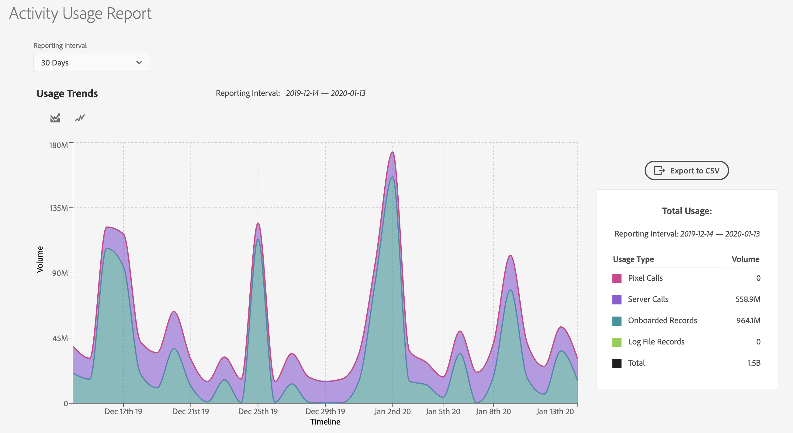

# [!UICONTROL Activity Usage Reporting] {#activity-usage-reporting}

## 概述 {#overview}

通过 [!UICONTROL Activity Usage Report]，您可以查看和跟踪 Audience Manager 实例的活动使用情况，从而清楚地了解实际的活动使用情况与合同承诺之间存在的差异。

此外，您还可以根据需要下载[!UICONTROL Activity Usage Report]，以进行记录保留和自定义分析。

## 注意事项 {#considerations}

[!UICONTROL Activity Usage Report]适用于具有[管理员权限](edit-account-settings.md)的所有Audience Manager用户。

>[!IMPORTANT]
>
>[!UICONTROL Activity Usage Report]显示Audience Manager实例的活动使用情况统计信息。 有关与活动使用情况相关的任何账单查询，请联系您的Adobe代表。

## 用例 {#use-cases}

[!UICONTROL Activity Usage Report]有两个主要用例：

* **根据活动使用情况承诺跟踪实际实例活动使用情况**:大多数客户会按每个Audience Manager实例每月估计活动承诺，然后，该承诺会累计到所有实例的每年活动承诺中。虽然此报表不是账单报表，但对于您的活动使用量是否超过承诺的使用量，它可以提供有用的指导。
* **验证实施更改**:如果您最近更新了实施(如设置 [!DNL Adobe Analytics] 服务器端转发或更改服务器 [!DNL Adobe Target] 调用设置)，此报表可帮助您检查新活动卷是否与预期活动卷一致。

## 使用 [!UICONTROL Activity Usage Report] {#using}

要查看[!UICONTROL Activity Usage Report]，请登录您的Audience Manager帐户，然后转到&#x200B;**[!UICONTROL Administration]** > **[!UICONTROL Usage]**。

接下来，使用&#x200B;**[!UICONTROL Reporting Interval]**&#x200B;过滤器选择生成报表的时间间隔。 您可以选择30天、60天、90天或自定义日期范围。

加载报表后，您可以看到选定时段的[!UICONTROL Activities]划分。

[!UICONTROL Activities] 定义与Audience Manager的所有现场和非现场交互的总数，分为以下类别：

* **[!UICONTROL Server Calls]**:从网站、服务器、电子邮件、移动应用程序或其他系统发送到Audience Manager的任何数据收集或检索事件。
* **[!UICONTROL Pixel Calls](前称 [!UICONTROL Impression Server Calls])**:从广告收集的数据（例如来自定位平台的展示量）或向Audience Manager发出的电子邮件展示调用。查询字符串中需要存在`d_event`参数。
* **[!UICONTROL On-Boarded Records]**:从您自己的客户关系管理系统(CRM)或其他离线数据文件摄取的唯一记录，例如呼叫中心记录、设备ID以及来自外部数据提供商的自定义数据馈送。
* **[!UICONTROL Log File Records]**:来自日志文件的唯一记录从定位平台摄取到Audience Manager中。

>[!NOTE]
>
>唯一记录定义了由Adobe代表Audience Manager客户存储的文件中每个单独的数据记录。

此外，还可以使用[!UICONTROL Activity Usage Trends]图表类型在两种类型的图表之间切换。

您还可以将光标悬停在时间轴中的特定日期上以查看该日期的详细使用情况。

## 导出[!UICONTROL Activity Usage Reports] {#export}

要更好地了解Audience Manager活动使用情况级别，您可以根据要包含的记录类型导出[!UICONTROL Activity Usage Report]。

**[!UICONTROL Onboarded Records Breakdown]**&#x200B;和&#x200B;**[!UICONTROL Onsite Server Calls Breakdown]**&#x200B;报表提供了可用于这些活动的源数据的最精细分析。 归因于这些划分的数量取决于您的实施。

### [!UICONTROL Onboarded Records Breakdown] {#onboarded-breakdown}

此报表包含按数据源划分的已载入记录。

### [!UICONTROL Onsite Server Calls Breakdown] {#onsite-breakdown}

此报表包含三个来源的服务器调用细分：[!UICONTROL Analytics]、[!UICONTROL Target]和[!UICONTROL Other]。

* **[!UICONTROL Analytics]**:这些是从所有实例传递到Audience Manager的可计 [!UICONTROL Adobe Analytics] 费服务器调用，包括服务器端转发。次级服务器调用或重复的服务器调用（如从多个报表包进行服务器端转发的情况）不是可计费的活动，因此它们不会包含在此划分中。
* **[!UICONTROL Target]**:这些是从到Audience Manager的服 [!UICONTROL Adobe Target] 务器端调用，用于作为服务器到服务器集成的一部分检索Audience Manager区段数据。
* **[!UICONTROL Other]**:包括来自任何其他网站或系统（合作伙伴网站、直接服务器调用等）、通过、、事件调用和调用进行的移动设备浏览器/ [!DNL SDK]应用程序 [!DNL DIL]调用中的 [!DNL DCS] 调用。如果设置为Cookie集成（而不是服务器到服务器），则还包括来自[!DNL Target]的调用。
