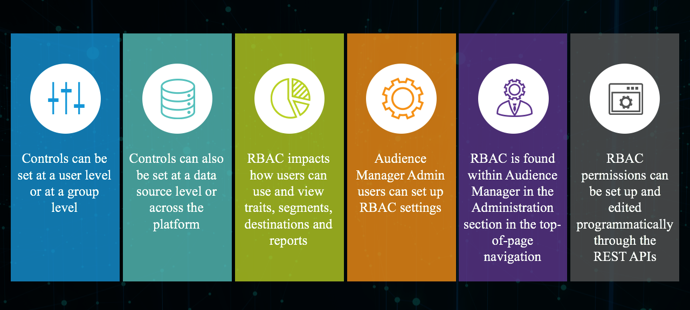

# [!UICONTROL Administration] （RBAC控制） {#administration}

菜单下的选 [!UICONTROL Administration] 项允许您创建Audience Manager用户并将其分配给用户组。 您还可以视图限制（特征、区段、目标和模型）。

使用数据管理 [!DNL Audience Manager] 平台的企业客户需要为其所有数据提供一个数据平台，但必须能够控制不同数据元素对特定业务单元的可见性。 您可以使用组权限完成此操作，也称 [!UICONTROL Role-Based Access Control] 为([!UICONTROL RBAC])。

[!DNL Audience Manager] 使用组来分配权限。 权限未在用户级别分配。 组权限与对象([!UICONTROL traits]、区段等)关联 以及可对这些对象执行的操作(编辑、视图等)。 这些控件也可通过Audience ManagerREST API使用。 请参 [阅用户](/help/using/api/rest-api-main/aam-api-user-group-permission/aam-api-user.md)管 [理](/help/using/api/rest-api-main/aam-api-user-group-permission/aam-api-group.md)、组管理 [和权](/help/using/api/rest-api-main/aam-api-user-group-permission/aam-api-permissions.md) 限管理API方法。

## Create Users {#create-users}

<!-- t_create_users.xml -->

在中创建用 [!DNL Audience Manager] 户并指定用户详细信息、登录状态以及将用户分配到组。

1. 单击 **[!UICONTROL Administration]** > **[!UICONTROL Users]**.
1. 单  击以显示 [!UICONTROL Create New User] 页面。
1. Under **[!UICONTROL User Details]**, fill in the fields:
   * **[!UICONTROL Username]:**为Audience Manager指定唯一用户名。
   * **[!UICONTROL First Name]:**指定用户的名。
   * **[!UICONTROL Last Name]:**指定用户的姓。
   * **[!UICONTROL Email Address]:**指定用户的电子邮件地址。[!DNL Audience Manager]不会向用户发送定期通知。[!DNL Audience Manager]管理员有权访问用户的电子邮件地址，并可以根据需要手动向用户发送电子邮件。 例如，如果用户忘记其口令，则使用此字段中指定的电子邮件地址发送临时口令和重置口令的说明。
   * **[!UICONTROL Phone Number]:**指定用户的电话号码。
   * **[!UICONTROL Is Admin]:**指定此用户是否为管[!DNL Audience Manager]理员。 管理员用户可以管理用户（创建、编辑等） 和用户组（创建、分配权限等）。 非管理员用户只能控制自己的用户用户档案，包括编辑其电子邮件地址和重置自己的密码。 有关详细信息，请参[阅编辑帐户设置](../../features/administration/edit-account-settings.md)。
1. 在下 **[!UICONTROL Login]**&#x200B;面，选择所需的状态：
   * **[!UICONTROL Active]:**活动用户可以访[!DNL Audience Manager]问并拥有组成员资格授予的权限。
   * **[!UICONTROL Deactivated]:**已取消激活的用[!DNL Audience Manager]户无法访问，也没有任何权限。 如果取消激活用户，其用户信息将保[!DNL Audience Manager]留在中，如有必要，您可以简单地重新激活用户。 如果删除用户，则如果用户将来需要再次使用，则必[!DNL Audience Manager]须重新创建用户。
   * **[!UICONTROL Expired]:**用户的密码超过90天。
   * **[!UICONTROL Pending]:**用户具有临时密码，例如在重置密码后或作为全新帐户，而且他们尚未设置永久密码。
   * **[!UICONTROL Locked Out]:**5次不正确的登录尝试将锁定用户。
1. 在 **[!UICONTROL Assigned Groups]**下拉列表下，从中选择要将此用户分配到的所需组。
有关用户组和权限的详细信息，请参 [阅创建用户组](../../features/administration/administration-overview.md#create-group)。
1. 单击 **[!UICONTROL Save]**.

## 创建一个 [!UICONTROL Group] {#create-group}

组 *是* 、和对象共享访问权限的用 [!UICONTROL destination]户 [!UICONTROL segment]的 [!UICONTROL trait] 集合。 您可以仅将组限制为单个对象，也可以授予它们对不同对象组合的广泛访问权限。

<!-- t_create_groups.xml -->

要创建用户组，请执行以下操作：

1. 单击 **[!UICONTROL Administration]** > **[!UICONTROL Groups]**.
1. 单击  以打开 [!UICONTROL Group Settings] 页面。
1. 在 [!UICONTROL Group Details]:
   * 命名组。
   * 提供简短的组描述。
1. 在中 [!UICONTROL Group Members]，单击选项中的 **[!UICONTROL Add Users]** 用户，将其添加到组中。
1. 在中 [!UICONTROL Group Permissions]，从 中选 [择特](../../features/segments/segments-purpose.md)征段 [、目](../../features/destinations/destinations.md) 的地 **[!UICONTROL Add Object]**区或目的地。
这会打开选定对象的权限窗口。
1. 选中您希望用户组成员具有的权限对应的复选框。
1. *（可选）* 为 [组分配通配符](../../features/administration/administration-overview.md#wild-card-permissions) “权限”。
1. 单击 **[!UICONTROL Save Group]**.

## 理解 [!UICONTROL Wild Card Permissions] {#wild-card-permissions}

通过简化组权限管理 [!UICONTROL Wild Card Permissions]。

<!-- c_wildcard_permissions.xml -->

[!UICONTROL Wild Card Permissions] 为组成员自动访问与、或关联的每个 [!UICONTROL segment]数 [!UICONTROL destination]据源 [!UICONTROL trait]。 相比之下，常规权限仅允许您为这 [!UICONTROL data sources] 些对象中的一个指定特定权限。 此外，添加新 [!UICONTROL data sources]源时，组成员无法访问这些新源。

您必须打开用户组权限，并将这些新权限 [!UICONTROL data sources] 分配给用户组。 [!UICONTROL Wild Card Permissions] 避免手动更新 [!UICONTROL data source] 过程。 具有访 [!UICONTROL Wild Card Permissions] 问新权限的组 [!UICONTROL data sources] 无需明确授权。

请阅读下面的说明，了解各自的 [!UICONTROL wildcard permission] 含义：

**[!UICONTROL Trait]**

* `MAP_ALL_TRAITS_TO_MODELS` -用户可 [!UICONTROL traits] 以选择作为基 [!UICONTROL models]线。
* `EDIT_ALL_TRAITS` -用户可以编辑其 [!UICONTROL traits] 公司帐户中设置的所有内容。
* `VIEW_ALL_TRAITS` -用户可以视图在 [!UICONTROL traits] 其公司帐户中设置的所有内容。
* `DELETE_ALL_TRAITS` -用户可以删除其 [!UICONTROL traits] 公司帐户中设置的所有内容。
* `CREATE_ALL_ALGO_TRAITS` -用户可以创 [!UICONTROL algorithmic traits]建。
* `MAP_ALL_TO_SEGMENTS` -用户可以将属于其公司 [!UICONTROL traits] 的任何内容添加到 [!UICONTROL segments]。
* `CREATE_ALL_TRAITS` -用户可以创 [!UICONTROL traits]建。

**[!UICONTROL Reports]**

* `PTRREPORTS` -这指 [!UICONTROL wildcard permission] 的是过时的功能，很快将从Audience Manager用户界面中删除。

**[!UICONTROL Models]**

* `VIEW_MODELS` -用户具有属于其视图 [!UICONTROL models] 的公司权限。

**[!UICONTROL Derived Signals]**

* `VIEW_DERIVED_SIGNALS` -用户可以视图属 [!UICONTROL derived signals] 于其公司的所有内容。
* `CREATE_DERIVED_SIGNALS` -用户可以创 [!UICONTROL derived signals]建。
* `EDIT_DERIVED_SIGNALS` -用户可以编辑属 [!UICONTROL derived signals] 于其公司的所有内容。
* `DELETE_DERIVED_SIGNALS` -用户可以删除属于其 [!UICONTROL derived signals] 公司的任何内容。

**[!UICONTROL Destination]**

* `EDIT_ALL_DESTINATIONS` -用户可以编辑其公司 [!UICONTROL destinations] 帐户中设置的所有内容。
* `CREATE_DESTINATIONS` -用户可以创 [!UICONTROL destinations]建。
* `VIEW_ALL_DESTINATIONS` -用户可以视图其 [!UICONTROL destinations] 公司帐户中设置的所有内容。
* `DELETE_ALL_DESTINATIONS` -用户可以删除其公司 [!UICONTROL destinations] 帐户中设置的所有内容。

**[!UICONTROL Tags]**

* `VIEW_TAGS` -用户可以执行任何操作(视图、创建、编辑、删除) [!UICONTROL Tag Containers]。

**[!UICONTROL Audience Lab]**

* `MANAGE_SEGMENT_TEST_GROUPS` -用户可以对测试组执行所有操作(视图、创建、编辑、 [!UICONTROL Audience Lab] 删除)。

**[!UICONTROL Segment]**

* `CREATE_ALL_SEGMENTS` -用户可以创建区段。
* `DELETE_ALL_SEGMENTS` -用户可以删除在其公司帐户中设置的所有区段。
* `MAP_ALL_TO_DESTINATIONS` -用户可以将属于其公司的任何区段映射到目标。
* `EDIT_ALL_SEGMENTS` -用户可以编辑在其公司帐户中设置的所有区段。
* `MAP_ALL_SEGMENTS_TO_MODELS` -用户可以选择区段作为模型的基线。
* `VIEW_ALL_SEGMENTS` -用户可以视图在其公司帐户中设置的所有细分。

**[!UICONTROL Signals]**

* `VIEW_ALL_SIGNALS` -用户可以视图在数据资源管理器中捕 [获的所有信号](/help/using/features/data-explorer/data-explorer-overview.md)。

## 用例 {#use-cases}

### 监视用户访问 {#monitoring-user-access}

[!UICONTROL Role-Based Access Control] 可以帮助您监视用户登录状态，清楚了解谁可以访问您的Audience Manager实例。

根据您的业务要求，您可以根据需要启用和禁用用户帐户。

### 确保对敏感内容的访问保护 [!UICONTROL Data Sources] {#protect-sensitive-data-sources}

您可以为 [!UICONTROL Role-Based Access Control] 每个 [!UICONTROL trait]用户组配置 [!UICONTROL destination] 在、区段和级别。

此功能可帮助您管理用户对特定数据集的视图、创建、读取、写入和编辑方式，甚至限制用户访问他们不应该访问的数据集。

