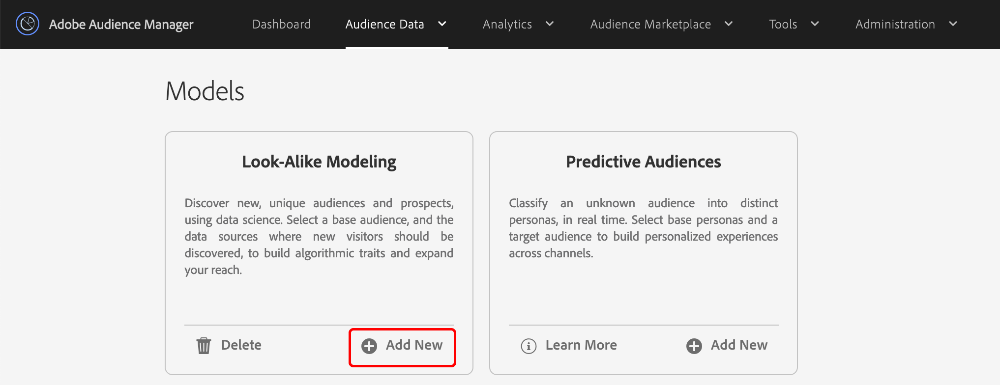
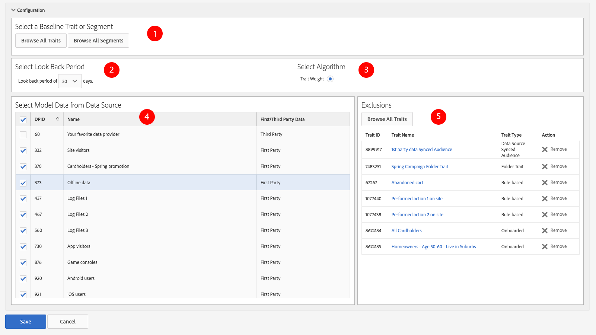

# 创建相似人群拓展模型 {#create-an-algorithmic-model}

描述允许您创建[!UICONTROL Look-Alike Model]的必需步骤和可选步骤。

## 模型生成器部分

[!UICONTROL Model Builder]包含[!UICONTROL Basic Information]和[!UICONTROL Configuration]部分。 要创建模型，请完成这两个部分中的必填字段。 保存模型以启动算法。 [!DNL Audience Manager]会在第一次数据运行完成后向您发送自动通知。 收到电子邮件后，您可以转到[特征生成器](../../features/traits/about-trait-builder.md)并创建算法特征。

>[!NOTE]
>
>* 如果您创建了一个模型并且没有用它构建任何特征，则建模过程只运行一次。
>* 从包含大量信息的数据源构建模型。 数据不足的模型将运行，但不会返回结果。
>* *不要*&#x200B;创建具有其他算法特征或区段的模型。
>* 自动电子邮件通知仅发送一次（在首次数据运行后）。

## 构建模型

请按照以下步骤构建[!UICONTROL Look-Alike Model]：

1. 转到&#x200B;**[!UICONTROL Audience Data]** > **[!UICONTROL Models]**，然后单击[!UICONTROL Look-Alike Modeling]部分中的&#x200B;**[!UICONTROL Add New]**。
   
1. 在[基本信息](../../features/algorithmic-models/create-model.md#basic-information)部分中
   * 命名模型。
   * *（可选）*&#x200B;提供有关模型的简短描述。
   * 将模型的状态设置为&#x200B;**[!UICONTROL Active]**&#x200B;或&#x200B;**[!UICONTROL Inactive]**。 不活动的模型将不会运行，也不会生成任何数据。

     
1. 在[配置](../../features/algorithmic-models/create-model.md#configuration)部分中：
   * 单击&#x200B;**[!UICONTROL Browse All Traits]**&#x200B;或&#x200B;**[!UICONTROL Browse All Segments]**&#x200B;以选择要作为建模依据的特征或区段。 按名称、ID、描述或数据源搜索特征。 搜索时单击某个文件夹，将结果限制为该文件夹及其子文件夹。 您还可以按特征类型（[!UICONTROL Folder Trait]、[!UICONTROL Rule-based]、[!UICONTROL Onboarded]和[!UICONTROL Algorithmic]）或群体类型（[设备ID](../../reference/ids-in-aam.md)和[跨设备ID](../../reference/ids-in-aam.md)）筛选特征。

     
   * 选择30、60或90天的回顾时段。 这将设置模型的时间范围。
   * 默认情况下选择[!UICONTROL TraitWeight]算法。
   * 从[!UICONTROL Available Data]列表中选择数据源。
   * 完成后单击&#x200B;**[!UICONTROL Save]**。

     

请观看以下视频，详细了解跨设备量度的工作方式。

>[!VIDEO](https://experienceleague.adobe.com/docs/audience-manager-learn/tutorials/build-and-manage-audiences/profile-merge/understanding-cross-device-metrics-in-audience-manager.html)

## 算法模型的基本信息 {#basic-information}

<!-- r_model_basic.xml -->

在[!UICONTROL Model Builder]中，[!UICONTROL Basic Information]设置允许您创建新模型或编辑现有模型。 要创建新模型，请提供名称并转到[!UICONTROL Configuration]设置。 描述字段是可选的。

| 字段 | 描述 |
|---|---|
| **[!UICONTROL Name]** | 为模型提供一个简短的逻辑名称，用于描述其功能或用途。 避免使用缩写、特殊字符和重音标记。 |
| **[!UICONTROL Description]** | 有关模型的其他描述性信息的字段。 |
| **[!UICONTROL Status]** | 激活或取消激活模型（默认处于活动状态）。 |

## 配置 {#configuration}

在[!UICONTROL Model Builder]中，[!UICONTROL Configuration]部分允许您向模型添加特征或区段。 在此部分中，选择基线特征或区段、回顾期间以及来自第一方和第三方数据源的数据。

<!-- r_model_configuration.xml -->

### 先决条件

首先填写[!UICONTROL Basic Information]部分中的必填字段。

<table id="table_7A6BE5E5498D4776A30323B743954150"> 
 <thead> 
  <tr> 
   <th colname="col1" class="entry"> 字段 </th> 
   <th colname="col2" class="entry"> 描述 </th> 
  </tr> 
 </thead>
 <tbody> 
  <tr> 
   <td colname="col1"> 
<b>选择基线特征或区段(1)</b> 
 </td> 
   <td colname="col2"> 
单击特征或区段按钮可查看所有特征或区段的列表。 您选定的区段或特征将成为系统算法用于建模的基线。 
 
 
<b>注意</b>：选择已载入的特征、基于规则的特征或区段作为基线。 否则，模型将不会运行。 
 
 </td> 
  </tr> 
  <tr> 
   <td colname="col1"> 
<b>选择回顾期间(2)</b> 
 </td> 
   <td colname="col2"> 
设置模型的时间范围。 根据您的选择，算法包含并评估过去30天、60天或90天的数据。 
 </td> 
  </tr> 
  <tr> 
   <td colname="col1"> 
<b>选择算法(3)</b> 
 </td> 
   <td colname="col2"> 
目前，模型生成器仅与我们的专有特征权重算法一起使用。 Audience Manager可能在后续版本中添加其他算法函数。 
 </td>
  </tr>
  <tr> 
   <td colname="col1"> 
<b>从数据Source (4)中选择模型数据</b> 
 </td> 
   <td colname="col2"> 
允许您选择要在模型中使用的第一方和第三方数据源。 
 </td>
  </tr> 
  <tr> 
   <td colname="col1"> 
<b>排除项(5)</b> 
 </td> 
   <td colname="col2"> 
您可以从为建模选择的数据源中排除特征。 使用排除项列表并读取<a href="../../features/algorithmic-models/trait-exclusion-algo-models.md">算法模型：特征排除项</a>以了解详情。 
 </td>
  </tr> 
 </tbody>
</table>

观看以下视频，了解如何创建第一方相似人群拓展模型，以便您能够找到更多与转换器相似的人群。

>[!VIDEO](https://video.tv.adobe.com/v/23504/)

>[!MORELIKETHIS]
>
>* [了解TraitWeight](../../features/algorithmic-models/understanding-models.md#understanding-traitweight)
