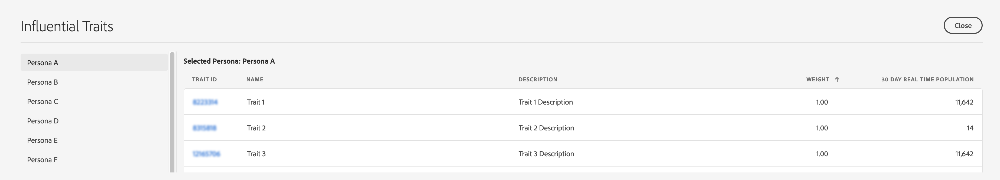

# 预测受众报告

保存模型后， [!UICONTROL Predictive Audiences] 受众经理会开始培训该模型。 在数小时内，计算模型将开始数据收集服务器上的 [受众分析](https://docs.adobe.com/content/help/en/audience-manager/user-guide/reference/system-components/components-data-collection.html#dcs-pcs)。 报告将在次日推出。

要查看分类结果， [!UICONTROL Predictive Audiences] 请转到 **[!UICONTROL Audience Data]** > **[!UICONTROL Models]**，然后单击列表中的模型。

使用左侧的筛选选项搜索模型名称或根据模型类型筛选结果。

模型表显示以下信息：

* **[!UICONTROL ID]**:model ID可唯一标识受众经理帐户中的每个模型；
* **[!UICONTROL Name]**:您在模型创建步骤中提供的名称；
* **[!UICONTROL Description]**:在模型创建步骤中提供的描述；
* **[!UICONTROL Model Type]**:每个模型(或[!UICONTROL Look-Alike Modeling] )的类 [!UICONTROL Predictive Audiences]型；
* **[!UICONTROL Status]**:每个模型的状态：
   * **[!UICONTROL Pending]**:模型正在初始化，很快将开始产生结果；
   * **[!UICONTROL Active]**:模型运行成功，取得了成效；
   * **[!UICONTROL Warning]**:由于数据不足(即基线数量低，用户用户档案不丰富)，模型未能产生结果；
   * **[!UICONTROL Error]**:模型无法运行。 您应与Adobe代表联系。

## 模型概述报告{#model-report}

选择模型后，其报告页面将加载。 在页面顶部，您可以看到前5个最大的预测细分，这些预测细分基于1天的实时实现，该模型已按目标受众分类。 该 **[!UICONTROL Other]** 类别包括其他角色，这些角色未包括在前5大预测细分中。

受众管理器显示颜色编码的圆环图和时间轴图 [!UICONTROL Predictive Audiences]表。

单击页面顶部的角色选项卡会在图表和图形中添加或删除角色选项卡。

圆环图显示了您的目标受众的基于角色的细分，而图表显示了过去6天内预测区段的1天实时人口趋势。

如果模型状态是、 [!UICONTROL Pending]或， [!UICONTROL Warning]则显 [!UICONTROL Error]示模型状态而不是图形。

报表表格显示每个区段的以下 [!UICONTROL Predictive Audiences] 信息。

1. **[!UICONTROL SEGMENT ID]**:与每个人物关联的自动创建的区段的区段ID;
1. **[!UICONTROL NAME]**:人物名称；
1. **[!UICONTROL STATUS]**:区段的状 [!UICONTROL Predictive Audiences] 态：
   * **[!UICONTROL Succeeded]**:用户被分为此类别；
   * **[!UICONTROL Pending]**:段仍在初始化中；
   * **[!UICONTROL Insufficient Training Data]**:由于数据不足，用户未被分类到此区段。 总基线数量太低，无法提供足够的数据供您学习。
1. **[!UICONTROL 1 DAY REAL TIME POPULATION]**:过去24小时内每个角色的细分实现数。
1. **[!UICONTROL 1 DAY REAL TIME POPULATION %]**:过去24小时内每个角色的细分实现占模型总人口的百分比。

## 影响力特征{#influential-traits}

[!UICONTROL Influential Traits] 是算法发 [!UICONTROL Predictive Audiences] 现为最强的预测器来确定访客的人物分类的特征。

其符号指示特征的存在是增加(+)还是减少(-)用户属于所选角色的可能性。

要视图所有角色的影响力特征，请单击 [!UICONTROL View All Influential Traits]。

该窗 [!UICONTROL Influential Traits] 口会显示选定模型中每个角色的以下信息：

1. **[!UICONTROL TRAIT ID]**:所选角色的每个影响特征的特征ID;
1. **[!UICONTROL NAME]**:所选角色的每个影响力特征的名称；
1. **[!UICONTROL DESCRIPTION]**:描述所选角色的每个影响特征；
1. **[!UICONTROL WEIGHT]**:所选角色的每个影响特征的权重。 [!UICONTROL Influential Traits] 默认情况下按权重以降序排序。  权重的值表示其预测能力。 该符号指示特征的存在是增加(+)还是减少(-)属于某个人物的可能性。
1. **[!UICONTROL 30 DAY REAL TIME POPULATION]**:过去30天中所选角色的每个影响特征的唯一特征实现数。
