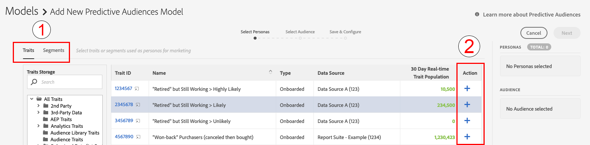

# Predictive Audiences快速入门 {#predictive-audiences-getting-started}

>[!IMPORTANT]
>本文包含产品文档，旨在指导您完成此功能的设置和使用。 此处不包含任何法律建议。 请咨询您自己的法律顾问以获得法律指导。

## 创建预测受众模型 {#create-predictive-audiences}

在创建[!UICONTROL Predictive Audiences]模型之前，您需要决定要将[!UICONTROL Predictive Audiences]特征和区段分配给哪个第一方数据源。 您可以使用现有的第一方数据源，也可以创建新的第一方数据源。 有关如何创建新的第一方数据源的详细信息，请参阅[管理数据源](https://experienceleague.adobe.com/docs/audience-manager/user-guide/features/data-sources/manage-datasources.html?lang=zh-Hans)。

了解要使用的数据源后，请按照以下步骤操作。

1. 转到&#x200B;**[!UICONTROL Audience Data]** > **[!UICONTROL Models]**。
1. 在[!UICONTROL Predictive Audiences]部分中，单击&#x200B;**[!UICONTROL Add New]**。

   

1. 接下来，定义要按其对受众进行分类的角色。 您可以通过选择要从中构建角色的特征或区段来执行此操作。 使用屏幕左上角的[!UICONTROL Traits]和[!UICONTROL Segments]选项卡在特征和区段目录之间切换。 在识别要用作角色的特征或区段后，单击&#x200B;**[!UICONTROL Add]**&#x200B;列中相应的[!UICONTROL Action]图标。
   
   >[!NOTE]
   >您必须至少为基线角色选择两个特征或两个区段。 不能同时使用特征和区段。
1. 在定义角色后，单击&#x200B;**[!UICONTROL Next]**。
1. 接下来，通过为此受众选择第一方特征或区段，选择要分类的第一方受众。 使用屏幕左上角的[!UICONTROL Traits]和[!UICONTROL Segments]选项卡在特征和区段目录之间切换。 选择要用作受众的第一方特征或区段以将其添加到模型。
   
1. 选择受众后，请单击&#x200B;**[!UICONTROL Next]**。
1. 填写模型详细信息：
   * **[!UICONTROL Model Name]**：为模型输入一个描述性名称，以便您以后识别。 模型生成的区段的名称将以模型的名称开头。
   * **[!UICONTROL Description]**：输入模型的描述以帮助您识别其用例。
   * **[!UICONTROL Data Source]**：选择要将此模型中的[!UICONTROL Predictive Audiences]区段分配到的第一方数据源。
   * **[!UICONTROL Profile Merge Rule]**：选择要分配给此模型创建的所有预测[!UICONTROL Profile Merge Rule]的[!UICONTROL segments]。 如果您选择的目标受众为[!UICONTROL segment]，我们建议您选择相同的[!UICONTROL Profile Merge Rule]目标受众。
     
1. 单击 **[!UICONTROL Save]**。

## 克隆和编辑预测受众模型 {#clone-predictive-audiences}

Audience Manager不支持编辑现有[!UICONTROL Predictive Audiences]模型。 要更改模型的配置，可以创建现有模型的克隆并对其进行编辑。 以下是具体操作方法：

1. 转到&#x200B;**[!UICONTROL Audience Data]** > **[!UICONTROL Models]**。
2. 单击要克隆的[!UICONTROL Predictive Audiences]模型的名称。
3. 单击屏幕左上角的&#x200B;**[!UICONTROL Clone]**&#x200B;按钮。
   
4. 克隆模型后，您将转到克隆模型的[!DNL Save & Configure]页。 在此页面中，您可以更改模型的[!UICONTROL data source]和分配的[!UICONTROL Profile Merge Rule]。 要编辑克隆模型的角色和目标受众，请使用[!UICONTROL Back]和[!UICONTROL Next]按钮在三个选项卡之间导航，或单击三个选项卡名称

   

5. 编辑完模型后，单击&#x200B;**[!UICONTROL Save]**。

## 删除预测受众 {#delete-predictive-audiences}

要删除[!UICONTROL Predictive Audiences]模型，请转到&#x200B;**[!UICONTROL Audience Data]** > **[!UICONTROL Models]**，查找要删除的模型，然后单击&#x200B;**[!UICONTROL Delete]**&#x200B;图标。
