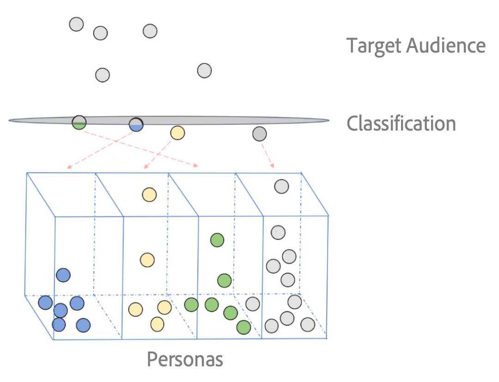

# [!UICONTROL Predictive Audiences] 概述 {#predictive-audiences}

[!UICONTROL Predictive Audiences] 帮助您使用高级数据科学技术将未知受众实时分类为不同的角色。

>[!IMPORTANT]
>本文包含用于指导您完成此功能的设置和使用的产品文档。 此处包含的任何内容都不是法律建议。 请咨询您自己的法律顾问以获得法律指导。

在营销环境中，角色是指由具有一系列相同特征（例如人口统计特征、浏览习惯、购物历史记录等）的访客、用户或潜在购买者构成的一个受众区段。

[!UICONTROL Predictive Audiences] 模型进一步扩展了角色这一概念的应用，允许您使用 Audience Manager 的机器学习功能将未知受众分类为不同的角色。Audience Manager 可以计算未知的第一方受众与一组已知的第一方受众之间的相似性，从而帮助您做到这一点。

创建[!UICONTROL Predictive Audiences]模型时，第一步是选择希望目标受众分类的基线特征或区段。 这些特征或细分将定义您的角色。

在评估阶段，模型会为您定义为基线的每个特征或区段创建新的[!UICONTROL Predictive Audiences]区段。 下次Audience Manager看到目标受众中未分类为人物（未符合任何基线特征或区段的资格）的访客时，[!UICONTROL Predictive Audiences]模型将确定访客应属于哪个预测区段，并将访客添加到该区段。

您可以在[!UICONTROL Segments]页面中标识模型创建的预测区段。 每个[!UICONTROL Predictive Audiences]型号的[!UICONTROL Predictive Audiences]文件夹下都有其自己的文件夹，单击模型文件夹即可查看每个型号的区段。

## 用例 {#use-cases}

为了帮助您更好地了解如何使用[!UICONTROL Predictive Audiences]以及何时使用&lt;a0/>，以下是Audience Manager客户可通过使用此功能解决的几个使用案例。

### 用例#1

作为电子商务公司的营销人员，我希望将我的所有Web和移动访客分类为不同的品牌关联类别，以便个性化其用户体验。

### 用例#2

作为媒体公司的营销人员，我希望按最喜爱的类别对未经身份验证的Web和移动访客进行分类，以便向他们建议跨所有渠道的个性化内容。

### 用例#3

作为航空公司的广告商，我想确保根据受众对旅游目的地的兴趣对其进行分类，以便在一个较短的重新定位窗口内实时向他们投放广告。

### 用例#4

作为广告商，我想实时对第一方受众进行分类，以便能够对热门新闻做出快速反应。

### 用例#5

作为营销人员，我希望预测我的网站访客处于哪个客户旅程阶段，如发现、参与、购买或保留，以便我能够相应地目标他们。

### 用例#6

作为媒体公司，我希望将受众分类，以便以优惠价格销售广告空间，同时为访客提供相关广告。

## [!UICONTROL Predictive Audiences]型号如何工作{#how-predictive-audiences-models-work}

创建[!UICONTROL Predictive Audiences]模型时，需要执行三个步骤：

1. 首先，您至少选择两个特征或两个将定义您角色的区段。
1. 然后，选择一个特征或区段，它定义要分类的目标受众。
1. 最后，为模型选择一个名称、一个将存储预测段的数据源和一个[!UICONTROL Profile Merge Rule]作为模型。

### 角色的选择标准{#selection-personas}

您可以选择任何第一方特征或细分来定义您的角色。 但是，为获得最佳效果，以下是一组推荐的最佳实践：

* 选择您的人物特征或区段，以便每个人物至少有几百个[设备ID](../../reference/ids-in-aam.md)。
* 如果您的特征基于[跨设备ID](../../reference/ids-in-aam.md)，则可以用使用[设备ID](../../reference/ids-in-aam.md)的[用户档案合并规则](../profile-merge-rules/merge-rules-overview.md)（如[!UICONTROL Device Graph]）将其包含在区段中。 这将确保有足够的[设备ID](../../reference/ids-in-aam.md)可供算法学习。
* 我们建议您为角色选择特征或简单的细分，包括1到3个特征。
* 选择重叠最小的基线特征或区段。
* 确保在您的数字资产中捕获粒度特征。

### 目标受众{#selection-audience}的选择标准

根据您的用例，无论您是要实时、批量还是同时对用户进行分类，都可以选择具有显着实时和／或总人口的目标受众（[!UICONTROL trait]或[!UICONTROL segment]）。 与人物选择类似，我们建议您的目标受众[!UICONTROL trait]或[!UICONTROL segment]具有富用户档案（富集[!UICONTROL traits]集）的用户。

选择目标受众时，分析您的用例并确定要分类的ID类型：[!UICONTROL device IDs]或[!UICONTROL cross-device IDs]。 创建模型时选择的[!UICONTROL Profile Merge Rule]定义将用于将每个用户放入预测[!UICONTROL segments]的数据。

作为最佳实践，我们建议选择与目标受众[!UICONTROL Profile Merge Rule]配置相同的[!UICONTROL Profile Merge Rule]，或选择包含目标受众的用户档案类型(设备用户档案或验证用户档案)的&lt;a0/>。

### [!UICONTROL Predictive Audiences] 模型培训阶段  {#model-training}

在算法将第一方受众分类为正确的角色之前，它需要根据您的数据进行自我培训。

对于您定义的每个人物，算法会分析其各自的受众，并评估过去30天内其用户的任何实时和／或载入的特征活动。
此步骤每24小时执行一次，以说明第一方受众中的更改。

### [!UICONTROL Predictive Audiences] 模型分类阶段  {#model-classification}

对于实时和批量受众分类，模型首先检查用户是否属于目标受众。 如果用户符合目标受众并且不属于任何角色，则模型会为他们分配角色资格得分。

在评估第一方受众和分配得分时，模型使用帐户中定义的默认&#x200B;**[!UICONTROL Profile Merge Rule]**。 最后，访客被归为他们获得最高分的角色。

## 注意事项和限制{#considerations}

>[!IMPORTANT]
> 进入实施阶段前，请仔细阅读本节内容。

配置[!UICONTROL Predictive Audiences]型号时，请注意以下注意事项和限制：

* 您最多可以创建 10 个 [!UICONTROL Predictive Audiences] 模型。
* 对于每个模型，您最多可以选择50个基本特征／区段。
* 当前[!UICONTROL Predictive Audiences]不支持第二方和第三方数据。
* [!UICONTROL Predictive Audiences] 根据您的第一方特征从所有第一方数据源执行受众分类。
* [!UICONTROL Predictive Audiences]的区段评估使用在创建模型时选择的&#x200B;**[!UICONTROL Profile Merge Rule]**。 要进一步了解[!UICONTROL Profile Merge Rules]，请参阅专用的[文档](../profile-merge-rules/merge-rules-overview.md)。
* 某些特征和区段不支持作为基准或目标受众。 [!UICONTROL Predictive Audiences] 当选择以下某项作为基准或目标受众时，模型将无法保存：
   * 利用预测特征创建的预测特征和细分；
   * [Adobe Experience Platform](../integration/../../integration/integration-aep/aam-aep-audience-sharing.md) 特征或细分；
   * 算法特征；
   * 第二方和第三方特征。
* [!UICONTROL Predictive Audience] [!UICONTROL segments] 不能在中使 [!UICONTROL Audience Lab]用。

## [!UICONTROL Data Export Controls] {#dec}

由[!UICONTROL Predictive Audiences]模型创建的预测段从以下第一方数据源继承[数据导出控制](https://docs.adobe.com/content/help/en/audience-manager/user-guide/features/data-export-controls.html):

1. 在构建模型时选择的第一方数据源。
1. 您的目标受众的第一方数据源。 具体而言，[!UICONTROL traits]或[!UICONTROL segments]的目标导出控件构成了您的受众。
1. 您为模型选择的[!UICONTROL Profile Merge Rule]的[数据导出控件](https://docs.adobe.com/content/help/en/audience-manager/user-guide/features/data-export-controls.html)。

新创建的预测[!UICONTROL traits]和[!UICONTROL segments]将具有与上述第一方数据源的合并相同的隐私限制。

具有不属于[!UICONTROL Predictive Audiences]区段隐私限制的其他限制的特征将被排除在培训阶段，并且不会对模型产生影响。

## [!UICONTROL Profile Merge Rules] {#pmr}

创建模型时，将为所有预测区段分配您选择的[!UICONTROL Profile Merge Rule]。 您选择的[!UICONTROL Profile Merge Rule]很重要，原因如下：

* 它定义当模型分析影响[!UICONTROL traits]时，在将用户分类为预测[!UICONTROL segment]时，应考虑哪些设备和／或认证用户档案。
* 它控制在模型培训步骤中应使用哪些[!UICONTROL trait]类型（设备级别或跨设备级别），并以影响[!UICONTROL traits]的形式呈现。 预测[!UICONTROL segments]是目标受众的子集。
   * 如果目标受众是区段，建议您为模型选择与分配给目标受众的[!UICONTROL Profile Merge Rule]相同的&lt;a0/>，或选择包含目标受众的用户档案类型的[!UICONTROL Profile Merge Rule]。
   * 如果目标受众是[!UICONTROL trait]，我们建议您选择一个[!UICONTROL Profile Merge Rule]，它可以访问与目标受众特征(设备用户档案数据或跨设备用户档案数据)相同类型的数据。
* [!UICONTROL Profile Merge Rules] 只支 [!UICONTROL Current Authenticated Profiles] 持 [!UICONTROL No Device Profile] 使用和选项进行实时受众分类。有关详细信息，请参阅[用户档案合并规则选项已定义](../profile-merge-rules/merge-rule-definitions.md)。

选择同时使用设备数据和跨设备数据的[!UICONTROL Profile Merge Rule]将可用于模型培训和用户分类的[!UICONTROL traits]数量最大化为预测[!UICONTROL segments]。

## [!UICONTROL Role-Based Access Controls] {#rbac}

您为角色和受众分类选择的特征和区段受Audience Manager[基于角色的访问控制](https://docs.adobe.com/content/help/en/audience-manager/user-guide/features/administration/administration-overview.html)的约束。

Audience Manager用户只能为角色和目标受众选择其具有[视图权限的特征或区段。](https://docs.adobe.com/content/help/en/audience-manager/user-guide/features/administration/administration-overview.html#wild-card-permissions)
