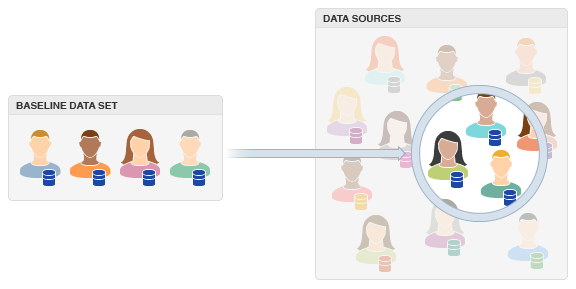

# 了解[!UICONTROL Look-Alike Modeling] {#about-algorithmic-models}

## 查找具有[!UICONTROL Look-Alike Modeling] {#find-new-users}的新用户

[!UICONTROL Look-Alike Modeling] 通过自动数据分析帮助您发现新的独特受众。当您选择[!UICONTROL trait]或[!UICONTROL segment]、时间间隔以及第一方和第三方[!UICONTROL data sources]时，将开始该过程。 您的选择为算法模型提供了输入。 运行分析流程时，它会根据所选群体的共享特征查找符合条件的用户。 完成后，此数据将在[特征生成器](../../features/traits/about-trait-builder.md)中提供，您可以在其中使用这些数据根据[准确性创建特征并访问](../../features/traits/trait-accuracy-reach.md)。 此外，您还可以构建将算法特征与[!UICONTROL rules-based traits]结合在一起的区段，并使用[!DNL Boolean]表达式和比较运算符添加其他资格要求。 [!UICONTROL Look-Alike Modeling] 可让您动态地从所有可用特征数据中提取值。

## 优势 {#advantages}

使用[!UICONTROL Look-Alike Modeling]的主要好处包括：

* **数据准确性：** 算法会定期运行，这有助于保持结果为最新且相关。
* **自动化：** 您无需管理大量静态规则。算法将为您查找受众。
* **节省时间并减少工作量：** 通过我们的建模过程，您不必猜测哪些 [!UICONTROL traits]/[!UICONTROL segments] 项目可能起作用，也不必花时间在营销活动上发现新受众。模型可以为您执行此操作。
* **可靠性：** 建模可与服务器端发现和鉴别流程结合使用，这些流程可评估您自己的数据和您有权访问的选定第三方数据。这意味着您无需查看网站上的访客即可确定其是否符合某个特征。

## 工作流 {#workflow}

在&#x200B;**[!UICONTROL Audience Data > Models]**&#x200B;中管理模型。 在高级别，工作流流程涉及以下内容：

* 选择要算法评估的基线数据。 这包括[!UICONTROL trait]或[!UICONTROL segment]、时间范围和[!UICONTROL data sources]（您自己的数据和已通过[!DNL Audience Manager]访问的第三方数据）。 在模型创建工作流中，可以排除不想干扰模型的[!UICONTROL traits]。
* 保存模型。 保存后，算法评估进程将自动运行。 但请注意，此过程可能需要长达7天的时间才能完成。 [!DNL Audience Manager] 当算法完成并且结果可供创建时，会向您发送电子 [!UICONTROL trait] 邮件。
* 在[!UICONTROL Trait Builder]中生成算法[!UICONTROL traits]。
* 将[!UICONTROL traits]组合到[!UICONTROL Segment Builder]的[!UICONTROL segments]中。
* 创建[!UICONTROL segment]数据并将其发送到[!UICONTROL destination]。

## 故障诊断 {#troubleshooting}

我们会停用任何未能连续三次生成数据的[!UICONTROL Look-Alike Model]。 请注意，以后不能将模型的状态重新设置为活动状态。 为确保模型生成数据，我们建议您从数据源构建模型，其中[!UICONTROL traits]足以累计中的数据。

## 了解[!UICONTROL TraitWeight] {#understanding-traitweight}

[!UICONTROL TraitWeight] 是专用的算法，旨在自动发现 [!UICONTROL traits] 新。它会将当前[!UICONTROL traits]和[!UICONTROL segments]中的[!UICONTROL trait]数据与您通过[!DNL Audience Manager]有权访问的所有其他第一方和第三方数据进行比较。 有关[!UICONTROL TraitWeight]算法发现过程的说明，请参阅此部分。

以下步骤描述了[!UICONTROL TraitWeight]评估过程。

### 步骤1:构建基线以进行比较[!UICONTROL Trait]

要构建基线，[!UICONTROL TraitWeight]会测量与受众关联的所有[!UICONTROL traits]，间隔为30、60或90天。 接下来，根据其频率和相关性对[!UICONTROL traits]进行排名。 频率计数衡量通用性。 关联度量[!UICONTROL trait]仅出现在基线受众中的可能性。 [!UICONTROL Traits] 通常，这些标记显示出高度的通用性，这是一个重要特征，用于在与您在所选内容中发现的加 [!UICONTROL traits] 权分数结合时设 [!UICONTROL data sources]置。

### 步骤2:在[!UICONTROL Data Source]中找到相同的[!UICONTROL Traits]

算法在生成基线以进行比较后，会在选定的[!UICONTROL data sources]中查找相同的[!UICONTROL traits]。 在此步骤中，[!UICONTROL TraitWeight]将执行所有发现的[!UICONTROL traits]的频率计数，并将它们与基线进行比较。 但是，与基线不同，不常见的[!UICONTROL traits]排名比显示频率更高的排名。 所述稀有[!UICONTROL traits]表现出高度特异性。 [!UICONTROL TraitWeight] 将公共基线和不常见( [!UICONTROL traits] 高度特定)的组合评 [!UICONTROL data source] [!UICONTROL traits] 估为比两个数据集的 [!UICONTROL traits] 通用更具影响力或更可取。事实上，我们的模型识别了这些大型且常见的[!UICONTROL traits]，并且不会为具有高关联的数据集分配过多的优先级。 极少有的[!UICONTROL traits]会获得更高的优先级，因为与[!UICONTROL traits]相比，它们更可能代表全局具有高度通用性的新的独特用户。

### 步骤3:分配权重

在此步骤中，[!UICONTROL TraitWeight]按影响或期望顺序对新发现的[!UICONTROL traits]进行排名。 重量比是0%到100%的百分比。 [!UICONTROL Traits] 排名接近100%意味着他们更像基线群体中的受众。此外，重量加权[!UICONTROL traits]很有价值，因为它们代表的是新的独特用户，这些用户的行为可能与您已建立的基准受众类似。 请记住，[!UICONTROL TraitWeight]认为在基线中具有高通用性的[!UICONTROL traits]和在比较的数据源中具有高专一性的比每个数据集中的[!UICONTROL traits]通用性更有价值。

### 步骤4:评分用户

选定[!UICONTROL data sources]中的每个用户都会获得一个用户分数，该分数等于该用户配置文件中具有影响力的[!UICONTROL traits]的所有权重的总和。 然后，将用户分数标准化为0%到100%。

### 步骤5:显示和处理结果

[!DNL Audience Manager] 显示加权模型结果 [!UICONTROL Trait Builder]。如果要构建[!UICONTROL algorithmic trait]，可使用[!UICONTROL Trait Builder]根据算法在数据运行期间生成的加权分数创建[!UICONTROL traits]。 您可以选择更高的准确性，以便仅鉴定用户得分非常高，因此与基准受众非常相似的用户，而不是其余的受众。 如果您想要访问更大的受众（访问），可以降低准确性。

### 步骤6:重新评估[!UICONTROL Trait]跨处理周期的显着性

[!UICONTROL TraitWeight]会定期根据[!UICONTROL trait]的大小和人口变化重新评估[!UICONTROL trait]的重要性。 当符合该[!UICONTROL trait]条件的用户数量随着时间的推移而增加或减少时，会发生这种情况。 这种行为在变大的特征中最为明显。 例如，假设算法使用[!UICONTROL trait A]进行建模。 随着[!UICONTROL trait A]的群体增加，[!UICONTROL TraitWeight]会重新评估该[!UICONTROL trait]的重要性，并可以分配较低的分数或忽略该分数。 在这种情况下，[!UICONTROL trait A]太常见或太大，无法对其人口发表任何重要的评论。 在[!UICONTROL TraitWeight]减小值[!UICONTROL trait A]（或在模型中忽略该值）后，算法特征的群体会减少。 具有影响力的[!UICONTROL traits]列表反映了基线群体的演变。 使用具有影响力的[!UICONTROL traits]列表了解发生这些更改的原因。

相关链接：

* [模型生成器](../../features/algorithmic-models/create-model.md)
* [精度和范围](../../features/traits/trait-accuracy-reach.md)

## [!UICONTROL Look-Alike Models]和[!UICONTROL Traits] {#update-schedule}的更新计划

为新的或现有的[!UICONTROL algorithmic models]和[!UICONTROL traits]创建和更新计划。

### [!UICONTROL Look-Alike Model] 创建和更新计划

<table id="table_E75A2B334A7F47ED9DFFBD6DF8636641"> 
 <thead>
  <tr>
   <th colname="col1" class="entry"> 活动类型 </th>
   <th colname="col2" class="entry"> 描述 </th>
  </tr>
 </thead>
 <tbody>
  <tr> 
   <td colname="col1"> <b>创建或克隆模型</b> </td>
   <td colname="col2"> 
对于新的或克隆的[!UICONTROL相似人群拓展模型]，创建过程每天在以下位置运行一次： 
     <ul id="ul_97333AC409AF4760A91D90A06050122B"> 
      <li id="li_3A43809F924341FCAC3A85E3825E0F61"> 东部标准时间下午5点（11月 — 3月） </li> 
      <li id="li_C07D22AB192D4E0191D9EBF6426EC73D"> 美国东部时间下午6:00（3月 — 11月） </li> 
     </ul> 
 
在创建截止日期后构建或克隆的模型将在第二天进行处理。 
 
如果模型的第一次运行未生成任何数据，则它将在次日再运行一次。 如果第二次尝试也未生成任何数据，则将在次日进行第三次尝试。 如果第三次尝试也未生成任何数据，则模型将停止运行。 在这种情况下，我们将停用模型。 请参阅<a href="../../features/algorithmic-models/understanding-models.md#troubleshooting">相似人群拓展模型疑难解答</a>中的更多信息。 
 </td>
  </tr>
  <tr> 
   <td colname="col1"> <b>更新模型</b> </td> 
   <td colname="col2"> 
在理想条件下，现有模型在工作日运行，至少每7天运行一次。 例如，如果您在星期一创建一个模型（截止时间），则该模型会在下一个星期一更新最晚。 
 
如果模型满足以下任一条件，则将重新运行该模型： 
 

     <ul id="ul_7B0442F6E840415B82705C7B7419D079"> 
      <li id="li_27DCB92CE61F4388B5D253C13BD030BE">其上次运行未成功。 </li> 
      <li id="li_9887E50D291446AC868A8FCE6295536E">它在运行之前已成功运行，并且在过去7天内根本未运行，并且模型至少有一个活动特征附加到该特征。 </li>
     </ul> 
 </td>
  </tr>
 </tbody>
</table>

### [!UICONTROL Look-Alike Trait] 创建和更新计划

<table id="table_92A908818C4F4F2287EA56C786CD0BBD"> 
 <thead> 
  <tr> 
   <th colname="col1" class="entry"> 活动类型 </th> 
   <th colname="col2" class="entry"> 描述 </th> 
  </tr> 
 </thead>
 <tbody> 
  <tr> 
   <td colname="col1"> <b>创建特征</b> </td> 
   <td colname="col2"> 
特征创建过程每天（星期一到星期五）运行。 通常，新的算法特征会在48小时内显示在UI中。 
 </td> 
  </tr> 
  <tr> 
   <td colname="col1"> <b>更新特征</b> </td> 
   <td colname="col2"> 
现有特征至少每7天更新一次，并遵循模型更新计划。 
 </td> 
  </tr> 
 </tbody> 
</table>

## 模型列表视图{#models-list-view}

列表视图是一个中心工作区，可帮助您创建、审阅和管理模型。

[!UICONTROL Models]列表页面包含可帮助您：

* 创建新模型。
* 管理现有模型（编辑、暂停、删除或克隆）。
* 按名称搜索模型。
* 使用任何给定模型创建[!UICONTROL algorithmic traits]。

## 模型摘要视图{#models-summary-view}

摘要页显示模型详细信息，如名称、访问/准确度、处理历史记录以及从模型创建的[!UICONTROL traits]。 该页面还包含允许您创建和管理模型的设置。 单击摘要列表中的模型名称可查看其详细信息。

模型摘要页面包括以下部分。

<table id="table_14AE8B324115442589E3F993101F72EA"> 
 <thead> 
  <tr> 
   <th colname="col1" class="entry"> 区域 </th> 
   <th colname="col2" class="entry"> 描述 </th> 
  </tr> 
 </thead>
 <tbody> 
  <tr>
   <td colname="col1"> 
  基本信息 
 </td>
   <td colname="col2"> 
包括有关模型的基本信息，如其名称和上次运行的时间。 
 </td>
  </tr> 
  <tr> 
   <td colname="col1"> 
  模型范围和准确度 
 </td> 
   <td colname="col2"> 
显示<a href="../../features/traits/trait-accuracy-reach.md">精度，并达到上次模型运行的</a>数据。 
 </td>
  </tr> 
  <tr> 
   <td colname="col1"> 
  模型处理历史记录 
 </td> 
   <td colname="col2"> 
显示最近10次运行的处理日期和时间以及这些运行中是否生成了数据。 
 </td>
  </tr> 
  <tr> 
   <td colname="col1"> 
  具有影响力的特征 
 </td> 
   <td colname="col2"> 
具有影响力的特征表： 
 
 
     <ul id="ul_FB15A554CADC40D09F9AC6D384D54ECD"> 
      <li id="li_343E25E8B3584D38B1E2BCB211033DBF"> 列出在模型的基线群体中最能代表的50个具有影响力的特征。 </li> 
      <li id="li_44957F46C0744A84A987D8F25D93E24E">按每个特征的相对权重排名对每个特征进行排名。 相对权重按影响或期望顺序对新发现的特征进行排序。 重量比是0%到100%的百分比。 排名接近100%的特征意味着它们更像基线群体中的受众。 请参阅<a href="../../features/algorithmic-models/understanding-models.md#understanding-traitweight">了解TraitWeight</a>。 </li> 
      <li id="li_260151E23B1E484BA06C8494552A04F0">显示每个特征的30天独特值和总特征人口。 </li> 
     </ul> 
 </td> 
  </tr> 
  <tr> 
   <td colname="col1"> 
  使用模型的特征 
 </td>
   <td colname="col2"> 
显示基于所选模型的算法特征列表。 单击特征名称或特征ID ，以了解有关该特征的更多信息。 选择<b>使用模型创建新特征</b>以转到算法特征创建过程。 
 
区域标签会根据模型名称而发生更改。 例如，假设您创建一个模型并将其命名为模型A。加载摘要页面时，此部分的名称将更改为使用模型A的特征。 
 </td>
  </tr>
 </tbody>
</table>

>[!MORELIKETHIS]
>
>* [目标](../../features/destinations/destinations.md)
* [特征](../../features/traits/trait-details-page.md)
* [区段](../../features/segments/segments-purpose.md)

