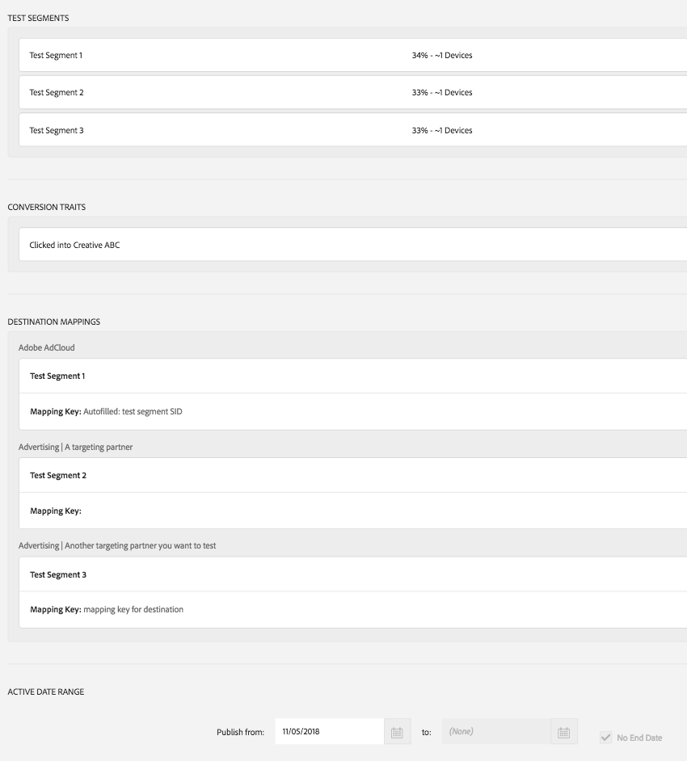
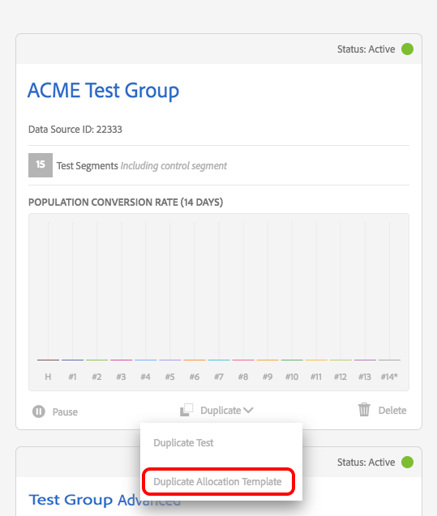

# [!DNL Audience Lab] 進階功能 {#audience-lab-advanced-functionality}

本文說明提供進階功能的兩項功能 [!DNL Audience Lab]： [!DNL Duplicate Allocation Template] 和 [!DNL Segment Holdout].

## 複製配置範本 {#duplicate-allocation-template}

<!-- 

The <b>Allocation Template</b> represents how you split a test group into test segments and the way the test segments are mapped to destinations. 

 -->

在 [!DNL Audience Lab]，則 [!DNL Allocation Template] 代表您在建立測試群組時所做的各種選擇：

* 測試區段之間的裝置分佈；
* 測試區段與目的地的對應；
* 用於測試群組的轉換特徵；
* 測試群組發佈至您所選目的地的日期範圍。

透過複製配置範本，您可以針對新測試群組中的不同基本區段，重複使用測試區段和目的地的相同分佈。 配置範本的範例如下圖所示。 影像取自於 [!UICONTROL Summary & Finalize] 中的步驟 **建立測試群組** 工作流程。

<!--
With the option to duplicate allocation templates, you can increase your productivity when running multivariate tests as part of multivariate campaigns.
-->

### 使用重複配置範本

建立初始測試群組，然後選取 **[!UICONTROL Duplicate Allocation Template]** 重複使用多個測試群組中的相同設定。 例如，如果您要執行的測試想要判斷多個區段多個目的地的功效，則可以使用此功能。

1. 在Audience Lab主要檢視中，搜尋您要在新測試群組中重現其配置範本的測試群組。 在下拉式方塊中，選取 **[!UICONTROL Duplicate Allocation Template]**.

   

2. 在 [!UICONTROL Create Test Group] 精靈，您可以指定基礎區段並重新命名測試區段（如果願意）。
3. 您 *無法* 修改：

   * 測試區段之間的裝置分佈；
   * 轉換特徵；
   * 測試區段與目的地的對應。 您只能為需要對應鍵的目的地填寫對應鍵。
   * 您的測試群組將發佈至您所選目的地的日期範圍。

4. 檢閱您在先前步驟中新增的資訊，並選取 **[!UICONTROL Finalize Group]**.

## 測試區段維持 {#test-segment-holdout}

>[!NOTE]
>
>[!UICONTROL Test Segment Holdout] 是一項進階功能，根據客戶要求啟用。 請聯絡 [!DNL Customer Care] 或 [!DNL Adobe Consulting] 以啟動此功能。

使用此功能可讓部分對象不參與測試。 您選取的百分比會排除在測試之外。 如此一來，您就可以測量並比較已鎖定目標（已在目的地啟用）和未鎖定目標（保留群組）對象的轉換次數。

<!--

Note that this option is different to the control segment because it subtracts the percentage ................. You can withhold an audience group and still use a control segment. 

-->

### 使用測試區段維持

1. 使用建立新的測試群組 [!UICONTROL Create Test Group] 精靈。
1. 在 **[!UICONTROL Allocate Test Segment]** 步驟，您可以選取不進行測試的部分對象。

   

1. 使用滑桿可調整您想禁止測試多少裝置。 請注意「測試區段1」和「測試區段2」現在只佔總裝置數的70%。

   

1. 請完成中的其餘步驟 **[!UICONTROL Create Test Group]** 工作流程並選取 **[!UICONTROL Finalize Group]** 在您滿意您的選取範圍時。 您現在有一個測試群組，其中一部分對象已停止測試。
