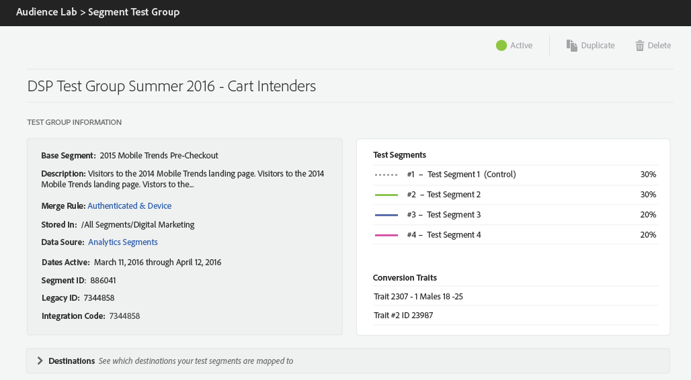

# 测试组信息 {#test-group-information}

此部分显示有关测试组及其所划分的测试区段、选定的转化特征和映射的目标的一般信息。 部分还提供了用于复制或删除测试组的控件。

您还可以查看有关用于测试组的基准区段的信息以及测试区段的划分方式。

**[!UICONTROL Test Segments]**&#x200B;由您用于测试组的基线区段中的用户随机填充。 该概述显示了您分配给每个测试区段的用户百分比。

**[!UICONTROL Conversion Traits]**&#x200B;驱动测试组的报告。 若要将特征指定为转化，请在[!UICONTROL Trait Builder]中创建或编辑特征时，选择&#x200B;**转化**&#x200B;作为&#x200B;**[事件类型](../../features/traits/create-onboarded-rule-based-traits.md)。**

**[!UICONTROL Destinations]**&#x200B;卡可折叠。 按箭头可打开或关闭各个目标，并获取有关测试区段的以下信息（按这些区段所映射到的目标分组）：

* 基础区段分配给每个目标的设备总数。
* 映射键；
* 映射值；
* [!DNL URL]目标的[!DNL URL]和安全[!DNL URL]。

>[!NOTE]
>
>请记住，完成测试组后不能对其进行编辑，只能暂停、删除或复制它们。

