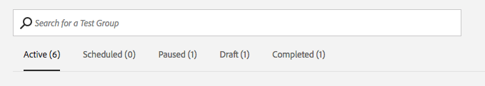

# [!UICONTROL Audience Lab] {#audience-lab}

在[!UICONTROL Segment Test Groups]中创建互斥测试区段，以比较和度量不同目标的有效性。 您可以设置一个对照组，将区段划分为总体的百分比以测试功效。

## 概述 {#audience-lab-overview}

[!UICONTROL Audience Lab]使用[配置文件链接](../../features/profile-merge-rules/merge-rules-overview.md)来加强跨设备测试。 这有助于确保用户符合同一测试区段的条件并在各个设备上获得相同的待遇。 测试组中的测试区段将继承基本区段分配给它的[配置文件合并规则](../../features/profile-merge-rules/merge-rules-dashboard.md)。

[!UICONTROL Audience Lab]默认视图为每个测试组显示一张信息卡。 单击卡片以访问&#x200B;**[!UICONTROL Test Group]**&#x200B;视图。 此视图包含以下信息：

* **[测试组信息](../../features/audience-lab/audience-lab-information-view.md)**
* **[测试组报表](../../features/audience-lab/audience-lab-reporting-view.md)**

您可以创建&#x200B;**最多10个测试组**，每个测试组具有&#x200B;**最多15个测试区段**。

## 搜索和筛选测试组 {#search-and-filter}

开始创建具有多个测试区段的多个测试组后，使用搜索框查找特定测试组可能会更容易。 您可以通过以下方式搜索测试组：

* 测试组的名称；
* 测试组中任何测试区段的名称；
* 测试组的描述。

您还可以按状态筛选测试组。 下面的[状态](../../features/audience-lab/audience-lab.md#status)部分中介绍了所有可用的状态。

## [!UICONTROL Status] {#status}

测试组的状态可以是“活动”、“已计划”、“已暂停”、“草稿”或“已完成”。 有关它们的更多信息，请参阅下表：

<table id="table_7A0388BA02E045AC971C06A22DAC2C63"> 
 <thead> 
  <tr> 
   <th colname="col1" class="entry"> 状态 </th> 
   <th colname="col2" class="entry"> 描述 </th> 
  </tr> 
 </thead>
 <tbody> 
  <tr> 
   <td colname="col1"> 
 <b>活动</b> 
 </td> 
   <td colname="col2"> 
<i>活动</i>测试组表示数据当前正在发送到目标。 按<b>测试组</b>卡片中的<b>暂停测试</b>以暂停向目标发送数据。 
 </td> 
  </tr> 
  <tr> 
   <td colname="col1"> 
 <b>已计划</b> 
 </td> 
   <td colname="col2"> 
<i>计划的</i>测试组尚未处于活动状态，但无法再进行编辑。 它将在您在<b>创建测试组</b>向导中选择的开始日期变为活动状态。 
 </td> 
  </tr> 
  <tr> 
   <td colname="col1"> 
 <b>已暂停</b> 
 </td> 
   <td colname="col2"> 
<i>已暂停</i>测试组当前未将数据发送到目标。 按<b>使</b>测试组<b>信息卡中的</b>处于活动状态，以继续发送特征。 
 </td> 
  </tr> 
  <tr> 
   <td colname="col1"> 
 <b>草稿</b> 
 </td> 
   <td colname="col2"> 
<i>草稿</i>测试组尚未处于活动状态，仍可编辑。 它尚未将数据发送到映射的目标。 
 </td> 
  </tr> 
  <tr> 
   <td colname="col1"> 
 <b>已完成</b> 
 </td> 
   <td colname="col2"> 
<i>已完成</i>的测试组已达到您在<b>创建测试组</b>向导中选择的结束日期，并且已停止发送报表数据。 
 </td>
  </tr>
 </tbody>
</table>

## [!UICONTROL Actions] {#actions}

<table id="table_481A411E2D2F4FE891595D00E775CF60"> 
 <thead> 
  <tr> 
   <th colname="col1" class="entry"> 操作 </th> 
   <th colname="col2" class="entry"> 描述 </th>
  </tr>
 </thead>
 <tbody> 
  <tr> 
   <td colname="col1"> 
 <b>编辑</b> 
 </td>
   <td colname="col2"> 
<b>仅</b>可用于草稿测试组。 允许您继续<b>新建测试组</b>向导。 
 </td>
  </tr>
  <tr> 
   <td colname="col1"> 
 <b>暂停</b> 
 </td>
   <td colname="col2"> 
可用于活动测试组。 允许您暂停将测试区段发送到目标。 
 </td>
  </tr>
  <tr> 
   <td colname="col1"> 
 <b>变为活动状态</b> 
 </td>
   <td colname="col2"> 
可用于暂停的测试组。 允许您恢复向目标发送测试区段。 
 </td>
  </tr>
  <tr> 
   <td colname="col1"> 
 <b>查看</b> 
 </td>
   <td colname="col2"> 
可用于已完成的测试组。 用于查看测试已生成的报表信息。 
 </td>
  </tr>
  <tr> 
   <td colname="col1"> 
 <b>重复</b> 
 </td>
   <td colname="col2"> 
允许您使用与正在复制的组相同的配置创建新测试组。 
 </td>
  </tr>
  <tr> 
   <td colname="col1"> 
 <b>删除</b> 
 </td>
   <td colname="col2"> 
用于删除测试组。 测试区段将从目标取消映射，与测试组关联的基准区段和转化特征完全可编辑。 当您删除测试组以保存报表时，系统会发出警告，提示您下载CSV文件（如果需要）。 
 </td>
  </tr>
 </tbody>
</table>
