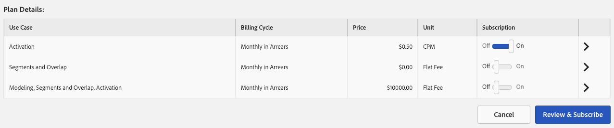

# 管理数据信息源订阅 {#manage-data-feed-subscriptions}

[!UICONTROL Marketplace]是数据购买者研究并订阅公共和私有数据馈送的位置。 按照以下步骤订阅公共数据馈送。

## 订阅公共数据馈送{#subscript-public-data-feed}

[!UICONTROL Marketplace]是数据购买者研究并订阅公共和私有数据馈送的位置。 按照以下步骤订阅公共数据馈送。

<!-- t_subscribe_feed.xml -->

要订阅公共数据馈送，请执行以下操作：

1. 转到&#x200B;**[!UICONTROL Audience Marketplace > Marketplace]**。 使用搜索功能或浏览列表以查找数据馈送。

   

1. 单击要使用的数据馈送的名称。 这将打开选定馈送的[计划详细信息页面](../../../features/audience-marketplace/marketplace-data-buyers/marketplace-manage-subscriptions.md#marketplace-buyer-details)。

   

1. 从订阅表中选择一个用例，然后：
   * 将&#x200B;**[!UICONTROL Subscription]**&#x200B;滑块移动到&#x200B;**[!UICONTROL On]**。
   * 单击 **[!UICONTROL Review & Subscribe]**. 这将打开[!UICONTROL Terms and Conditions]窗口。

   

1. 在[!UICONTROL Terms and Conditions]窗口中：

   * **重要信息：** 保持选 **[!UICONTROL ID sync]** 中该复选框。此设置有助于提高与数据提供商的匹配率。
   * 选中条款和条件框，然后单击&#x200B;**[!UICONTROL Accept]**&#x200B;以完成订阅过程。

   

### 后续步骤

订阅数据馈送后：

* 检查[!UICONTROL Traits]文件夹以验证订阅。 请参阅[订阅数据馈送的存储](../../../features/audience-marketplace/marketplace-data-buyers/marketplace-manage-subscriptions.md#find-subscribed-data-fee)。

* 查看帐单和付款文档。 请参阅下面的相关链接。

### 最佳实践 {#best-practices}

以下是我们建议您在使用[!UICONTROL Audience Marketplace]时遵循的一组最佳实践：

在通过[!UICONTROL Audience Marketplace]浏览新的第三方和第二方数据集时，我们建议的第一步是为[!UICONTROL Segments & Overlap]启用数据馈送。 这允许用户通过构建区段来评估受众规模，并运行重叠报表来获取初始受众分析，从而探索数据。 大多数数据提供商都免费提供此用例，因此您无需支付额外费用即可执行此分析。

运行重叠报表时，请遵循以下最佳实践，确保您获得有用的结果。

1. 确保重叠的数据集在数据类型和收集方法方面相似，例如：
   * 访客地理位置
   * Cookie与移动设备ID
   * 回顾窗口
   * 离线活动与在线活动
   * 数据提供程序刷新数据的频率

1. 重叠量可能会随着时间而略有增加，因此请确保在运行重叠报表以允许数据同步之前，允许多达30天。
1. 如果您在多个营销活动中使用来自数据提供商的数据，则重叠会增加。
和计划。 这为来自两个数据集的用户提供了更多同步机会。
1. 无法保证数据集之间会存在重叠。 要使重叠有效，客户数据集中的用户必须与数据关联
提供程序数据集。 如果客户的媒体数据未提供给数据提供商数据集中的用户，则永远不会发生重叠。
1. 不要把低重叠视为坏事。 利用低重叠度来潜在客户和吸引新用户。

## 订阅专用数据馈送{#subscript-private-data-feed}

购买者可订阅&#x200B;**[!UICONTROL Audience Marketplace > Marketplace]**&#x200B;中的私有数据馈送和计划。

<!-- t_private_feed.xml -->

>[!TIP]
>
>有时，数据提供商可能会对专用数据馈送提供折扣。 在提交订阅请求时，您可能想要询问有关可能的折扣。

要订阅专用数据馈送，请执行以下操作：

1. 单击[!UICONTROL Marketplace]中的数据馈送名称。
1. 单击 **[!UICONTROL Request Access]**. 此时将打开请求对话框。
1. 在“请求”对话框中，为提供者写一条注释，表示您对其数据馈送感兴趣，然后单击&#x200B;**[!UICONTROL Send]**。 卖家将审核您的邮件，并批准或拒绝您的请求。 等待批准时，该数据馈送的[!UICONTROL Marketplace]列表中会显示“已请求”。

   * **[!UICONTROL Request approved]**:列表中的状 [!UICONTROL Marketplace] 态将变为“已授予的访问权限”，您将收到自动通知。此时，您可以订阅信息源。 有关说明，请参阅[订阅公共数据馈送](../../../features/audience-marketplace/marketplace-data-buyers/marketplace-manage-subscriptions.md#subscript-public-data-feed) 。
   * **[!UICONTROL Request denied]**:“已请求”文本将从馈送的列 [!UICONTROL Marketplace] 表中删除。您可以尝试再次订阅或选择其他信息源。

## 购买者的数据馈送折扣{#buyer-discount}

在[!UICONTROL Audience Marketplace]中，提供商可以为购买者提供[!DNL CPM]或单价数据馈送的已发布价格折扣。 但是，折扣金额在[!DNL Marketplace]信息源列表中对购买者不可见。 但是，在订阅专用数据馈送或请求有关特定馈送的更多信息时，您也可以要求提供折扣。

## 请求折扣{#request-discount}

<!-- marketplace-buyer-discounts.xml -->

<table id="table_3C6E58F593BA48EC89ACBD9A26E4E74F"> 
 <thead> 
  <tr> 
   <th colname="col1" class="entry"> 采购员状态 </th> 
   <th colname="col2" class="entry"> 描述 </th> 
  </tr> 
 </thead>
 <tbody> 
  <tr> 
   <td colname="col1"> 
 <b>当前订阅者</b> 
 </td> 
   <td colname="col2"> 
如果您已经订阅了专用数据馈送，并且想要请求折扣： 
 
    <ol id="ol_A58D419EBB9349E9B1225202535130F6"> 
     <li id="li_D0DDC8AC6E9C4675AA4630D63FE8F071">  取消订阅数据馈送。 </li> 
     <li id="li_05A5379F2A944FB28AB39C196DDE3A1D">与数据提供商联系并请求折扣价。 </li> 
     <li id="li_B1B5AA6F6CC64512A02D5E8861A5F266">如果提供商给您折扣，请在下月1st日重新订阅信息源。 </li> 
    </ol> </td> 
  </tr> 
  <tr> 
   <td colname="col1"> 
 <b>新的专用数据馈送订阅者</b> 
 </td> 
   <td colname="col2"> 
在您的订阅请求中要求折扣。 请参阅<a href="../../../features/audience-marketplace/marketplace-data-buyers/marketplace-manage-subscriptions.md#subscript-private-data-feed">订阅专用数据馈送</a>。 
 </td>
  </tr> 
  <tr> 
   <td colname="col1"> 
 <b>潜在订阅者</b> 
 </td> 
   <td colname="col2"> 
<a href="../../../features/audience-marketplace/marketplace-private-feeds.md">潜在用户</a>是数据购买者，其请求访问私有数据馈送，接受卖方批准，但未订阅该馈送。 要请求作为潜在订阅者提供折扣，请执行以下操作： 
 
    <ol id="ol_9CECDA92E7894B20AC8A777D78962188"> 
     <li id="li_618B64160CF24549AFCA73E006DCA35A">转到<b>Audience Marketplace&gt; Marketplace</b>。 </li> 
     <li id="li_FE52A06B30FC4858B48AF81954365FE9">单击您已获得批准的馈送的名称。 </li> 
     <li id="li_763C050AC9464BE380D00F6085B6E540">单击<b>请求更多详细信息</b>。 在向卖家的详细请求中要求折扣。 </li> 
    </ol> </td> 
  </tr> 
 </tbody> 
</table>

## 查看折扣馈送{#review-discounted-feeds}

要查看折扣源，请执行以下操作：

1. 转到&#x200B;**[!UICONTROL Audience Marketplace > Marketplace]**。
1. 单击您已订阅的馈送的名称。
1. 查看[!UICONTROL Plan Details]表中的[!UICONTROL Price]和[!UICONTROL Your Price]列。 如果馈送已折扣：

   * 原价上标有红线。
   * [!UICONTROL Your Price]列中的费用将低于[!UICONTROL Price]列中的费用。

在本例中，采购员在&#x200B;**[!UICONTROL Software Audience Feed]**&#x200B;的[!UICONTROL Segments and Overlap]计划中获得10%的折扣。

## 查找订阅的信息源数据 {#find-subscribed-data-fee}

数据馈送的数据（特征）会显示在其自己的特征存储文件夹中。 转到&#x200B;**[!UICONTROL Audience Data > Traits]**&#x200B;并展开&#x200B;**[!UICONTROL 3rd-Party Data]**&#x200B;文件夹，以查看和处理订阅动态消息中的特征。 查找以您的数据提供程序命名的子文件夹。 其中包含以单个数据馈送和馈送提供的列表特征命名的文件夹。

<!-- marketplace-feed-storage.xml -->

## 取消订阅数据馈送 {#unsubscribe}

数据购买者取消订阅&#x200B;**[!UICONTROL Audience Marketplace > Marketplace]**&#x200B;中的数据馈送和计划。

<!-- t_unsubscribe_feed.xml -->

要取消订阅数据馈送，请执行以下操作：

1. 单击[!UICONTROL Marketplace]中的数据馈送名称。
1. 在[!UICONTROL Use Case]部分中，找到要使用的计划，并将&#x200B;**[!UICONTROL Subscription]**&#x200B;滑块移动到&#x200B;**[!UICONTROL Off]**。

## 数据馈送停用：发生此事件的原因及如何响应{#data-feed-deactivation-reasons}

在[!UICONTROL Audience Marketplace]中，数据提供商可以撤消对订阅的数据馈送的访问权限。 如果你发生这事，别惊慌。 我们掩护你。 查看此部分内容，了解与数据馈送停用相关的流程和过程。

## 数据馈送停用的常见原因{#reasons-for-deactivation}

<!-- marketplace-subscriber-deactivated.xml -->

如果你所订购的饲料被关闭，这可能令人费解，甚至令人不安。 但是，数据提供程序可能会由于各种原因而停用数据馈送。 一些常见原因包括：

* **账单：** 如果您始终延迟支付费用或者您未能支付费用，数据提供商将停用信息源。
* **信息源更新：** 数据提供程序在更新其信息源分类或成本结构时，需要停用信息源。
* **不活动购买者：** 如果订阅者显示较长时间段内没有支出，则数据提供商保留停用馈送的权限。
* **不活动的卖家：** 离开的数据提供商 [!UICONTROL Audience Marketplace] 将停用并删除其所有数据馈送。

>[!TIP]
>
>如果您认为数据馈送被错误停用，请直接与您的数据提供商联系。 您的[!DNL Adobe]顾问可以帮助您提供联系信息或其他支持。

## 停用电子邮件{#deactivation-email}

当数据提供程序停用您的其中一个数据馈送时， [!DNL Audience Manager]会向贵公司中拥有[!UICONTROL Administrator]权限的用户发送电子邮件。 有时，电子邮件过滤器会将此消息分类为垃圾邮件。 因此，您可能会错过此重要通知。 为了帮助您识别停用消息，此电子邮件包含以下元素：

* **发件人：** 停用电子邮件来自 `aam-noreply@adobe.com`。专业提示：请勿回复此电子邮件。

* **主题行：** 取消 *订阅数据馈* 送名称。

* **附件：** 电子邮件包含标题为“ `list-of-affected-entities-by-feed-revocation.csv`”的附件。这是一种令人费解的方式，表示附件列出了已取消馈送中包含的所有特征。 作为数据购买者，您应审核此附件。 它将帮助您从区段和[算法模型](../../../features/algorithmic-models/understanding-models.md)中查找并删除已停用的特征。

## 已停用的特征列表{#deactivation-trait-list}

停用电子邮件随附的列表包含如下所示的字段。

<table id="table_5C3800F9D8AA43EFAB4690959A721F63"> 
 <thead> 
  <tr> 
   <th colname="col1" class="entry"> 字段 </th> 
   <th colname="col2" class="entry"> 描述 </th> 
  </tr> 
 </thead>
 <tbody> 
  <tr> 
   <td colname="col1"> 
<b> 数据馈送ID</b> 
 </td> 
   <td colname="col2"> 
已停用数据馈送的ID。 
 </td> 
  </tr> 
  <tr> 
   <td colname="col1"> 
<b> 数据馈送名称</b> 
 </td> 
   <td colname="col2"> 
已停用数据馈送的名称。 
 </td> 
  </tr> 
  <tr> 
   <td colname="col1"> 
<b> 特征SID</b> 
 </td> 
   <td colname="col2"> 
已停用的特征ID。 
 </td> 
  </tr> 
  <tr> 
   <td colname="col1"> 
<b> 特征名称</b> 
 </td> 
   <td colname="col2"> 
停用的特征名称。 
 </td> 
  </tr> 
  <tr> 
   <td colname="col1"> 
<b> 区段SID</b> 
 </td> 
   <td colname="col2"> 
包含已停用特征的区段的ID。 
 </td> 
  </tr> 
  <tr> 
   <td colname="col1"> 
<b> 区段名称</b> 
 </td> 
   <td colname="col2"> 
包含已停用特征的区段的名称。 
 </td> 
  </tr> 
  <tr> 
   <td colname="col1"> 
<b> Algo模型ID</b> 
 </td> 
   <td colname="col2"> 
包含已停用特征的算法模型的ID。 
 </td> 
  </tr> 
  <tr> 
   <td colname="col1"> 
<b> Algo模型名称</b> 
 </td> 
   <td colname="col2"> 
包含已停用特征的算法模型的名称。 
 </td> 
  </tr> 
 </tbody> 
</table>

## 删除已停用的特征{#remove-deactivated-traits}

作为数据购买者，您负责从所有活动/使用中或不活动区段中删除已取消馈送中的特征。 删除选项包括：

* 使用[REST API](../../../api/rest-api-main/rest-api-main.md)或[批量管理工具](../../../reference/bulk-management-tools/bulk-management-intro.md)批量删除。

* 使用[!UICONTROL Segment Builder]手动搜索受影响的区段并删除已停用的特征。 请参阅[从区段中删除特征](../../../features/segments/segment-builder.md#segment-builder-controls-traits)。

>[!NOTE]
>
>从活动算法模型或目标中删除特征会影响缩放和定位的准确性。 尽量尝试将已吊销的特征替换为新的活动特征。

[从帐户中删除所有](../../../features/audience-marketplace/marketplace-data-buyers/marketplace-manage-subscriptions.md#unsubscribe) 已吊销的特征后，取消订阅已停用的数据馈送。如果这是临时停用，您可以在数据提供程序完成其所需更改并重新激活馈送后重新订阅。 与大多数情况一样，与您的合作伙伴（数据提供商和[!DNL Adobe]）的良好沟通可以帮助您完成此过程。

## 了解受众市场中的计划详细信息页面 {#marketplace-buyer-details}

在[!UICONTROL Marketplace]中单击数据计划的名称时，[!DNL Audience Manager]会提供有助于您在订阅数据馈送时做出明智选择的信息。

<!-- marketplace-buyer-details.xml -->

本页为您提供以下信息：

1. **基本计划信息**。这包括信息源信息，例如：
   * 数据馈送名称。 例如，如上所示，此馈送的名称为“示例数据馈送”。
   * 数据提供商的名称；
   * 数据馈送ID;
   * 描述;
   * 信息源中的特征数量；

1. 计划信息按钮。
   * 单击&#x200B;**[!UICONTROL Explore All Traits]**&#x200B;可查看有关选定数据馈送中所有特征的详细信息。
   * 单击&#x200B;**[!UICONTROL Request More Details]**&#x200B;可向数据提供商询问有关所选数据馈送的问题或请求折扣。 此功能会直接将您的评论和问题发送给数据提供商。

1. 数据馈送报表量度。 维恩图（及相关量度）显示了过去30天的特征重叠数据。 请参阅[The Marketplace:关于](marketplace-data-buyers.md#about-marketplace)以了解详细信息。
   * **[!UICONTROL 30 Day Overlapped Uniques]**:您帐户中与提供商帐户中的用户重叠的独特用户数。有关独特用户的定义，请参阅Audience Manager](/help/using/reference/ids-in-aam.md)的[ID索引中的AAM UUID。
   * **[!UICONTROL 30 Day Provider Unique Users]**:来自提供商帐户的独特用户数。
   * **[!UICONTROL Your Unique Users]**:来自您帐户的独特用户数。

1. **[!UICONTROL Plan Details]** 表. 此表显示了可订阅数据馈送的用例及其定价模型。 请参阅[了解数据馈送用例](#use-cases)。

1. 计划操作按钮。
   * 单击&#x200B;**[!UICONTROL Cancel]**&#x200B;离开页面而不进行更改。
   * 单击&#x200B;**[!UICONTROL Review & Subscribe]**&#x200B;订阅数据馈送。 在将[!UICONTROL Subscription]切换到[!UICONTROL On]之前，此按钮呈灰显状态。 另请参阅[订阅公共数据馈送](#subscript-public-data-feed)和[订阅专用数据馈送](#subscript-private-data-feed)。

## 了解数据馈送用例{#use-cases}

作为[!UICONTROL Audience Marketplace]数据购买者，您可以为重叠、建模和激活用例购买数据。 每个用例都专为特定目的而设计，并限制您可以对数据执行的操作。 这些用例描述可帮助您针对要购买的数据类型计划做出正确决策。

## 与区段和重叠计划进行比较 {#comparisons}

<!-- c_use_cases_for_buyers.xml -->

### 区段和重叠

此用例允许您在[特征到特征重叠报表中比较您的特征与提供者特征。](../../../reporting/dynamic-reports/trait-trait-overlap-report.md#trait-to-trait-overlap-report) 此外，您还可以创建提供者特征或将提供者特征添加到区段，并与区段到 [区段和区段到区](../../../reporting/dynamic-reports/segment-trait-overlap-report.md) 段 [进行其他](../../../reporting/dynamic-reports/segment-segment-overlap-report.md) 比较。重叠比较可以帮助您：

* **扩展受众范围：** 重叠程度较低意味着您的特征包含之前从未见过的用户。您可能希望这些特征尝试并联系新用户。
* **增强现有受众：** 重叠程度较高意味着您的特征与数据提供商拥有的特征类似。您可能希望这些特征有助于对已开发的受众进行有针对性的增量改进。

### 算法模型

此用例允许您使用[算法建模](../../../features/algorithmic-models/understanding-models.md#understanding-models)来根据您的特征评估供应商特征。 例如，我们的算法建模系统使用您的某个特征作为与供应商特征进行比较的基础。 当模型运行时，它会显示供应商特征中的受众是否与您的特征具有相似的转化属性。

### 激活

此用例允许您将数据发送到[destination](../../../features/destinations/destinations.md)。 在[!DNL Audience Manager]中，目标是任何第三方系统（广告服务器、[!DNL DSP]、[!DNL DMP]、exchange等） 任何其他系统（广告服务器、DSP、广告网络等）。但是，使用[!UICONTROL Activation]用例时，您无法运行重叠报表或在算法模型中测试数据。

>[!MORELIKETHIS]
>
>* [CPM数据馈送的计费和展示次数分配](../../../features/audience-marketplace/marketplace-data-buyers/marketplace-buyer-billing.md#cost-attribution)
* [固定费用数据馈送的计费和展示次数分配](../../../features/audience-marketplace/marketplace-data-buyers/marketplace-buyer-billing.md)
* [如何报告CPM使用情况](../../../features/audience-marketplace/marketplace-data-buyers/marketplace-buyer-billing.md#report-cpm-usage)
* [订阅公共数据馈送](../../../features/audience-marketplace/marketplace-data-buyers/marketplace-manage-subscriptions.md#subscript-public-data-feed)
* [数据购买者的折扣](../../../features/audience-marketplace/marketplace-data-buyers/marketplace-manage-subscriptions.md#buyer-discount)
* [市场：关于](../../../features/audience-marketplace/marketplace-data-buyers/marketplace-data-buyers.md#about-marketplace)

