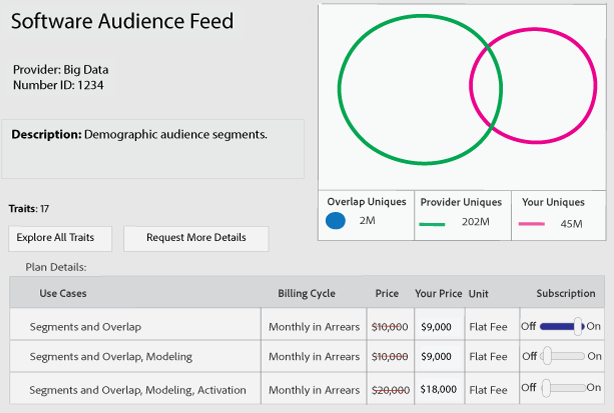

# 管理数据信息源订阅 {#manage-data-feed-subscriptions}

是数据买家开始研究并订阅公共和私有数据馈送的 [!UICONTROL Marketplace] 位置。 按照以下步骤订阅公共数据馈送。

## 订阅到公共数据馈送 {#subscript-public-data-feed}

是数据买家开始研究并订阅公共和私有数据馈送的 [!UICONTROL Marketplace] 位置。 按照以下步骤订阅公共数据馈送。

<!-- t_subscribe_feed.xml -->

订阅公用数据馈送：

1. 转到 **[!UICONTROL Audience Marketplace > Marketplace]** 。 使用搜索功能或浏览列表以查找数据馈送。

   

1. 按一下您要使用的資料摘要名稱。 如此將可開啟 [計畫詳細資訊頁面](../../../features/audience-marketplace/marketplace-data-buyers/marketplace-manage-subscriptions.md#marketplace-buyer-details) 用於選取的摘要。

   

1. 從「訂閱」表格中選擇使用案例，然後：
   * **[!UICONTROL Subscription]**&#x200B;将滑块移动到 **[!UICONTROL On]** 。
   * 单击 **[!UICONTROL Review & Subscribe]**. 这将打开 [!UICONTROL Terms and Conditions] 窗口。

   

1. [!UICONTROL Terms and Conditions]在窗口中：

   * **重要：** 離開 **[!UICONTROL ID sync]** 核取方塊。 此設定有助於改善與資料提供者的符合率。
   * 核取條款與條件方塊，然後按一下 **[!UICONTROL Accept]** 以完成訂閱程式。

   

### 后续步骤

订阅数据馈送后：

* 檢查您的以驗證訂閱 [!UICONTROL Traits] 資料夾。 请参阅 [ 存储以了解订阅的数据馈送 ](../../../features/audience-marketplace/marketplace-data-buyers/marketplace-manage-subscriptions.md#find-subscribed-data-fee) 。

* 檢閱帳單和付款檔案。 请参阅下面的相关链接。

### 最佳实践 {#best-practices}

以下是我们建议您在使用时 [!UICONTROL Audience Marketplace] 关注的一套最佳实践：

在探索新的第三和第二方数据集 [!UICONTROL Audience Marketplace] 时，我们建议的第一步是为启用数据馈送 [!UICONTROL Segments & Overlap] 。 这允许用户通过构建区段来评估受众的大小，以及运行重叠报表来获取初始受众分析数据，从而浏览 data。 大多数数据提供程序优惠免费的此用例，因此您无需额外成本即可执行此分析。

运行重叠报表时，关注这些最佳实践以确保您获得有用的结果。

1. 確保您的重疊資料集在資料型別和收集方法方面類似，例如：
   * 訪客地理位置
   * Cookie與行動ID的比較
   * 回顾窗口
   * 離線與線上活動
   * 資料提供者重新整理資料的頻率

1. 重疊可能會隨著時間稍微增加，因此在執行重疊報表前，請確定最多允許30天過去，以允許同步資料。
1. 如果您在多個行銷活動中使用來自資料提供者的資料，重疊可能會增加。
和方案。 這允許來自兩個資料集的使用者有更多機會進行同步。
1. 無法保證您的資料集之間會重疊。 若要重疊有效，客戶資料集的使用者必須在報告時間範圍內與資料提供者資料集建立關聯。 如果客戶的媒體資料未提供給資料提供者資料集中的使用者，則絕不會發生重疊。
1. 不要認為低重疊率是壞事。 利用低重疊率來發掘潛在客戶，並與新使用者互動。

## 訂閱私人資料摘要 {#subscript-private-data-feed}

購買者訂閱中的私人資料摘要和計畫 **[!UICONTROL Audience Marketplace > Marketplace]**.

<!-- t_private_feed.xml -->

>[!TIP]
>
>有時資料提供者可能會提供私人資料摘要的折扣。 提交訂閱要求時，您可能會想要詢問可能的折扣。

若要訂閱私人資料摘要：

1. 按一下「 」中的資料摘要名稱 [!UICONTROL Marketplace].
1. 单击 **[!UICONTROL Request Access]**. 這會開啟請求對話方塊。
1. 在「請求」對話方塊中，向提供者寫下備註，表達您對其資料摘要的興趣，然後按一下 **[!UICONTROL Send]**. 賣家將會稽核您的訊息，並核准或拒絕您的請求。 在等待核準時，「已要求」會出現在 [!UICONTROL Marketplace] 該資料摘要的清單。

   * **[!UICONTROL Request approved]**：中的狀態 [!UICONTROL Marketplace] 列出「已授予存取權」的變更，您將會收到自動通知。 此時，您可以訂閱摘要。 另請參閱 [訂閱公開資料摘要](../../../features/audience-marketplace/marketplace-data-buyers/marketplace-manage-subscriptions.md#subscript-public-data-feed) 以取得指示。
   * **[!UICONTROL Request denied]**：「已要求」文字會從 [!UICONTROL Marketplace] 摘要的清單。 您可以嘗試再次訂閱或選擇其他摘要。

## 購買者的資料摘要折扣 {#buyer-discount}

在 [!UICONTROL Audience Marketplace]，提供者可為買家提供發佈價格的折扣 [!DNL CPM] 或固定速率資料饋送。 不過，採購員看不到折扣金額 [!DNL Marketplace] 摘要清單。 但是，当您订阅私有数据馈送或请求有关特定馈送的更多信息时，也可以提出折扣。

## 请求折扣 {#request-discount}

<!-- marketplace-buyer-discounts.xml -->

<table id="table_3C6E58F593BA48EC89ACBD9A26E4E74F"> 
 <thead> 
  <tr> 
   <th colname="col1" class="entry"> 买方状态 </th> 
   <th colname="col2" class="entry"> 描述 </th> 
  </tr> 
 </thead>
 <tbody> 
  <tr> 
   <td colname="col1"> 
 <b>当前订阅者</b> 
 </td> 
   <td colname="col2"> 
如果您已订阅私人数据馈送并希望请求折扣： 
 
    <ol id="ol_A58D419EBB9349E9B1225202535130F6"> 
     <li id="li_D0DDC8AC6E9C4675AA4630D63FE8F071"> <a href="../../../features/audience-marketplace/marketplace-data-buyers/marketplace-manage-subscriptions.md#unsubscribe"> 取消订阅 </a> 数据馈送。 </li> 
     <li id="li_05A5379F2A944FB28AB39C196DDE3A1D">请联系数据提供程序并请求打折价格。 </li> 
     <li id="li_B1B5AA6F6CC64512A02D5E8861A5F266">如果提供商提供折扣，请在下一个月的 1  个圣  日重新订阅馈送。 </li> 
    </ol> </td> 
  </tr> 
  <tr> 
   <td colname="col1"> 
 <b>新私人数据馈送订阅者</b> 
 </td> 
   <td colname="col2"> 
在订阅请求中提出折扣。 请参阅 <a href="../../../features/audience-marketplace/marketplace-data-buyers/marketplace-manage-subscriptions.md#subscript-private-data-feed"> 订阅私有数据馈送 </a> 。 
 </td>
  </tr> 
  <tr> 
   <td colname="col1"> 
 <b>潛在訂閱者</b> 
 </td> 
   <td colname="col2"> 
A <a href="../../../features/audience-marketplace/marketplace-private-feeds.md"> 潛在訂閱者</a> 資料購買者已請求存取私人資料摘要、獲得賣家核准，但尚未訂閱摘要。 若要以潛在訂戶要求折扣，請執行下列步驟： 
 
    <ol id="ol_9CECDA92E7894B20AC8A777D78962188"> 
     <li id="li_618B64160CF24549AFCA73E006DCA35A">前往 <b> 「Audience Marketplace&gt;市集」</b>. </li> 
     <li id="li_FE52A06B30FC4858B48AF81954365FE9">按一下您已核准的摘要名稱。 </li> 
     <li id="li_763C050AC9464BE380D00F6085B6E540">按一下 <b> 要求更多詳細資料</b>. 在您的详细信息请求销售商那里提出折扣。 </li> 
    </ol> </td> 
  </tr> 
 </tbody> 
</table>

## 查看折扣信息源 {#review-discounted-feeds}

要查看您的折扣信息源：

1. 前往 **[!UICONTROL Audience Marketplace > Marketplace]**.
1. 按一下您已訂閱的摘要名稱。
1. 檢視 [!UICONTROL Price] 和 [!UICONTROL Your Price] 中的欄 [!UICONTROL Plan Details] 表格。 如果馈送打折：

   * 原始价格使用红线进行标记。
   * 列中 [!UICONTROL Your Price] 的费用将低于列中 [!UICONTROL Price] 的费用。

在本例中，买方在中 **[!UICONTROL Software Audience Feed]** 的 [!UICONTROL Segments and Overlap] 计划上获得10% 的折扣。

## 查找订阅的信息源数据 {#find-subscribed-data-fee}

資料摘要的資料（特徵）會顯示在其專屬的特徵儲存資料夾中。 转到 **[!UICONTROL Audience Data > Traits]** 并展开 **[!UICONTROL 3rd-Party Data]** 文件夹以视图，并使用订阅的馈送中的特征。 数据提供程序中命名的子文件夹 Look。 其中包含的文件夹命名在单个数据馈送和馈送提供的列表特征之后。

<!-- marketplace-feed-storage.xml -->

## 取消订阅数据馈送 {#unsubscribe}

数据买家取消订阅来自中 **[!UICONTROL Audience Marketplace > Marketplace]** 的数据馈送和计划。

<!-- t_unsubscribe_feed.xml -->

从数据馈送中取消订阅：

1. 单击中 [!UICONTROL Marketplace] 的数据馈送名称。
1. 在 [!UICONTROL Use Case] 區段尋找您要使用的計畫並移動 **[!UICONTROL Subscription]** 滑桿至 **[!UICONTROL Off]**.

## 資料摘要停用：發生原因和回應方式 {#data-feed-deactivation-reasons}

在 [!UICONTROL Audience Marketplace]，資料提供者可以撤銷您訂閱資料摘要的存取權。 如果發生這種狀況，請不要驚慌。 我們為您提供支援。 請參閱本節以瞭解與資料摘要停用相關的流程和程式。

## 資料摘要停用的常見原因 {#reasons-for-deactivation}

<!-- marketplace-subscriber-deactivated.xml -->

如果您訂閱的摘要已關閉，可能會令人困惑或甚至不快。 但是，由于各种原因，数据提供程序可以停用数据馈送。 一些常见原因包括：

* **帐单：如果您对费用付款的持续延迟或您无法支付费用，则数据提供商将停用馈送。**
* **信息源更新：** 数据提供程序在更新其馈送分类或成本结构时，需要取消激活馈送。
* **非活动买家：** 如果订户在长时间内没有显示任何开支，则数据提供商保留取消激活馈送的权利。
* **非作用中賣家：** 離開的資料提供者 [!UICONTROL Audience Marketplace] 將會停用並刪除其所有資料摘要。

>[!TIP]
>
>如果您认为误停了某个数据馈送，请直接联系您的数据提供程序。 您 [!DNL Adobe] 的顾问可以帮助您了解联系信息或其他支持。

## 停用电子邮件 {#deactivation-email}

当数据提供程序停用某个数据馈送时， [!DNL Audience Manager] 会向拥有 [!UICONTROL Administrator] 权限的公司中的用户发送电子邮件。 有时电子邮件过滤器会将此邮件作为垃圾邮件进行分类。 因此，您可能会错过此重要通知。 为帮助您识别停用消息，此电子邮件包含以下元素：

* **從：** 停用電子郵件來自 `aam-noreply@adobe.com`. 專業秘訣：請勿回覆此電子郵件。

* **主旨列：** 訂閱 *此處為資料摘要的名稱* 「 」已取消。

* **附件：** 此電子郵件包含標題為「 」的附件 `list-of-affected-entities-by-feed-revocation.csv`.」 這麼說很複雜，因為附件中列出取消的摘要中包含的所有特徵。 身為資料購買者，您應該檢閱此附件。 它可協助您尋找及移除區段中已停用的特徵，並且 [演演算法模型](../../../features/algorithmic-models/understanding-models.md).

## 已停用的特徵清單 {#deactivation-trait-list}

停用電子郵件隨附的清單包含下列欄位。

<table id="table_5C3800F9D8AA43EFAB4690959A721F63"> 
 <thead> 
  <tr> 
   <th colname="col1" class="entry"> 字段 </th> 
   <th colname="col2" class="entry"> 描述 </th> 
  </tr> 
 </thead>
 <tbody> 
  <tr> 
   <td colname="col1"> 
<b> 資料摘要ID</b> 
 </td> 
   <td colname="col2"> 
已停用資料摘要的ID。 
 </td> 
  </tr> 
  <tr> 
   <td colname="col1"> 
<b> 数据馈送名称</b> 
 </td> 
   <td colname="col2"> 
已停用数据馈送的名称。 
 </td> 
  </tr> 
  <tr> 
   <td colname="col1"> 
<b> 特征 SID</b> 
 </td> 
   <td colname="col2"> 
停用的特征 Id。 
 </td> 
  </tr> 
  <tr> 
   <td colname="col1"> 
<b> 特征名称</b> 
 </td> 
   <td colname="col2"> 
停用的特征名称。 
 </td> 
  </tr> 
  <tr> 
   <td colname="col1"> 
<b> 区段 SID</b> 
 </td> 
   <td colname="col2"> 
包含停用特征的区段 ID。 
 </td> 
  </tr> 
  <tr> 
   <td colname="col1"> 
<b> 区段名称</b> 
 </td> 
   <td colname="col2"> 
包含停用特征的区段的名称。 
 </td> 
  </tr> 
  <tr> 
   <td colname="col1"> 
<b> Algo 模型 ID</b> 
 </td> 
   <td colname="col2"> 
包含已停用特徵的演演算法模型ID。 
 </td> 
  </tr> 
  <tr> 
   <td colname="col1"> 
<b> 演演算法模型名稱</b> 
 </td> 
   <td colname="col2"> 
包含已停用特徵的演演算法模型名稱。 
 </td> 
  </tr> 
 </tbody> 
</table>

## 移除已停用的特徵 {#remove-deactivated-traits}

作为数据购买者，您负责从您的所有活动/正在使用或不活动的区段中删除已取消的馈送中的特征。 删除选项包括：

* 使用 [ REST api ](../../../api/rest-api-main/rest-api-main.md) 或 [ 批量管理工具 ](../../../reference/bulk-management-tools/bulk-management-intro.md) 批量删除。

* 手动搜索受影响的区段，并删除使用 [!UICONTROL Segment Builder] 的禁用特征。 请参阅 [ 移除领域 ](../../../features/segments/segment-builder.md#segment-builder-controls-traits) 中的特征。

>[!NOTE]
>
>從使用中的演演算法模型或目的地中移除特徵，會影響規模和鎖定目標的準確性。 儘可能嘗試將已撤銷的特徵取代為新的使用中特徵。

[取消訂閱已停用的資料摘要](../../../features/audience-marketplace/marketplace-data-buyers/marketplace-manage-subscriptions.md#unsubscribe) 移除帳戶中所有已撤銷的特徵後。 如果這是臨時停用，您可以在資料提供者完成其所需的變更並重新啟用摘要後重新訂閱。 与大多数情况一样，与合作伙伴的良好沟通（数据提供程序和 [!DNL Adobe] ）可帮助您完成此过程。

## 了解受众市场中的计划详细信息页面 {#marketplace-buyer-details}

当您在中 [!UICONTROL Marketplace] 单击数据计划的名称时， [!DNL Audience Manager] 将提供可帮助您做出有关订阅数据馈送的通知选项的信息。

<!-- marketplace-buyer-details.xml -->

此页面可为您提供以下信息：

1. **基本計畫資訊**. 這包括摘要資訊，例如：
   * 数据馈送名称。 例如，如上所示，此馈送的名称为 &quot;示例数据馈送&quot;。
   * 資料提供者的名稱；
   * 資料摘要ID；
   * 描述;
   * 摘要中的特徵數量；

1. 計畫資訊按鈕。
   * 按一下 **[!UICONTROL Explore All Traits]** 以檢視所選資料摘要中所有特徵的詳細資訊。
   * 按一下 **[!UICONTROL Request More Details]** 向資料提供者詢問關於所選資料摘要的問題，或要求折扣。 此功能會將您的意見與問題直接傳送給資料提供者。

1. 資料摘要報表量度。 文氏圖表（和相關量度）會顯示過去30天的特性重疊資料。 另請參閱 [Marketplace：關於](marketplace-data-buyers.md#about-marketplace) 以取得詳細資訊。
   * **[!UICONTROL 30 Day Overlapped Uniques]**：您的帳戶中與提供者帳戶中的使用者重疊的不重複使用者人數。 有关独特用户的定义，请参阅 Audience Manager ](/help/using/reference/ids-in-aam.md) 中 id Index 中 [ 的 AAM UUID。
   * **[!UICONTROL 30 Day Provider Unique Users]**：提供商帐户的独特用户的数量。
   * **[!UICONTROL Your Unique Users]**：来自您帐户的独特用户的数量。

1. **[!UICONTROL Plan Details]** 表. 此表格顯示您可以訂閱資料摘要的使用案例，以及其定價模型。 另請參閱 [瞭解資料摘要使用案例](#use-cases).

1. 计划操作按钮。
   * 单击 **[!UICONTROL Cancel]** 以保留页面，而不进行任何更改。
   * 单击 **[!UICONTROL Review & Subscribe]** 可订阅数据馈送。 在切换 [!UICONTROL Subscription] 切换到 [!UICONTROL On] 之前，此按钮会处于灰色。 [另请参阅订阅公共数据馈送 ](#subscript-public-data-feed) ，并 [ 订阅到私有数据馈送 ](#subscript-private-data-feed) 。

## 了解数据馈送用例 {#use-cases}

[!UICONTROL Audience Marketplace]作为数据购买者，您可以购买重叠、建模和激活用例的数据。每個使用案例都是針對特定目的而設計，並限制您可以對資料執行的操作。 這些使用案例說明可協助您針對要購買的資料計畫型別做出正確的決策。

## 比較區段和重疊計畫 {#comparisons}

<!-- c_use_cases_for_buyers.xml -->

### 區段和重疊

此使用案例可讓您比較以下專案中的特徵與提供者特徵： [特徵對特徵重疊報表。](../../../reporting/dynamic-reports/trait-trait-overlap-report.md#trait-to-trait-overlap-report) 此外，您也可以建立提供者特徵或將其新增至區段，然後與 [區段對特徵](../../../reporting/dynamic-reports/segment-trait-overlap-report.md) 和 [區段對區段](../../../reporting/dynamic-reports/segment-segment-overlap-report.md) 報表。 重疊比較可協助您：

* **擴大受眾範圍：** 低重疊表示您的特徵包含您之前未曾見過的使用者。 您可能希望這些特徵能試著觸及新使用者。
* **增強現有對象：** 高度重疊表示您的特徵與資料提供者擁有的特徵類似。 您可能希望這些特徵能協助對已開發的對象進行針對性的漸進式改善。

### 算法模型

此使用案例可讓您透過評估供應商特徵與您的特徵 [演演算法建模](../../../features/algorithmic-models/understanding-models.md#understanding-models). 例如，我們的演演算法模型系統使用您其中一個特徵作為與供應商特徵進行比較的基礎。 當模型執行時，可顯示供應商特徵中的對象是否與您特徵共用類似的轉換屬性。

### 激活

此用例可让您将数据发送到 [ 目标 ](../../../features/destinations/destinations.md) 。 在中 [!DNL Audience Manager] ，目标是任何第三方系统（广告服务器、 [!DNL DSP] 、 [!DNL DMP] 、exchange 等） 任何其他系统（广告服务器、DSP、广告网络等）。但是，对于 [!UICONTROL Activation] 用例，您无法运行重叠报表或测试算法模型中的数据。

>[!MORELIKETHIS]
>
>* [CPM 数据馈送的计费和印象分配](../../../features/audience-marketplace/marketplace-data-buyers/marketplace-buyer-billing.md#cost-attribution)
>* [平整费用数据馈送的计费和印象分配](../../../features/audience-marketplace/marketplace-data-buyers/marketplace-buyer-billing.md)
>* [如何报告 CPM 使用情况](../../../features/audience-marketplace/marketplace-data-buyers/marketplace-buyer-billing.md#report-cpm-usage)
>* [订阅到公共数据馈送](../../../features/audience-marketplace/marketplace-data-buyers/marketplace-manage-subscriptions.md#subscript-public-data-feed)
>* [数据买家的折扣](../../../features/audience-marketplace/marketplace-data-buyers/marketplace-manage-subscriptions.md#buyer-discount)
>* [市场：关于](../../../features/audience-marketplace/marketplace-data-buyers/marketplace-data-buyers.md#about-marketplace)

