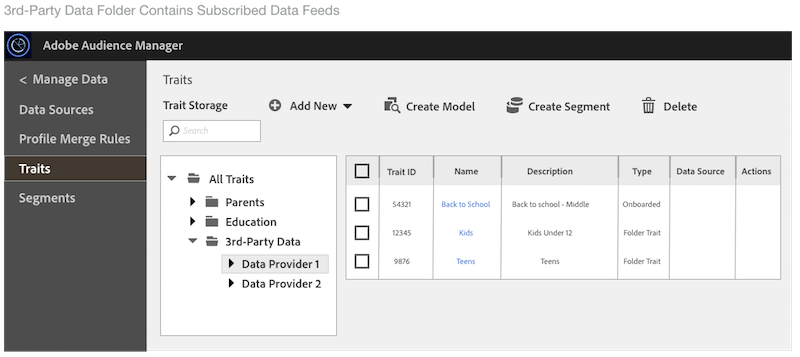

# Manage Data Feed Subscriptions {#manage-data-feed-subscriptions}

The [!UICONTROL Marketplace] is where data buyers go to research and subscribe to public and private data feeds. 按照这些步骤订阅公共数据源。

## Subscribe to a Public Data Feed {#subscript-public-data-feed}

The [!UICONTROL Marketplace] is where data buyers go to research and subscribe to public and private data feeds. 按照这些步骤订阅公共数据源。

<!-- t_subscribe_feed.xml -->

订阅公共数据源：

1. **[!UICONTROL Audience Marketplace > Marketplace]**&#x200B;转至。使用搜索功能或浏览列表以查找数据源。

   

1. 单击要使用的数据源的名称。This opens the [plan details page](../../../features/audience-marketplace/marketplace-data-buyers/marketplace-manage-subscriptions.md#marketplace-buyer-details) for the selected feed.

   

1. 从订阅表中选择一个用例，并：
   * Move the **[!UICONTROL Subscription]** slider to **[!UICONTROL On]**.
   * 单击 **[!UICONTROL Review & Subscribe]**. This opens the [!UICONTROL Terms and Conditions] window.
   

1. In the [!UICONTROL Terms and Conditions] window:

   * **重要：** 选中 **[!UICONTROL ID sync]** 复选框。此设置有助于提高与您的数据提供商的匹配率。
   * Check the terms and conditions box and click **[!UICONTROL Accept]** to complete the subscription process.
   

### 后续步骤

订阅数据源后：

* Verify the subscription by checking your [!UICONTROL Traits] folder. See [Storage for Subscribed Data Feeds](../../../features/audience-marketplace/marketplace-data-buyers/marketplace-manage-subscriptions.md#find-subscribed-data-fee).

* 查看账单和付款文档。请参阅下面的相关链接。

>[!MORE_ LIKE_ This]
>
>* [CPM数据源的结帐和印象分配](../../../features/audience-marketplace/marketplace-data-buyers/marketplace-buyer-billing.md#cost-attribution)
>* [付费数据馈送计费和印象分配](../../../features/audience-marketplace/marketplace-data-buyers/marketplace-buyer-billing.md)
>* [如何报告CPM使用情况](../../../features/audience-marketplace/marketplace-data-buyers/marketplace-buyer-billing.md#report-cpm-usage)

## Subscribe to a Private Data Feed {#subscript-private-data-feed}

Buyers subscribe to private data feeds and plans in **[!UICONTROL Audience Marketplace > Marketplace]**.

<!-- t_private_feed.xml -->

>[!TIP]
>
>有时数据提供商可能会在私人数据服务上提供折扣。提交订阅请求时，您可能希望询问可能的折扣。

订阅私人数据源：

1. Click the data feed name in the [!UICONTROL Marketplace].
1. 单击 **[!UICONTROL Request Access]**. 这将打开请求对话框。
1. In the request dialog box, write the provider a note expressing your interest in their data feed and click **[!UICONTROL Send]**. 卖家将查看您的消息，批准或拒绝您的请求。While waiting for approval, "Requested" appears in the [!UICONTROL Marketplace] list for that data feed.

   * **[!UICONTROL Request approved]**： [!UICONTROL Marketplace] 列表中的状态将变为“已授予的访问权限”，您将收到一个自动通知。此时，您可以订阅源。See [Subscribe to a Public Data Feed](../../../features/audience-marketplace/marketplace-data-buyers/marketplace-manage-subscriptions.md#subscript-public-data-feed) for instructions.
   * **[!UICONTROL Request denied]**：将从源列表中删除“请求的 [!UICONTROL Marketplace] ”文本。您可以尝试再次订阅或选择其他源。

>[!MORE_ LIKE_ This]
>
>* [订阅公共数据馈送](../../../features/audience-marketplace/marketplace-data-buyers/marketplace-manage-subscriptions.md#subscript-public-data-feed)
>* [数据购买者的折扣](../../../features/audience-marketplace/marketplace-data-buyers/marketplace-manage-subscriptions.md#buyer-discount)

## Data Feed Discounts for Buyers {#buyer-discount}

In [!UICONTROL Audience Marketplace], providers can offer buyers a discount on the published price of a [!DNL CPM] or flat rate data feed. However, discount amounts aren't visible to buyers in the [!DNL Marketplace] feed list. 但是，当您订阅私人数据源或请求有关特定源的更多信息时，您也可以要求折扣。

## Request a Discount {#request-discount}

<!-- marketplace-buyer-discounts.xml -->

<table id="table_3C6E58F593BA48EC89ACBD9A26E4E74F"> 
 <thead> 
  <tr> 
   <th colname="col1" class="entry"> 买家状态 </th> 
   <th colname="col2" class="entry"> 描述 </th> 
  </tr> 
 </thead>
 <tbody> 
  <tr> 
   <td colname="col1"> 
 <b>当前订阅者</b> 
 </td> 
   <td colname="col2"> 
如果您已经订阅了私人数据源并希望获得折扣： 
 
    <ol id="ol_A58D419EBB9349E9B1225202535130F6"> 
     <li id="li_D0DDC8AC6E9C4675AA4630D63FE8F071"> <a href="../../../features/audience-marketplace/marketplace-data-buyers/marketplace-manage-subscriptions.md#unsubscribe"> 取消订阅</a> 数据源。 </li> 
     <li id="li_05A5379F2A944FB28AB39C196DDE3A1D">联系数据提供商并请求折扣价。 </li> 
     <li id="li_B1B5AA6F6CC64512A02D5E8861A5F266">If the provider gives you a discount, re-subscribe to the feed on the 1st day of the next month. </li> 
    </ol> </td> 
  </tr> 
  <tr> 
   <td colname="col1"> 
 <b>新的私人数据供给用户</b> 
 </td> 
   <td colname="col2"> 
在订阅请求中申请折扣。See <a href="../../../features/audience-marketplace/marketplace-data-buyers/marketplace-manage-subscriptions.md#subscript-private-data-feed"> Subscribe to a Private Data Feed</a>. 
 </td>
  </tr> 
  <tr> 
   <td colname="col1"> 
 <b>潜在订阅者</b> 
 </td> 
   <td colname="col2"> 
<a href="../../../features/audience-marketplace/marketplace-private-feeds.md"> 潜在订阅者</a> 是一名数据购买者，请求访问私人数据源、获得卖家批准但未订阅源。申请作为潜在订阅者的折扣： 
 
    <ol id="ol_9CECDA92E7894B20AC8A777D78962188"> 
     <li id="li_618B64160CF24549AFCA73E006DCA35A">Go to <b> Audience Marketplace &gt; Marketplace</b>. </li> 
     <li id="li_FE52A06B30FC4858B48AF81954365FE9">单击您已批准的源的名称。 </li> 
     <li id="li_763C050AC9464BE380D00F6085B6E540">Click <b> Request More Details</b>. 向卖家索取详细信息请求折扣。 </li> 
    </ol> </td> 
  </tr> 
 </tbody> 
</table>

## Review Discounted Feeds {#review-discounted-feeds}

要查看您的折扣源，请执行以下操作：

1. **[!UICONTROL Audience Marketplace > Marketplace]**&#x200B;转至。
1. 单击已订阅的源的名称。
1. Look at the [!UICONTROL Price] and [!UICONTROL Your Price] columns in the [!UICONTROL Plan Details] table. 如果源被折扣：

   * 原始价格用红线标出。
   * [!UICONTROL Your Price] 列中的费用将低于 [!UICONTROL Price] 列中的费用。

In the example, the buyer gets a 10% discount on the [!UICONTROL Segments and Overlap] plan in the **[!UICONTROL Software Audience Feed]**.

>[!MORE_ LIKE_ This]
>
>* [市场：关于关于](../../../features/audience-marketplace/marketplace-data-buyers/marketplace-data-buyers.md#about-marketplace)

## 查找订阅的信息源数据 {#find-subscribed-data-fee}

数据源的数据(特征)显示在其自己的特征存储文件夹中。Go to **[!UICONTROL Audience Data > Traits]** and expand the **[!UICONTROL 3rd-Party Data]** folder to view and work with the traits in your subscribed feeds. 查找在数据提供程序之后命名的子文件夹。这些文件夹包含按源提供的单个数据源和列表特征命名的文件夹。

<!-- marketplace-feed-storage.xml -->

>[!MORE_ LIKE_ This]
>
>* [订阅公共数据馈送](../../../features/audience-marketplace/marketplace-data-buyers/marketplace-manage-subscriptions.md#subscript-public-data-feed)

## Unsubscribe from a Data Feed {#unsubscribe}

Data buyers unsubscribe from data feeds and plans in **[!UICONTROL Audience Marketplace > Marketplace]**.

<!-- t_unsubscribe_feed.xml -->

要取消订阅数据源，请执行以下操作：

1. Click the data feed name in the [!UICONTROL Marketplace].
1. [!UICONTROL Use Case] 在部分中，找到要使用的计划并将 **[!UICONTROL Subscription]** 滑块移动到 **[!UICONTROL Off]**。

## Data Feed Deactivation: Why It Happens and How to Respond {#data-feed-deactivation-reasons}

In [!UICONTROL Audience Marketplace], data providers can revoke access to your subscribed data feeds. 如果您发生这种情况，请不要进行培训。我们可以满足您的需求。阅读本节，了解与数据源取消激活相关的流程和程序。

## Common Reasons for Data Feed Deactivation {#reasons-for-deactivation}

<!-- marketplace-subscriber-deactivated.xml -->

如果您订阅的源被关闭，则可能会眩目或更上一层楼。但是，出于各种原因，数据提供程序都可以取消激活数据源。一些常见原因包括：

* **帐单：** 如果您通过支付费用持续迟到或未支付费用，数据提供商将停用某个源。
* **供给更新：** 当数据提供商更新其源分类或费用结构时，需要取消激活源。
* **不活动的购买者：** 如果订阅者在长期内不显示支出，数据提供商保留取消激活源的权利。
* **非活动销售者：** 离开 [!UICONTROL Audience Marketplace] 的数据提供商将停用并删除其所有数据源。

>[!TIP]
>
>如果您认为数据源被错误地取消激活，请直接与您的数据提供商联系。[!DNL Adobe] 您的顾问可以为您提供联系信息或其他支持。

## Deactivation Email {#deactivation-email}

When a data provider deactivates one of your data feeds, [!DNL Audience Manager] sends an email to the users in your company who have [!UICONTROL Administrator] permissions. 有时电子邮件过滤器会将此消息分类为垃圾邮件。因此，您可能会错过此重要通知。为了帮助您识别取消激活消息，此电子邮件包含以下元素：

* **发件人：** 取消激活电子邮件 `aam-noreply@adobe.com`来自。Pro提示：不要回复此电子邮件。

* **主题行：** 此处已取消订阅数据源 ** 的订阅。

* **附件：** 该电子邮件包含标题为“ `list-of-affected-entities-by-feed-revocation.csv`”的附件。这是一种复合方式，表示附件列出了已取消源中包含的所有特征。作为数据购买者，您应该查看此附件。It will help you find and remove deactivated traits from your segments and [algorithmic models](../../../features/algorithmic-models/understanding-models.md).

## Deactivated Trait List {#deactivation-trait-list}

取消激活电子邮件附带的列表包含以下字段。

<table id="table_5C3800F9D8AA43EFAB4690959A721F63"> 
 <thead> 
  <tr> 
   <th colname="col1" class="entry"> 字段 </th> 
   <th colname="col2" class="entry"> 描述 </th> 
  </tr> 
 </thead>
 <tbody> 
  <tr> 
   <td colname="col1"> 
<b> 数据源ID</b> 
 </td> 
   <td colname="col2"> 
取消激活的数据源的ID。 
 </td> 
  </tr> 
  <tr> 
   <td colname="col1"> 
<b> 数据源名称</b> 
 </td> 
   <td colname="col2"> 
取消激活的数据源的名称。 
 </td> 
  </tr> 
  <tr> 
   <td colname="col1"> 
<b> 特征SID</b> 
 </td> 
   <td colname="col2"> 
取消激活的特征ID。 
 </td> 
  </tr> 
  <tr> 
   <td colname="col1"> 
<b> 特征名称</b> 
 </td> 
   <td colname="col2"> 
取消激活的特征名称。 
 </td> 
  </tr> 
  <tr> 
   <td colname="col1"> 
<b> 细分SID</b> 
 </td> 
   <td colname="col2"> 
包含取消激活特征的区段的ID。 
 </td> 
  </tr> 
  <tr> 
   <td colname="col1"> 
<b> 区段名称</b> 
 </td> 
   <td colname="col2"> 
包含已取消激活特征的区段名称。 
 </td> 
  </tr> 
  <tr> 
   <td colname="col1"> 
<b> Argo Model ID</b> 
 </td> 
   <td colname="col2"> 
包含已取消激活特征的算法模型的ID。 
 </td> 
  </tr> 
  <tr> 
   <td colname="col1"> 
<b> Argo Model Name</b> 
 </td> 
   <td colname="col2"> 
包含已停用特征的算法模型的名称。 
 </td> 
  </tr> 
 </tbody> 
</table>

## Remove Deactivated Traits {#remove-deactivated-traits}

作为数据购买者，您负责删除所有活动/使用中或无效区段中取消的信息源中的特征。删除选项包括：

* Bulk removal with the [REST APIs](../../../api/rest-api-main/rest-api-main.md) or the [Bulk Management Tools](../../../reference/bulk-management-tools/bulk-management-intro.md).

* Manually search for affected segments and remove deactivated traits using [!UICONTROL Segment Builder]. See [Remove Traits from a Segment](../../../features/segments/segment-builder.md#segment-builder-controls-traits).

>[!NOTE]
>
>从活动的算法模型或目标中删除特征会影响缩放和定位准确性。尝试在可能的情况下使用新的活动特征替换撤销的特征。

[从帐户删除所有已吊销的特征](../../../features/audience-marketplace/marketplace-data-buyers/marketplace-manage-subscriptions.md#unsubscribe) 后，取消订阅已取消激活的数据源。如果这是临时取消激活，您可以在数据提供程序完成所需的更改并重新激活源后重新订阅。As with most things, good communication with your partners (the data provider and [!DNL Adobe]) can help you work through this process.

## 了解受众市场中的计划详细信息页面 {#marketplace-buyer-details}

When you click the name of a data plan in the [!UICONTROL Marketplace], [!DNL Audience Manager] provides information that can help you make informed choices about subscribing to a data feed.

<!-- marketplace-buyer-details.xml -->

此页面提供以下信息：

1. **基本计划信息**。这包括供给信息，如：
   * 数据源名。例如，如上图所示，此源的名称为“示例数据源”。
   * 数据提供程序的名称；
   * 数据馈送ID；
   * 描述;
   * 源中的特征数量；

1. 计划信息按钮。
   * Click **[!UICONTROL Explore All Traits]** to see details about all the traits in the selected data feed.
   * Click **[!UICONTROL Request More Details]** to ask the data provider questions about the selected data feed or to request a discount. 此功能将您的注释和问题直接发送到数据提供程序。

1. 数据馈送报告指标。Venn图(及相关指标)显示了过去30天特征重叠数据。See [The Marketplace: About](marketplace-data-buyers.md#about-marketplace) for details.
   * **[!UICONTROL 30 Day Overlapped Uniques]**：帐户中与提供者帐户中的用户重叠的唯一用户数量。For a definition of unique users, see AAM UUID in the [Index of IDs in Audience Manager](/help/using/reference/ids-in-aam.md).
   * **[!UICONTROL 30 Day Provider Unique Users]**：来自提供者帐户的唯一用户的数量。
   * **[!UICONTROL Your Unique Users]**：来自您帐户的唯一用户的数量。

1. **[!UICONTROL Plan Details]** 表。下表显示了可订阅数据源的用例及其定价模式。See [Understanding Data Feed Use Cases](#use-cases).

1. 计划操作按钮。
   * Click **[!UICONTROL Cancel]** to leave the page without making changes.
   * Click **[!UICONTROL Review & Subscribe]** to subscribe to a data feed. This button is greyed out until you switch a [!UICONTROL Subscription] toggle to [!UICONTROL On]. See also [Subscribe to a Public Data Feed](#subscript-public-data-feed) and [Subscribe to a Private Data Feed](#subscript-private-data-feed).

>[!MORE_ LIKE_ This]
>
>* [市场：关于关于](../../../features/audience-marketplace/marketplace-data-buyers/marketplace-data-buyers.md#about-marketplace)

## Understanding Data Feed Use Cases {#use-cases}

As an [!UICONTROL Audience Marketplace] data buyer, you can purchase data for overlap, modeling, and activation use cases. 每个用例都是专为特定用途设计的，限制了您对数据的处理。这些使用案例描述可以帮助您做出关于哪种类型的数据计划的正确决策。

## Make Comparisons with Segments and Overlap Plans {#comparisons}

<!-- c_use_cases_for_buyers.xml -->

### 区段和重叠

This use case lets you compare your traits with provider traits in a [trait-to-trait overlap report.](../../../reporting/dynamic-reports/trait-trait-overlap-report.md#trait-to-trait-overlap-report) 此外，您可以为区段创建提供商特征或添加供应商特征，并与 [区段到特征](../../../reporting/dynamic-reports/segment-trait-overlap-report.md) 和 [区段到细分](../../../reporting/dynamic-reports/segment-segment-overlap-report.md) 报表进行更多比较。重叠比较可以帮助您：

* **扩大受众范围：** 重叠部分表示您的特征包含您之前未见过的用户。您可能希望这些特征尝试接触新用户。
* **增强现有受众：** 重叠部分表示您的特征类似于数据提供商拥有的特征。您可能希望这些特征有助于为已经开发的受众做出有针对性的增量改进。

### 算法模型

This use case lets you evaluate supplier traits against your traits with [algorithmic modeling](../../../features/algorithmic-models/understanding-models.md#understanding-models). 例如，我们的算法建模系统使用特征之一作为对比供应商特征的基础。当该模型运行时，它可以显示供应商特征中的受众是否与您的特征共享类似的转化属性。

### 激活

This use case lets you send data to a [destination](../../../features/destinations/destinations.md). In [!UICONTROL Audience Manager], a destination is any third-party system (ad server, [!DNL DSP], [!DNL DMP], exchange, etc.) 您希望与之共享数据的数据。However, with an [!UICONTROL Activation] use case, you cannot run overlap reports or test the data in an algorithmic model.
