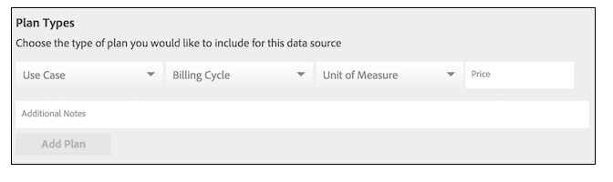

# 创建、定价和管理数据信息源 {#create-price-and-manage-data-feeds}

## 创建公共或专用数据馈送{#create-public-private-data-feed}

数据馈送需要名称、说明、数据源和计划类型。 在保存并激活源之前，源处于禁用状态。 在&#x200B;**[!UICONTROL Audience Marketplace > My Shared Data]**&#x200B;中设置公共或专用数据馈送。 仅供数据销售者使用。

<!-- t_data_feed.xml -->

您必须具有管理员权限才能创建公共或专用数据源。
要创建数据馈送，请执行以下操作：

1. 单击 **[!UICONTROL New Data Feed]**.
1. 命名数据馈送。 数据购买者可以根据名称搜索您的源。
1. 提供简短说明（最多255个字符）。

   描述得当，应准确描述您的源。 例如，您可以包含营销类别、人口统计和地理覆盖范围的文本（例如[!DNL US]或北美）。 描述文本是可搜索的，可帮助买家查找或评估您的源。 良好的描述是吸引用户加入数据馈送的重要部分。
1. 从&#x200B;**[!UICONTROL Data Source]**&#x200B;选项中选择数据源。 数据馈送仅限于单个数据源。 不能将多个数据源分配给同一数据馈送。

   >[!IMPORTANT]
   >
   >属于此数据源的任何当前和未来特征都将作为此源的一部分与您的数据购买者共享。

1. 在[!UICONTROL Plan Types]中，选择要使用的选项并单击&#x200B;**[!UICONTROL Add Plan]**。

   源可以包含多个计划。 计划可包含多个使用案例。 有关详细信息，请参阅[数据馈送的计划类型](../../../features/audience-marketplace/marketplace-data-providers/marketplace-create-manage-feeds.md#plan-types)。

1. 单击&#x200B;**[!UICONTROL Save]**&#x200B;以保存数据源&#x200B;*而不激活*。
1. 要保存并激活数据馈送，请执行以下操作：
   1. 将&#x200B;**[!UICONTROL Availability]**&#x200B;滑块移动到&#x200B;**[!UICONTROL Active]**。
   1. 单击 **[!UICONTROL Save]**.

   >[!NOTE]
   >
   >* 无法删除已保存和已激活的数据馈送。
   >* 采购员只能查看活动源。

### 可选：创建专用数据馈送

在[!UICONTROL Settings]部分中，将滑块移动到：

* **[!UICONTROL Private]** 和 **[!UICONTROL Branded]**:买方的列表 [!UICONTROL Marketplace] 在提供者列中显示卖方的姓名，所有其他数据都处于隐藏状态。

* **[!UICONTROL Private]** 和 **[!UICONTROL Unbranded]**:采购员的列表 [!UICONTROL Marketplace] 仅显示数据馈送名称和说明。数据提供程序名称显示为[!UICONTROL Private Seller]。

要查看私有数据馈送对购买者的外观，请参阅[私有数据馈送](../../../features/audience-marketplace/marketplace-private-feeds.md)中的“购买者”部分。

## 停用订阅者的数据馈送 {#deactivate-data-feed}

作为[!UICONTROL Audience Marketplace]数据提供者，您可以撤销买方对订阅数据馈送的访问权。 您可能希望将买方从源中删除，原因包括延迟付款/不支付费用或他们不当使用特征数据。

<!-- marketplace-deactiva4te-subscribers.xml -->

要撤销订阅者：

1. 在[!UICONTROL My Shared Data]中，找到订阅者正在使用的源。

   >[!NOTE]
   >
   >包含过期帐户的数据馈送带有三角形/感叹号图标标记。

1. 在[!UICONTROL Subscribers]列中，单击对订阅者计数的蓝色数字。 这将打开订阅详细信息页面。
1. 将&#x200B;**[!UICONTROL Subscription]**&#x200B;滑块移动到&#x200B;**[!UICONTROL Off]**。 这将打开确认对话框窗口。
1. 在[!UICONTROL Confirmation]弹出窗口中，单击&#x200B;**[!UICONTROL Yes]**&#x200B;取消激活订阅，或单击&#x200B;**[!UICONTROL Cancel]**&#x200B;退出而不更改订阅。

### 取消激活订阅后发生的情况

撤销对数据馈送的访问权限会向数据购买者帐户中的所有管理员用户发送通知电子邮件。 该电子邮件包含一个附件，列表撤销了特征。 此列表可帮助订阅者从其区段和模型中查找和删除取消激活的特征。

### 计费和信息源取消激活

在您删除对数据馈送的访问权后，订阅者将负责上个月或当月的费用，具体取决于您取消激活该馈送的时间。

## 数据馈送{#plan-types}的计划类型

[!DNL Plan types] 是数据馈送中的必 [!UICONTROL Audience Marketplace] 要组件。作为数据提供商，您可以为源创建多个使用案例和价格选项。 此外，为每个数据馈送创建几个计划可能是一个不错的策略。 这为购买者提供了不同的选择，供他们在寻找要建模的数据或将数据发送到目标时进行选择。

[创建要选](../../../features/audience-marketplace/marketplace-data-providers/marketplace-create-manage-feeds.md#create-public-private-data-feed) 择的数据 [!UICONTROL Plan Types]。

## 计划类型和用例选项{#plan-types-use-cases}

<!-- c_feed_options.xml -->

通过[!UICONTROL Use Case]设置，销售者可以控制购买者如何使用您的数据。

### 区段和重叠

**[!UICONTROL Segments and Overlap]**&#x200B;用例创建一个计划，让买家可以在[特征到特征重叠报表](../../../reporting/dynamic-reports/trait-trait-overlap-report.md#trait-to-trait-overlap-report)中比较特征数据。 此外，买家可以将您的数据添加到区段，并与[ segment-to-trait](../../../reporting/dynamic-reports/segment-trait-overlap-report.md)和[segment-to-segment](../../../reporting/dynamic-reports/segment-segment-overlap-report.md)报表进行比较。

每个数据馈送必须至少包含一个[!UICONTROL Segments and Overlap]用例。 如果数据馈送中不包含[!UICONTROL Segments and Overlap]用例（单独或与其他用例组合），则购买者不能订阅数据馈送中的其他计划。

重叠比较有助于买家：

* **扩大受众范围：** 低重叠表明您的特征包含买方之前从未见过的用户。因此，买家可能希望这些特征将新用户添加到其受众细分。
* **增强现有受众:** 重叠程度高意味着您的特征包含的用户与买方已知的相似。因此，买家可能希望这些特征有助于对已开发的受众进行有针对性的渐进改进。

为此用例定价如下：

* 单位：固定费用
* 价格：免费（0.00美元）

### 建模

**[!UICONTROL Modeling]**&#x200B;用例创建一个计划，让买家用[算法建模](../../../features/algorithmic-models/understanding-models.md#understanding-models)将您的特征与他们的特征进行比较。 买家查看模型结果，在您的数据中找到与自己具有相似转换属性的新受众。 为此用例定价如下：

* 单位：固定费用
* 价格：折扣或市价

### 激活

**[!UICONTROL Activation]**&#x200B;用例允许买家将数据发送到[destination](../../../features/destinations/destinations.md)。 在此用例中，买家无法将数据与重叠报表或算法模型进行比较。 为此用例定价如下：

* 单位：[!DNL CPM]
* 价格：[!DNL CPM]市场

## 帐单和价格选项{#billing}

帐单和价格选项控制了购买者为您的数据付费的方式。

<table id="table_CCEAAF24295942EA82F20753827D1A23"> 
 <thead> 
  <tr> 
   <th colname="col1" class="entry"> 选项 </th> 
   <th colname="col2" class="entry"> 描述 </th>
  </tr> 
 </thead>
 <tbody> 
  <tr> 
   <td colname="col1"> <b> 账单周期</b> </td> 
   <td colname="col2"> <b> 每月在阿</b> 雷阿西斯是唯一的选择。结算周期于每月第10天结束。 </td> 
  </tr> 
  <tr> 
   <td colname="col1"> <b> 单位</b> </td> 
   <td colname="col2">按CPM费率或固定费用向数据购买者收费。 
    <ul id="ul_D5F125E0F7364C568D9F3107E090059D"> 
     <li id="li_A79F47FFC1DC4B9DADC014621A9C12A1"> 使用CPM定价时，数据购买者必须自行报告使用情况。 </li> 
     <li id="li_DFED3194854A492F9DD0E7BA1A655E96">由于定价固定，数据购买者不会报告使用情况，因为他们收取固定费用。 </li> 
    </ul> </td>
  </tr> 
  <tr> 
   <td colname="col1"> <b> 价格</b> </td>
   <td colname="col2"> 卖家以CPM费率或固定费用价格向买方收取的金额（以美元为单位）。 </td>
  </tr> 
 </tbody> 
</table>

## 计划说明{#plan-notes}

在&#x200B;**[!UICONTROL Additional Notes]**&#x200B;字段中，请花一些时间描述源中的每个数据计划。 简短的说明有助于购买者了解数据馈送中每个计划的内容或用途。 在搜索或评估新数据源时，购买者可以读取数据馈送和计划说明。

## 管理专用数据馈送请求{#manage-private-requests}

用于管理来自买方的私人源请求的提供商工作流。

要审核、批准或拒绝采购员请求，请转到[!UICONTROL My Shared Data]并：

<!-- t_private_feed_workflows.xml -->

1. 单击专用数据馈送的名称。
2. 单击&#x200B;**[!UICONTROL Access Requests]**&#x200B;查看所有希望访问您的数据馈送的购买者。
3. 在每个请求框的[!UICONTROL Allow Access]部分，单击复选标记以批准请求或单击X以拒绝访问。
4. 在确认弹出窗口中确认或取消选定的操作。

## 数据提供者{#discounts}的折扣

在[!UICONTROL Audience Marketplace]中，折扣允许您降低单个订阅者的数据馈送的发布价格。 您可以向已提交订阅请求的订阅者或已请求有关数据馈送的详细信息的订阅者优惠折扣。 折扣适用于[!DNL CPM]和统一费率源。 当您希望为新客户提供订阅激励或奖励客户忠诚度时，折扣会很有帮助。

## 对数据馈送{#apply-discounts}应用折扣

<!-- marketplace-seller-discounts.xml -->

要折扣源，请在折扣字段中添加折扣金额(%)并确认您的更改。 数据提供者可以从以下任一方式折扣[!UICONTROL Audience Marketplace]中的数据馈送：

* **[!UICONTROL My Shared Data > Potential Subscribers]**
* **[!UICONTROL My Shared Data > Details Requests]**

在这些示例中，卖家为[!UICONTROL Software Audience]数据馈送增加了10%的折扣。

## 查看折扣源{#review-discounted-feeds}

数据提供商可以在&#x200B;**[!UICONTROL Audience Marketplace > My Shared Data > Current Subscribers]**&#x200B;中查看其所有订阅者和折扣源。

>[!MORELIKETHIS]
>
>* [专用数据信息源](../../../features/audience-marketplace/marketplace-private-feeds.md)

