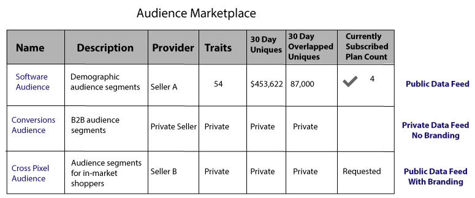

# 面向数据提供商的 Audience Marketplace {#audience-marketplace-for-data-providers}

資料提供者想要從中銷售資料的概述和工作流程 [!DNL Audience Manager].

<!-- c_marketplace_provider.xml -->

>[!NOTE]
>
>[角色型許可權](../../../reporting/reports-dashboard.md) 控制對的存取 [!UICONTROL Audience Marketplace] 功能。
>
>* 管理員可以建立資料摘要、管理訂閱者，以及訂閱資料摘要。
>* 使用者只能搜尋和檢視摘要。

## 我的共用資料：關於 {#my-shared-data-about}

[!UICONTROL My Shared Data] 是 [!UICONTROL Audience Marketplace] 適用於資料提供者（賣家）的功能。 身為提供者，它可讓您將特徵捆綁至資料摘要，並以固定費用或透過下列方法銷售： [!DNL CPM] 從以下日期對買家進行評分： [!DNL Audience Manager]. 啟用後，買家只需按幾下滑鼠即可訂閱摘要。 此外，簡單的報告工具可追蹤收入並管理訂閱者。 最後，使用 [!UICONTROL Audience Marketplace]， [!DNL Adobe] 會為您處理發票、帳單和費用支付。 這些功能可讓您專注於建立買家想要的有效且有利可圖的資料摘要。

<!-- c_myshared_data.xml -->

功能包括：

* **搜尋：** 搜尋欄位可協助您依名稱或文字說明尋找資料摘要。
* **名稱：** 資料摘要的名稱。 您可以透過私人、不記名資料饋送來向買家隱藏此內容。
* **說明：** 告知買家您的資料摘要內容。
* **特徵：** 每個資料摘要中的特徵數量。 您可以透過私人資料摘要向買家隱藏此內容。
* **過去30天不重複：** 過去30天內檢視的不重複使用者人數。 您可以透過私人資料摘要向買家隱藏此內容。
* **上個月的總費用：** 訂閱的資料購買者缺您的金額。 報告期間於每月10日結束。 逾期帳戶會以三角形/驚歎號圖示標示。 您可以 [停用訂閱者的資料摘要](../../../features/audience-marketplace/marketplace-data-providers/marketplace-create-manage-feeds.md#deactivate-data-feed) 如果他們濫用您的資料，或他們的帳戶已逾期。
* **狀態：**  顯示摘要是作用中、非作用中、私人或公開的。
* **訂閱者：** 顯示有多少買家正在使用資料摘要。 按一下此欄中的數字，即可檢視購買者的公司名稱、訂閱、帳單和訂閱狀態。
* **要求：** 資料摘要的存取要求數目。

## 专用数据信息源 {#private-data-feeds}

在 [!UICONTROL My Shared Data]，有時摘要狀態會標示為私人。 這表示私人資料摘要。 私人資料摘要可讓賣家限制買家存取其資料，甚至資料摘要的名稱。 當賣家提供特別優惠、折扣，或當隱私權和存取控制很重要時，可以將摘要設為私人。 透過私人資料摘要，提供者會稽核並核准所有購買者存取權請求。 如需詳細資訊，請參閱 [私人資料摘要](../../../features/audience-marketplace/marketplace-private-feeds.md). 若要建立公開或私人資料摘要，請參閱 [建立公開或私人資料摘要](../../../features/audience-marketplace/marketplace-data-providers/marketplace-create-manage-feeds.md#create-public-private-data-feed).

>[!MORELIKETHIS]
>
>* [資料提供者的折扣](../../../features/audience-marketplace/marketplace-data-providers/marketplace-create-manage-feeds.md#discounts)

