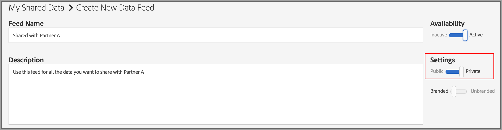

# 专用数据信息源 {#private-data-feeds}

专用数据馈送是允许提供商限制购买者访问其数据的选项。 数据提供商和购买者应在创建和订阅专用数据馈送之前，查看此信息。

<!-- c_marketplace_privatefeed.xml -->

## 提供程序的专用数据馈送{#private-data-feeds-providers}

作为提供商，您的数据馈送可以是公有的，也可以是私有的。 通过专用数据馈送，您可以限制购买者对您数据的访问，包括数据销售者的姓名。 您可能希望创建私有数据馈送以提供特殊交易、折扣，或者在隐私和访问控制很重要时。 通过专用数据馈送，您可以审核和批准购买者请求。 在您批准请求后，该信息源看起来就像是给买方的公共数据信息源。 您可以在&#x200B;**[!UICONTROL Audience Marketplace > My Shared Data]**&#x200B;中查看和管理所有馈送。 如下所示，此类型的信息源在状态列中标记为“专用”。

### 管理馈送请求

单击[!UICONTROL My Shared Data]中的专用数据馈送的名称会转到包含多个选项卡的页面。 单击选项卡以管理您的专用数据馈送请求。

下表定义了每个操作选项卡提供的角色或函数。

<table id="table_AFB429CA52A34658859448D9A5215F9F"> 
 <thead> 
  <tr> 
   <th colname="col1" class="entry"> 制表符 </th> 
   <th colname="col2" class="entry"> 描述 </th> 
  </tr> 
 </thead>
 <tbody> 
  <tr> 
   <td colname="col1"> 
 <b> 当前订阅者</b> 
 </td> 
   <td colname="col2"> 
列出订阅了私人数据馈送的已批准购买者。 
 </td> 
  </tr> 
  <tr> 
   <td colname="col1"> 
 <b> 潜在订阅者</b> 
 </td> 
   <td colname="col2"> 
列出未订阅私人数据馈送的已批准购买者。 
 
批准后，购买者可以像查看公共数据馈送一样查看数据馈送。 这样，用户便有机会在订阅之前查看和评估您的馈送。 您还可以向列为潜在订阅者的购买者提供数据馈送折扣。 购买者订阅后，其配置文件将移至<b>当前订阅者</b>。 
 </td>
  </tr> 
  <tr> 
   <td colname="col1"> 
 <b> 访问请求</b> 
 </td>
   <td colname="col2"> 
列出专用数据馈送的新订阅请求。 单击此选项卡可审核、批准或拒绝采购员请求。 

    <ul id="ul_BE0A835A90B14C05B3F63226B79D052D"> 
     <li id="li_2C5686CEB6F4430BA18AED5AD75C330A">已批准的购买者将移至<b>潜在订阅者</b>。 </li>
     <li id="li_929591FCF81E43A3881813BDBD3AC278">被拒绝的购买者将移至<b>拒绝访问</b>。 </li>
    </ul> </td>
  </tr>
  <tr> 
   <td colname="col1"> 
 <b> 详细信息请求</b> 
 </td>
   <td colname="col2"> 
列出尚未订阅数据馈送并请求获取有关您的馈送更多信息的已批准购买者。 
 
批准后，购买者可以像查看公共数据馈送一样查看数据馈送。 这样，用户便有机会在订阅之前查看和评估您的馈送。 您还可以向请求访问的购买者提供数据馈送的折扣。 响应详细信息请求会从此选项卡中删除采购员用户档案。 如果他们未订阅，则购买者资料仍位于<b>潜在订阅者</b>中。 
 </td>
  </tr>
  <tr> 
   <td colname="col1"> 
 <b> 拒绝访问</b> 
 </td> 
   <td colname="col2"> 
列出拒绝的专用数据馈送订阅请求。 
 
要重新批准被拒绝的购买者，请将拒绝状态更改为<b>允许</b>。 这会将购买者移至<b>潜在订阅者</b>。 
 </td> 
  </tr> 
 </tbody> 
</table>

### 后续步骤

以下文档可帮助您开始使用专用数据馈送。

* [创建公共或专用数据馈送](../../features/audience-marketplace/marketplace-data-providers/marketplace-create-manage-feeds.md#create-public-private-data-feed)
* [审核、批准或拒绝专用信息源请求](../../features/audience-marketplace/marketplace-data-providers/marketplace-create-manage-feeds.md#manage-private-requests)
* [面向购买者的专用数据馈送](../../features/audience-marketplace/marketplace-private-feeds.md#private-data-feeds-for-buyers)

## 面向购买者的专用数据馈送{#private-data-feeds-for-buyers}

作为购买者，私有数据馈送会像任何其他选件一样显示在[Marketplace](../../features/audience-marketplace/marketplace-data-buyers/marketplace-data-buyers.md#about-marketplace)中。 但是，在这种情况下，信息源列表不会显示特征、独特用户和用户重叠的摘要信息。 此外，数据销售者还可以选择在[!UICONTROL Marketplace]列表的[!UICONTROL Provider]列中显示或隐藏其名称。 在卖家批准您的订阅请求后，您即可使用专用馈送中的所有数据（其工作方式与公共馈送类似）。 以下[!UICONTROL Marketplace]示例列出了作为购买者您可以使用的3种不同馈送类型。

馈送类型包括：

下表描述了这些不同馈送类型如何显示或隐藏数据。

<table id="table_41D4A798ACF548A3A03ACB427CA4652D"> 
 <thead> 
  <tr> 
   <th colname="col1" class="entry"> 信息源类型 </th> 
   <th colname="col2" class="entry"> 描述 </th> 
  </tr> 
 </thead>
 <tbody> 
  <tr> 
   <td colname="col1"> 
<b> 公共</b> 
 </td> 
   <td colname="col2"> 
提供程序的名称、特征和唯一数据将显示在列表中。 
 </td> 
  </tr> 
  <tr> 
   <td colname="col1"> 
<b> 无品牌的私有</b> 
 </td> 
   <td colname="col2"> 
提供商的名称设置为“私人卖家”，您看不到特征计数、唯一数据和特征重叠数据。 
 </td> 
  </tr> 
  <tr> 
   <td colname="col1"> 
<b> 品牌专用</b> 
 </td> 
   <td colname="col2"> 
提供程序的名称会显示在列表中，但您看不到特征计数、唯一数据和特征重叠数据。 
 </td> 
  </tr> 
 </tbody> 
</table>

### 后续步骤

请参阅  [订阅专用数据馈](../../features/audience-marketplace/marketplace-data-buyers/marketplace-manage-subscriptions.md#subscript-private-data-feed) 送以请求访问。

## 如何设置数据提供商与数据购买者之间的共享关系{#set-up-sharing-relationship}

### 步骤1 — 启用 — 数据提供商和数据购买者

该过程的第一步需要Adobe咨询或客户关怀团队的介入。 数据提供商和数据购买者应联系Adobe咨询或客户关怀团队以请求启用此功能。

### 步骤2 — 数据提供程序 — 创建新数据源

在您的Audience Manager帐户中，通过以下项创建新的Cookie数据源：

* **Audience Manager** ID作为集客密钥；
* 选中&#x200B;**共享已启用**&#x200B;选项。

单击&#x200B;**Save**&#x200B;后，将在&#x200B;**特征存储>第三方数据**&#x200B;中自动创建新子文件夹。

### 步骤3 — 数据提供程序 — 识别共享特征

在此步骤中，您可以识别要与合作伙伴共享的特征。 您可以创建新特征或编辑现有特征。 无论如何，您都需要特征：

* 与在步骤2中创建的数据源关联。
* 要存储在新创建的子文件夹中，位于第三方数据下。

有关[创建特征](/help/using/features/traits/create-onboarded-rule-based-traits.md)和[编辑特征](/help/using/features/traits/manage-trait-rules.md#edit-trait)的更多信息。

### 步骤4 — 数据提供程序 — 创建数据馈送

接下来，创建一个数据馈送，以与数据购买者共享您的特征。 有关如何创建数据馈送的说明，请参阅[创建公共或专用数据馈送](/help/using/features/audience-marketplace/marketplace-data-providers/marketplace-create-manage-feeds.md)。

>[!IMPORTANT]
>
>在设置中，选择专用选项。 如果将此字段设置为“公共”，则任何Audience Marketplace客户都可以订阅您的信息源。

### 步骤5 — 数据购买者 — 请求访问

转到&#x200B;**Audience Marketplace> Marketplace**。 搜索由数据提供程序在上一步中创建的数据馈送。 单击&#x200B;**请求访问**。 现在，来自数据提供方的指定联系人将收到电子邮件通知。 另请参阅[订阅专用数据馈送](/help/using/features/audience-marketplace/marketplace-data-buyers/marketplace-manage-subscriptions.md#subscript-private-data-feed)。

### 步骤6 — 数据提供程序 — 授予访问权限

转到&#x200B;**Audience Marketplace>我的共享数据**，然后搜索您在步骤4中创建的馈送。 单击新访问请求，然后单击&#x200B;**允许访问**&#x200B;以批准该请求。 另请参阅[审核、批准或拒绝专用馈送请求](/help/using/features/audience-marketplace/marketplace-data-providers/marketplace-create-manage-feeds.md#manage-private-requests)。

### 步骤7 — 数据购买者 — 打开订阅

在数据提供商授予对数据馈送的访问权限后，您可以在帐户的&#x200B;**Audience Marketplace> Marketplace**&#x200B;中看到该馈送。 查看详细信息，打开“订阅”按钮，然后单击&#x200B;**查看并订阅**。 有关在何处查找第三方特征的信息，请参阅[存储订阅的数据馈送](/help/using/features/audience-marketplace/marketplace-data-buyers/marketplace-manage-subscriptions.md#find-subscribed-data-fee)。

请注意，这些特征只能在数据提供商的帐户中进行编辑。
