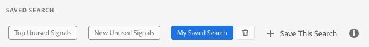

# 保存搜索条件 {#save-search-criteria}

通过保存最多10组搜索标准以随时使用来优化信号搜索工作，并在[!UICONTROL Signals Dashboard]上跟踪这些标准。 每次加载[!UICONTROL Signals Dashboard]时，Audience Manager都会重新加载保存的搜索。

1. 转到&#x200B;**[!UICONTROL Audience Data > Signals > Search]**&#x200B;并运行包含键值对和/或要保存以供将来搜索之用的筛选器的&#x200B;**[!UICONTROL Signals Search]**。
1. 获得搜索结果后，请单击&#x200B;**[!UICONTROL Save this Search]**。

   
1. 为搜索输入提示性名称，以便您以后可以对其进行识别。
1. （可选）如果希望信号仪表板包含当前搜索集中的信号，请启用&#x200B;**[!UICONTROL Track this search result in the dashboard]**&#x200B;选项。
1. 选择&#x200B;**[!UICONTROL Default Sorting]**&#x200B;条件：
   * **[!UICONTROL Total Counts]**
   * **[!UICONTROL Key Name]**
1. 选择&#x200B;**[!UICONTROL Default Sorting]**&#x200B;模式：
   * **[!UICONTROL Descending]**
   * **[!UICONTROL Ascending]**
1. 单击&#x200B;**[!UICONTROL Save]**。 您可以在[!UICONTROL Saved Search]部分中看到保存的搜索，并随时使用它。

观看以下视频，了解如何保存信号搜索。

>[!VIDEO](https://video.tv.adobe.com/v/25147/)
