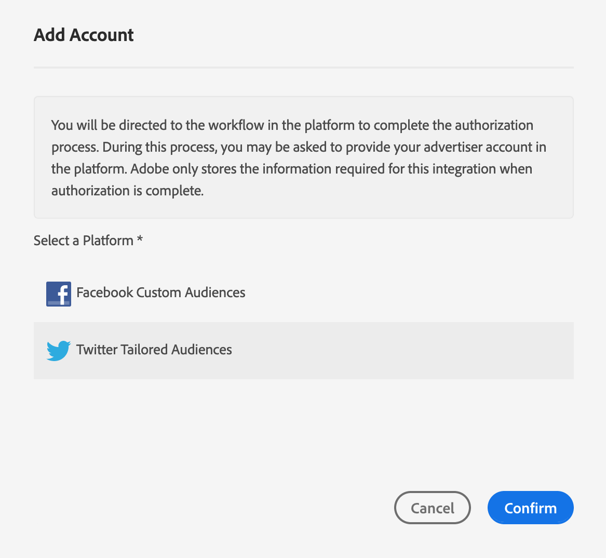
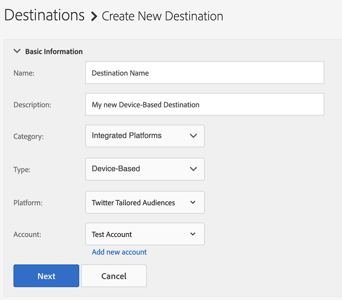

# 添加新的基于设备的目标 {#add-new-device-based-destinations}

本文介绍如何从Audience Manager用户界面配置新的基于设备的目标。

>[!IMPORTANT]
>
>目前，大多数基于设备的目标都不符合自助服务配置工作流的条件。 如果目标列表中未显示您需要添加的基于设备的目标，请联系您的Adobe顾问或客户支持寻求帮助。

## 概述 {#overview}

添加新的基于设备的目标的过程包括两个主要步骤。 首先，您需要配置Audience Manager与目标合作伙伴之间的集成。 执行此操作后，您可以创建一个新的基于设备的目标。

## 先决条件 {#prerequisites}

使用集成平台创建第一个基于设备的目标时，请联系Adobe Consulting或客户关怀团队，为您的帐户启用Audience Manager和集成平台之间的ID同步。 这是Audience Manager与目标平台之间正确同步所必需的。

## 步骤 1. 使用目标平台进行身份验证 {#step1}

在创建新的基于设备的目标之前，您需要配置Audience Manager与目标平台之间的集成。 以下是操作方法：

1. 登录到您的Audience Manager帐户并转到&#x200B;**[!DNL Administration > Integrated Accounts]**。 如果您之前配置了与目标平台的集成，您应该会看到此页面中列出了该集成。 否则，页面为空。
1. 单击 **[!DNL Add Account]**。
1. 选择要进行身份验证的目标平台，然后单击&#x200B;**[!DNL Confirm]**&#x200B;以重定向到所选平台的身份验证页面。

   

1. 在针对目标平台帐户进行身份验证后，您将被重定向到Audience Manager，您应该会在其中看到关联的广告商帐户。 选择要使用的广告商帐户，然后单击&#x200B;**[!DNL Confirm]**。

## 步骤 2. 创建新的基于设备的目标 {#step2}

配置目标平台集成后，即可创建新目标。 以下是操作方法：

>[!NOTE]
>
>无法更改现有基于设备的目标的名称。 请确保提供有助于您正确识别目标的名称。

1. 登录到您的Audience Manager帐户，转到&#x200B;**[!DNL Audience Data > Destinations]**，然后单击&#x200B;**[!DNL Create Destination]**。
1. 在&#x200B;**[!DNL Basic Information]**&#x200B;部分中，输入新目标的&#x200B;**[!DNL Name]**&#x200B;和&#x200B;**[!DNL Description]**，并使用以下列表中的设置：

   

   * **[!DNL Category]**： [!DNL Integrated Platforms]；
   * **[!DNL Type]**： [!DNL Device-Based]；
   * **[!DNL Platform]**：选择要将受众区段发送到的目标平台。
   * **[!DNL Account]**：选择与所选平台关联的所需广告商帐户。
1. 单击 **[!DNL Next]**。
1. 选择要为此目标设置的[数据导出标签](/help/using/features/data-export-controls.md#controls-labels)。
1. 单击 **[!DNL Save]**。
1. 在&#x200B;**[!DNL Segment Mappings]**&#x200B;部分中，选择要发送到此目标的受众区段。
1. 保存目标。
