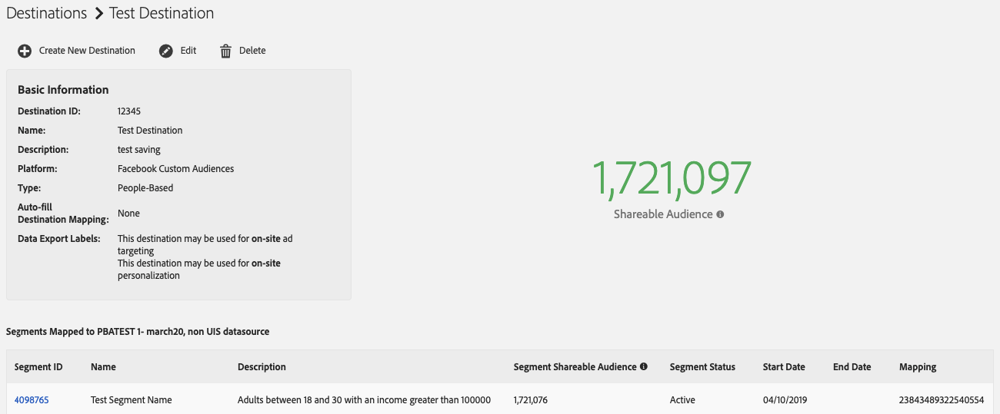

# 可共享受众 {#shareable-audiences}

>[!IMPORTANT]
>本文包含用于指导您完成此功能的设置和使用的产品文档。 此处包含的任何内容都不是法律建议。 请咨询您自己的法律顾问以获得法律指导。

[!DNL People-Based Destinations] 把这个概念带给 [!DNL Shareable Audiences] 受众经理。 此指标可帮助您了解受众管理器可与目标平台共享的哈希电子邮件地址数。

[!DNL Shareable Audiences] 是帮助您在上下文中解释受众数据的量度 [!DNL People-Based Destinations]。 您可以在页面和页 [!UICONTROL Destinations] 面中查看此 [!UICONTROL Segment] 度量。

## 分类可共享受众 {#segment-shareable-audiences}

区段页 [!DNL Segment Shareable Audience] 面中的度量指示数据源中具有匹配 [DPUUID的哈希化电子邮件地址数量，考虑到对其应用的用户档案合并规则，该](../../reference/ids-in-aam.md)DPUUID也符合给定回顾期内定义的区段的条件，并且受众管理器可以与目标平台共享。

此指标有1天的回顾期。 这有助于您了解特定目标中的区段的受众范围。

## 目标可共享受众 {#destination-shareable-audience}

基于 [!DNL Destination Shareable Audience] 人员的目标页面中的度量指示数据源中哈希电子邮件地址的总数，这些地址具有匹配的 [DPUUID](../../reference/ids-in-aam.md),受众管理器可以从映射到该目标的所有区段与目标平台共享。

此指标具有终生回顾期。 这有助于您了解从哈希电子邮件地址数据源可以访问的受众规模。

## 示例

受众经理客户的数据源有110,000个 [DPUUID](../../reference/ids-in-aam.md) (CRM ID)。 他们将100,000个哈希电子邮件地址收录到受众管理器中，以将其与多个基于人员的目标结合使用，并针对CRM ID对100,000个哈希电子邮件地址执行ID同步。 客户可使用合并规 [!DNL All Cross-Device Profiles] 则创建三个受众区段：

* 区段A的人口数为10,000，映射到目标A;
* 区段B，人口数为20,000，映射到目标A;
* 区段C，人口计数为50,000，映射到目标B。

在此方案中：

* A类可共享受众= 10,000;
* B分部可共享受众= 20,000;
* C段可共享受众= 50,000;
* 目标A可共享受众=区段A可共享受众+区段B可共享受众= 30,000;
* 目标B可共享受众=区段C可共享受众= 50,000。

>[!NOTE]
>
>在上例中，这并不意味着三个区段中的所有80,000个哈希电子邮件地址都与目标平台中的现有帐户匹配。 它仅表示受众管理器将三个区段的哈希标识符发送到它们各自的目标。 将受众区段发送到基于人员的目标时，受众匹配会在合作伙伴端进行。 目标A最多可有30,000个匹配用户帐户，而目标B最多可有50,000个匹配用户帐户，但无法保证匹配率。 Adobe无权访问特定于合作伙伴的指标。 有关“ [基于人员的目标](../../faq/faq-people-based-destinations.md#match-rates) ”在匹配率方面的可见性的常见问题解答，请参阅匹配率。
