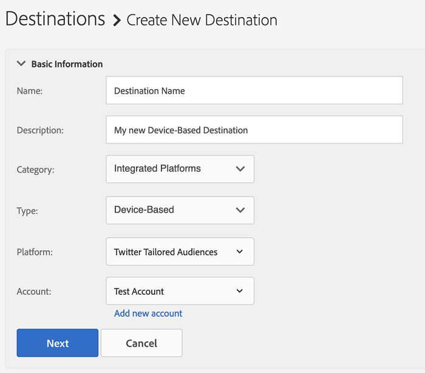

# 将[!DNL Twitter Tailored Audiences]配置为基于设备的自助服务目标{#configure-twitter}

本文介绍如何配置与[Twitter定制受众](https://business.twitter.com/en/targeting/tailored-audiences.html)的集成。

## 先决条件 {#prerequisites}

在配置[!DNL Twitter Tailored Audiences]目标之前，请确保查看您需要满足的以下Twitter先决条件。

1. 您的[!DNL Twitter Ads]帐户必须符合广告资格。 新[!DNL Twitter Ads]帐户在创建后的前2周内没有资格获得广告。
2. 您在Audience Manager中授权访问的[!DNL Twitter]用户帐户必须启用[合作伙伴受众管理器](https://business.twitter.com/en/help/troubleshooting/multi-user-login-faq.html#accesslevels)权限。
3. 在您的Audience Manager实例中创建第一个[!DNL Twitter Tailored Audiences]目标时，请与Adobe咨询或客户关怀部门联系，为您的帐户启用[!DNL Twitter] ID同步（数据源ID = 1123）。 这是在Audience Manager和[!DNL Twitter]之间正确同步所必需的。

## 添加新[!DNL Twitter Tailored Audiences]目标{#add-new-twitter-destination}

本节介绍为[!DNL Twitter Tailored Audiences]配置新的基于设备的目标时需要遵循的步骤。 此方案假设您没有通过Adobe顾问或客户服务部门配置现有[!DNL Twitter Tailored Audiences]目标。

### 步骤 1. 使用[!DNL Twitter Tailored Audiences] {#step1-authenticate-with-twitter}进行身份验证

在添加基于设备的目标之前，您需要链接Audience Manager和[!DNL Twitter Tailored Audiences]帐户。 下面将介绍如何执行此操作：

1. 登录您的Audience Manager帐户并转到&#x200B;**[!DNL Administration > Integrated Accounts]**。 如果您之前已配置了与目标平台的集成，则应在本页中列出该集成。 否则，页面为空。
1. 单击 **[!DNL Add Account]**.
1. 选择[!DNL Twitter Tailored Audiences]并单击&#x200B;**[!DNL Confirm]**&#x200B;以重定向到身份验证页面。                     
1. 通过身份验证后，您将被重定向到Audience Manager，您应在其中看到关联的广告商帐户。 选择要使用的广告商帐户，然后单击&#x200B;**[!DNL Confirm]**。

### 步骤 2. 创建新的基于设备的目标{#step2-create-new-destination}

在链接了Audience Manager和[!DNL Twitter Tailored Audiences]后，您可以创建新目标。 下面将介绍如何执行此操作：

>[!NOTE]
>
>您无法更改现有基于设备的目标的名称。 请确保提供一个名称，帮助您正确识别目标。

1. 登录您的Audience Manager帐户，转到&#x200B;**[!DNL Audience Data > Destinations]**，然后单击&#x200B;**[!DNL Create Destination]**。
1. 在&#x200B;**[!DNL Basic Information]**&#x200B;部分，输入&#x200B;**[!DNL Name]**&#x200B;和&#x200B;**[!DNL Description]**&#x200B;作为新目标，然后使用以下设置：
1. 单击 **[!DNL Next]**.
1. 选择要为此目标设置的[数据导出标签](/help/using/features/data-export-controls.md#controls-labels)。
1. 单击 **[!DNL Save]**.
1. 在&#x200B;**[!DNL Segment Mappings]**&#x200B;部分，选择要发送到此目标的受众段。
1. 保存目标。

## 区段映射注意事项{#segment-mapping-considerations}

将受众段映射到[!UICONTROL Twitter]时，请确保满足以下段命名要求：

* 提供可读的区段映射名称。 我们建议使用您用于Audience Manager区段的相同名称。
* 请勿在段和段映射名称中使用特殊字符(`+` `&` `,` `%` `:` `;` `@` `/` `=` `?` `$`)。 如果您的Audience Manager段名称包含这些字符，请先删除这些字符，然后再将段映射到[!UICONTROL Twitter]目标。

### 示例

* 正确的区段或映射名称：“美国和欧洲购物者”；
* 区段或映射名称不正确：“美国，欧洲5h0pP3rs”。

>[!IMPORTANT]
>
>您无法更改已映射区段的名称。 Audience Manager使用区段名称来正确识别集成中的区段。

## 匹配率注意事项{#match-rates-considerations}

* Audience Manager与[!UICONTROL Twitter Tailored Audiences]之间的集成支持历史受众回填。 创建目标时，所有区段资格都将发送到[!UICONTROL Twitter]。
