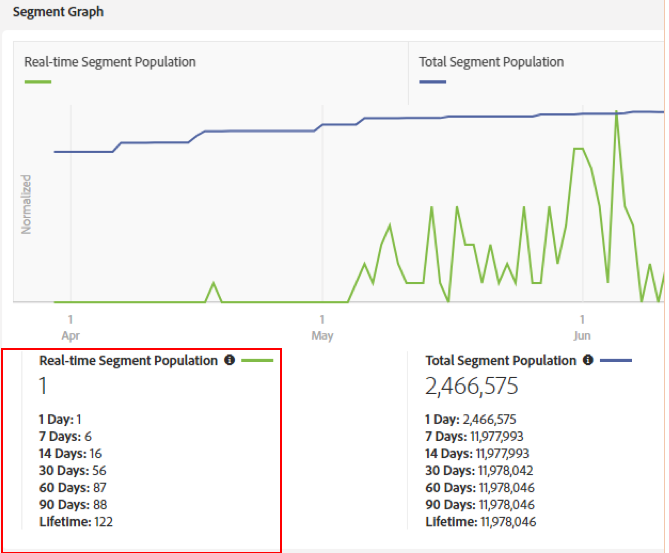

# 关于设备图的配置文件合并规则的重要注意事项 {#important-considerations-for-profile-merge-rules-with-device-graphs}

避免 [!UICONTROL Profile Merge Rules] 对实 [!UICONTROL Device Graph] 时区段数量很少或没有的区段使用。

>[!IMPORTANT]
>
>如果配 [!UICONTROL Profile Merge Rule] 置不正确，导出到批目标的区段数量可能显着低于预期。

只有在创 [建区段后，才会根据](../../features/profile-merge-rules/merge-rule-targeting-options.md#device-graph-options) Audience Manager边缘服务器上实时查看的设备来评估使用配置文件合并规则和设备图形的区段  。

请记住， [!UICONTROL Profile Merge Rule] 具有的 [!UICONTROL Device Graph] 设备选项选择了下列设备选项之一，如下所示。

符合实时细分条件的设备按细分 [的实时分布进行计量](../../features/segments/segment-builder-data.md#segment-populations)。

低实时细分数量意味着很少有符合细分条件的设备能够实时查看。 为获得最佳性能，实时数量很少或没有的细分应使用 [!UICONTROL Profile Merge Rule] 集来评估 *[!UICONTROL Current Device]*，如下图所示。

设置评 [!UICONTROL Profile Merge Rule] 估值可确 *[!UICONTROL Current Device]* 保为区段评估所有设备（而不仅仅是实时查看的设备）。 符合该分部资格的所有设备均由总分部人口定义，如下所示。

