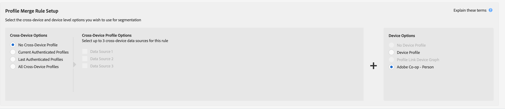

# 外部设备图用例 {#external-device-graph-use-cases}

Recommendations，并通过外部设备图表为未知用户寻找、重新定位和个性化案例。 外部设备图形被定义为与Audience Manager分离的设备图形。 这包括[!DNL Adobe Experience Cloud Device Co-op]和与第三方确定性或概率设备图形Adobe的其他集成公司。

## 推荐 {#recommendations}

考虑以下活动的[!DNL Experience Cloud Device Co-op]和第三方设备图形选项：

* 在数字资产中进行低级别的身份验证。 如果您有大量经过身份验证的用户，请使用[!UICONTROL Profile Link Device Graph option]。
* 目标大受众。 [!DNL Experience Cloud Device Co-op]和第三方设备图形包含已验证和未验证的数据。
* 在个人和家庭层面对经认证和／或未经认证的访客进行细分。

<!-- 
## Prospecting/Branding Use Case {#prospecting-branding-use-cases}

A branding campaign is designed to reach as many people as possible. It places few limits on segment qualification. But, these campaigns can waste budget and impressions by constantly targeting people who see your content multiple times and don't convert. A [!UICONTROL Profile Merge] rule that uses the [!DNL Device Co-op] or third-party option can help you create an efficient branding campaign. For example, you can add these unknown users to a "not in-market" segment after seeing them across multiple devices for your set frequency cap.

<table id="table_00F6EED172574E80A38CADA8A92A23B1"> 
 <thead> 
  <tr> 
   <th colname="col1" class="entry"> Use Case </th> 
   <th colname="col2" class="entry"> Description </th> 
  </tr> 
 </thead>
 <tbody> 
  <tr> 
   <td colname="col1"> 
 <b>Conditions</b> 
 </td> 
   <td colname="col2">This use case assumes these conditions: 
 
     <ul id="ul_F5CA7EE525774F7EBA5FBB5F94E4EDC8"> 
      <li id="li_81AE304924724146A24FAB5B6533AD8E">You want to deliver a maximum of 10 impressions to an anonymous user for a specific ad campaign. </li> 
      <li id="li_E371F989735245B0B82433DE240D56D0">A user has 4 devices and may or may not have authenticated on your site. </li> 
      <li id="li_9231ABE15CA249E6B79D8BF0E511FD33">An anonymous user sees the ad a total of 10 times while browsing in an unauthenticated state on their current device and 3 devices linked to the current device by an external device graph. </li> 
      <li id="li_8C276C07019C49EFA3A0D0D54CF73C31">You have defined an  Audience Manager segment to qualify anonymous users after they have seen 10 impressions. </li> 
     </ul> 
 </td> 
  </tr> 
  <tr> 
   <td colname="col1"> 
 <b>Results</b> 
 </td> 
   <td colname="col2"> 
Given these conditions,  Audience Manager: 
 
 
     <ul id="ul_8E988B1005324526BC6DC6637BBACCFB"> 
      <li id="li_C9DD546754914BACB8F4C92C7D4ED70E">Merges the anonymous, unauthenticated activity collected from the current device and the 3 devices linked by the external device graph (the ad impressions from each device). </li> 
      <li id="li_FB55CB9116074525BA30FF062D1136AE">Evaluates the unauthenticated user for segment qualification based on a combination of anonymous activity across all 3 devices linked by the external device graph and the current device. </li> 
      <li id="li_B28EB32F718145A7ABBDAC0AF75E2AFC">Sends the segment to any real-time destination for use as a suppression segment on the current device and all 3 devices linked by the external device graph. </li> 
     </ul> 
 </td> 
  </tr> 
 </tbody> 
</table>

## Retargeting or Site Personalization Use Case {#retargeting-use-case}

These strategies are designed to bring an unauthenticated or unknown user back to your site or personalize their browsing experience while they're on-site.

<table id="table_0EE2052AA3E744B3B76036FC06B5A453"> 
 <thead> 
  <tr> 
   <th colname="col1" class="entry"> Use Case </th> 
   <th colname="col2" class="entry"> Description </th> 
  </tr> 
 </thead>
 <tbody> 
  <tr> 
   <td colname="col1"> 
 <b>Conditions</b> 
 </td> 
   <td colname="col2">This use case assumes these conditions: 
 
     <ul id="ul_FD0B869B4AF3453FAEC9BA3A45ABF039"> 
      <li id="li_8E30BAED42E94AB3B81FCB1C7464E5FC">You want to deliver a personalized on-site and/or off-site experience to an anonymous user based on their activity on your site while in an unauthenticated state. </li> 
      <li id="li_3DBE53BA94324F1BA1C52A37AD4E426C">A user has multiple devices and may or may not have authenticated to your site. </li> 
      <li id="li_F867AFBDC1A54CD6A68AB0EC196E27C9">A user views multiple pages on your site while browsing in an unauthenticated state on their current device and 3 other devices linked by an external device graph. </li> 
      <li id="li_7E35D77949CE4E69BD51655AA4C40BEE">You have defined an  Audience Manager segment to qualify users after they have viewed multiple pages on your site while browsing in an unauthenticated state.</li>
     </ul> 
 </td> 
  </tr> 
  <tr> 
   <td colname="col1"> 
 <b>Results</b> 
 </td> 
   <td colname="col2"> 
Given these conditions,  Audience Manager: 
 
 
     <ul id="ul_301339426B0643B295DC5B17E1939CFB"> 
      <li id="li_7E8BC3B179804F4A929497DE81E76911">Merges the anonymous, unauthenticated activity collected from the current devices and the 3 devices linked by the external device graph (the multiple page views from each device). </li> 
      <li id="li_803EFD58AA124A5BBC8279C4DC695544">Evaluates the unauthenticated user for segment qualification based on a combination of anonymous activity across all 3 devices linked by the external device graph and the current device. </li> 
      <li id="li_98D749268CC5456CBC9CF3BF5EB91BA8">Sends the segment to any real-time destination to deliver a personalized on-site and/or off-site experience across the current device and all 3 devices linked by the external device graph. </li>
     </ul> 
 </td>
  </tr>
 </tbody>
</table> -->

## 扩展的设备定位{#audience-expansion}

此用例说明了如何通过[!DNL Adobe Co-Op Device Graph]或其他[!DNL External Device Graphs]，通过准确的跨设备个性化扩展可寻址受众的大小。

假设简拥有三款她经常用来搜索度假套餐的设备：她的笔记本电脑([!DNL Device 1])、智能手机([!DNL Device 2])和平板电脑([!DNL Device 3])。 使用笔记本电脑时，Jane搜索航班、酒店和导游。 在使用智能手机和平板电脑时，她只访问了旅行社的主页。

通过使用[!UICONTROL No Cross-Device Profile] + [!UICONTROL Adobe Co-op Device Graph]规则，旅行社可以合并所有三台设备用户档案，因为它们通过[!UICONTROL Adobe Co-op Device Graph]与同一所有者链接。

在我们的示例中，符合区段资格所需的特征均已在[!DNL Device 1]上收集。 由于Audience Manager符合参与用户档案合并的每个设备用户档案的条件，因此Jane的三个设备用户档案现在都已分段。

通过此规则，设备图将符合区段的设备用户档案数从1扩展到3，使旅行社能够向Jane拥有的所有三台设备发送一致的消息。

## 高级跨设备定位{#advanced-graph-expansion}

此用例说明如何通过使用&#x200B;**[!UICONTROL Last Authenticated Profiles]** + **[!UICONTROL Adobe Co-Op Device Graph]**&#x200B;规则，通过外部设备图或[!DNL Adobe Co-Op Device Graph]中的设备扩展已验证受众的访客定位。

在以下示例中，Acme Inc.公司希望目标所有收入超过$100.000/年(在[!DNL Data Plan A]上具有[!DNL Acme Inc.]订阅者且使用[!DNL iPhone 7]设备的家庭。

John在Data Plan A上使用其iPhone 7在Acme Inc.网站上进行身份验证。 同时，John的[!DNL Co-Op Device Graph]群集包含他经常使用的另外两个设备：他的笔记本电脑([!DNL Device 1])和他的辅助智能手机[!DNL Device 2]（[!DNL Data Plan B]上的[!DNL Samsung S7]）。

通过使用&#x200B;**[!UICONTROL Last Authenticated Profiles]** + **[!UICONTROL Adobe Co-Op Device Graph]**,[!DNL Acme Inc.]能够从John的设备图形群集向所有三台设备发送个性化消息，尽管其中只有一台设备最初符合该区段的资格。

>[!MORELIKETHIS]
>
>* [配置文件关联设备图用例](profile-link-use-case.md)
>* [配置文件合并规则的一般用例](merge-rule-targeting-options.md)
>* [用户档案合并规则常见问题解答](../../faq/faq-profile-merge.md)

