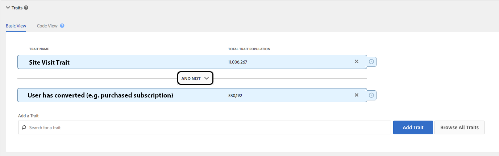

# 即时跨设备抑制 {#instant-cross-device-suppression}

[!UICONTROL Instant Cross-Device Suppression]能够在连接到这些设备的多个设备上禁止用户，当这些设备上发生特定体验时。 使用[!UICONTROL Instant Cross-Device Suppression]功能可为您的用户提供跨设备的一致体验。 Audience Manager 中的实时取消区段功能可提供这种体验。

## 概述 {#overview}

[!UICONTROL Instant Cross-Device Suppression]提供了两个关键用例：改进了用户体验和媒体效率。

* **改进的用户体验**：已购买您的产品或服务的用户将看不到与购买之前相同的创意。 相反，您可以针对您知道他们尚未购买的产品或服务显示追加销售或交叉销售消息。
* **媒体效率**：通过为所有[!DNL DSP]应用全局频率上限来优化促销活动支出。可以为属于一个用户的多个设备实时操作频率上限。

实时取消分段的技术详细信息在[配置文件合并规则和设备取消分段流程](merge-rule-unsegment.md)中进行了详细描述。 请阅读上述用例的实际实施情况。

## 转换后不定位 {#do-not-target-once}

确保已转换的用户（已购买产品、已获得订阅等）不会看到与转换前相同的消息。 您可以使用[!UICONTROL AND NOT]逻辑获取此项，如下所示。

1. 使用两个特征创建一个区段，并使用[!UICONTROL AND NOT]逻辑，如下图所示。 您必须使用基于规则的特征来定义要实时触发的取消分段的转化事件。 详细了解如何[创建基于规则的特征](../traits/create-onboarded-rule-based-traits.md)。
2. 将区段映射到任意数量的实时服务器到服务器目标。 阅读有关如何将区段添加到[服务器到服务器目标](../destinations/add-edit-segments.md)的信息。

只要您的访客未转化，则符合该区段的条件。 一旦他们符合转化特征，就会停止遵循区段规则并立即从区段中移除。

## X次展示后不定位 {#do-not-target-after-x}

通过设置回访间隔和频率控制，您可以确保用户不会受到同样的创意内容吸引。 在此场景中，创建一个具有两个特征的区段，如以下步骤所述。

1. 使用两个特征创建一个区段，并使用[!UICONTROL AND]逻辑，如下图所示。 您必须使用基于规则的特征来定义要实时触发的取消分段的展示事件。 详细了解如何[创建基于规则的特征](../traits/create-onboarded-rule-based-traits.md)。

   >[!NOTE]
   >
   >您可以使用[!UICONTROL Actionable Log Files]或[!UICONTROL Pixel Calls]根据用户印象创建特征。 了解有关[可操作的日志文件](../../integration/media-data-integration/actionable-log-files.md)和[像素调用](../../integration/media-data-integration/impression-data-pixels.md)的更多信息。

1. 将频率控件应用于第二个特征。 如果您愿意，也可以添加回访间隔控件。 详细了解[如何应用回访间隔和频率控制](../segments/recency-and-frequency.md)。
1. 将区段映射到任意数量的实时服务器到服务器目标。 阅读有关如何将区段添加到[服务器到服务器目标](../destinations/add-edit-segments.md)的信息。

在此方案中，一旦您的用户累积了超过三次展示，他们将被从此区段中移除，并且不会再看到此特定创意内容。

## 需要注意的重要方面 — 处理 {#processing-notes}

请记住以下与处理相关的方面：

* 要使实时取消分段功能正常工作，必须将所需的分段映射到实时服务器到服务器目标。
* 对于通过[设备图](profile-link-use-case.md#recommendations)连接到设备的设备，我们强制实施有关评估和取消分段的4个设备限制。 [设备图选项和设备取消分段](merge-rule-unsegment.md#device-graph-options-unsegmentation)中介绍了此限制&#x200B;。
* 对于通过设备图连接的多个设备， unsegment命令将包含在批处理文件中，每24小时发送到目标一次。
* 必须实时查看该设备(在[Edge](../../reference/system-components/components-edge.md)上)才能实时提示区段评估。 对于在符合特征[!UICONTROL time-to-live (TTL)]时具有[!DNL TTL]的特征，设备将通过批处理文件在24小时内自动取消分段&#x200B;。 阅读有关如何[设置特征过期时间间隔](../traits/create-onboarded-rule-based-traits.md#set-expiration-interval)的详细信息。
* 如果您实时使用[!UICONTROL DCS API]来板载基于规则的特征，则可以使用[!UICONTROL AND NOT]逻辑触发取消分段。 了解有关[将数据发送到DCS API](../../api/dcs-intro/dcs-event-calls/dcs-url-send.md)的更多信息。&#x200B;

## 需要注意的重要方面 — 计时 {#timing-notes}

请记住以下与时间相关的方面：

* 区段将存储在[Edge](../../reference/system-components/components-edge.md)上，其时间与设备配置文件存储在[!UICONTROL Edge]上的时间相同，即自上次实时交互以来的14天。 有关数据保留的更多信息，请参阅[数据保留常见问题解答](../../faq/faq-privacy.md#data-retention-faq)。
* 取消分段操作大约需要24小时才能在[!DNL DCS]区域中传播。 详细了解[!DNL DCS]地区[此处](../../reference/system-components/components-data-collection.md)和[此处](../../api/dcs-intro/dcs-api-reference/dcs-regions.md)。
