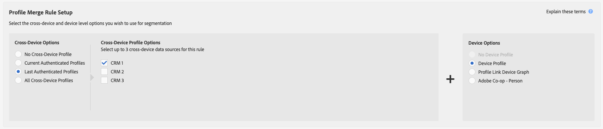

# 配置文件合并规则的一般用例 {#general-use-cases-for-profile-merge-rules}

通过[!UICONTROL Profile Merge Rules]选项，您可以根据业务需求或目标扩大或限制受众对特定受众的关注。 这些常规用例探索了如何使用可用选项并为个人、家庭和跨设备定位创建合并规则。 [!UICONTROL Profile Merge Rules]用于实时和批处理目标。

>[!TIP]
>
>有关这些[!UICONTROL Merge Rule]设置的定义和说明，请参阅[定义的配置文件合并规则选项](merge-rule-definitions.md)。

## 设备定位 {#device-personalization}

此方案适用于希望针对Audience Manager中定义的受众区段评估单个设备配置文件的营销人员，以便使用支持设备ID的定位平台(DSP、现场个性化平台和其他基于设备的定位平台)为设备提供一致的体验，而不考虑用户身份验证。

要创建仅针对设备配置文件的规则，请选择&#x200B;**[!UICONTROL No Cross-Device Profile]** + **[!UICONTROL Device Profile]**。

假设John拥有三部智能手机。 其中两个是数据计划A上的iPhone 7，另一个是数据计划B上的三星。John的移动运营商没有考虑他在其中任何一台设备上经过身份验证的状态，因此他想为他提供数据计划升级，但只针对在数据计划A上运行的iPhone 7设备。

通过使用&#x200B;**[!UICONTROL No Cross-Device Profile]** + **[!UICONTROL Device Profile]**&#x200B;规则，[!DNL Device 1]和[!DNL Device 3]都符合该区段的条件，而忽略设备2。

## 共享设备定位 {#target-shared-devices}

比如John和他的妻子Jane使用同一台笔记本电脑访问网上商店并订购各种商品。

约翰用自己的帐户预订旅行票和特别优惠，而珍用自己的帐户购买音乐和电影。

该商店的营销团队可以使用&#x200B;**[!UICONTROL Current Authenticated Profiles]** + **[!UICONTROL No Device Profile]**&#x200B;规则，完全根据经过身份验证的活动，通过特定交易来定位John和Jane。

使用此规则，Audience Manager将完全忽略设备配置文件，确认John的CRM ID符合该区段的条件，而不确认Jane的CRM ID。

## 在线/离线定位 {#device-household-targeting}

此用例涵盖家庭身份管理。 公司可以使用&#x200B;**[!UICONTROL Last Authenticated Profiles]** + **[!UICONTROL Device Profile]**&#x200B;规则将单个设备配置文件与在该设备上经过身份验证的最后一个配置文件合并。

让我们考虑一个由年收入超过100.000美元的家庭构成的区段，其中至少包含一个设备，该设备是[!DNL Data Plan B]上的[!DNL iPhone 7]。 我们有两个家庭用户档案（跨设备用户档案），每个用户档案都连接到两个不同的设备用户档案。 符合区段资格所需的特征将分布在设备和跨设备配置文件中。

Audience Manager可合并每个设备+跨设备配置文件对，以查看合并的特征集是否符合区段的条件。 由于Audience Manager会评估合并中包含的每个配置文件，因此设备配置文件和家庭配置文件都可以分段。

设备和家庭配置文件之间的链接允许Audience Manager使[!DNL Household 2]符合该区段的条件，但不允许[!DNL Household 1]。 从[!DNL Household 2]开始，只有[!DNL Device 3]符合该区段的条件。 此[!UICONTROL Profile Merge Rule]使营销人员能够向单个设备([!DNL Device 3])和更广泛的家庭([!DNL Household 2])传递一致的营销消息。

## 基于人员的目标定位 {#all-cross-device}

>[!IMPORTANT]
>
>本文包含产品文档，旨在指导您完成此功能的设置和使用。 此处不包含任何法律建议。 请咨询您自己的法律顾问以获得法律指导。

此定位方案仅适用于已购买[!DNL People-Based Destinations]加载项的客户。 此规则允许营销人员根据自己的经过身份验证的数据联系客户。

假设一家在线零售商希望通过社交平台与现有客户联系，并向他们显示基于先前订单的个性化优惠。 通过[!UICONTROL People-Based Destinations]，他们可以将自己[!DNL CRM]中的经过哈希处理的电子邮件地址摄取到Audience Manager中，从离线数据中生成区段，然后使用该经过哈希处理的标识符将这些区段发送到他们想在社交平台上做广告的平台，从而优化他们的广告支出。

要了解有关此选项的更多信息，请参阅[基于人员的目标](../destinations/people-based-destinations-overview.md)。

## 设备图选项 {#device-graph-options}

为[!UICONTROL Profile Merge]规则选择[!UICONTROL device graph]选项取决于您的数字属性和业务目标所特有的条件。 这些一般准则可以帮助您了解何时使用一种类型的图形与何时使用另一种类型的图形。 请注意，要使用这些选项，您必须与外部设备图具有合同关系。 有关何时选择设备图选项的常规指导，请参阅下表。 有关特定用例，请参阅[配置文件链接设备图形用例](profile-link-use-case.md)和[外部设备图形用例](external-graph-use-cases.md)。

<table id="table_66D9152D4FF040A186003272D456625D"> 
 <thead> 
  <tr> 
   <th colname="col1" class="entry"> 设备图类型 </th> 
   <th colname="col2" class="entry"> 描述 </th> 
  </tr>
 </thead>
 <tbody> 
  <tr> 
   <td colname="col1"> 
配置文件链接设备图 
 </td> 
   <td colname="col2"> 
使用配置文件链接选项生成的配置文件合并规则非常适合： 
 
 
     <ul id="ul_FF44FA894BB2448887C8EDA9C8407EF9"> 
      <li id="li_E22505210C664FE6A9AA7C61244B36DA">具有高级客户身份验证的数字资产。 </li> 
      <li id="li_BE7112EE611E4DEB95B5C0A2852BFA97">重点突出、影响较小的营销活动。 配置文件链接设备图仅基于确定性数据构建。 相对于未经身份验证的用户和设备池，此设备配置文件池始终较小。 </li> 
      <li id="li_5FD9E936A72A4EFE80E694FA2E08E385">客户需要处于身份验证状态才能符合分段条件的用例。 </li> 
     </ul> 
 </td> 
  </tr> 
  <tr> 
   <td colname="col1"> 
外部设备图形选项 
 </td> 
   <td colname="col2"> 
使用与Audience Manager集成的任何外部设备图形生成的配置文件合并规则非常适合： 
 
 
     <ul id="ul_D76D773988604A619FA4A3BF37F910F0"> 
      <li id="li_969A0755A9E34CBEB2F7331C137B9A26">具有低级客户身份验证的数字资产。 </li> 
      <li id="li_AC78C8B4AD5340FFAC44FE851096C6A6">广泛、高影响力的品牌促销活动。 </li> 
      <li id="li_14AEC54CE34440889A3A36324EC6F497">客户不需要处于身份验证状态即可符合分段条件的用例。 </li> 
     </ul> 
 </td> 
  </tr> 
 </tbody> 
</table>

观看以下视频，了解[!UICONTROL Profile Merge Rules]的可能用例概述。

>[!VIDEO](https://video.tv.adobe.com/v/28975/)

>[!MORELIKETHIS]
>
>* [配置文件关联设备图用例](profile-link-use-case.md)
>* [外部设备图用例](external-graph-use-cases.md)
>* [配置文件合并规则常见问题解答](../../faq/faq-profile-merge.md)
