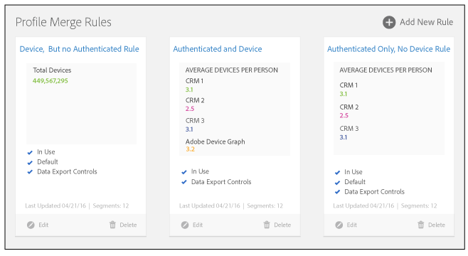

# 配置文件合并规则仪表板 {#profile-merge-rules-dashboard}

从功能板创建和管理所有合并规则。 您最多可以创建4个[!UICONTROL Profile Merge Rules]。

第四个配置文件合并规则 ([!UICONTROL All Cross-Device Profiles]) 仅适用于购买 [!UICONTROL People-Based Destinations] 加载项的客户。

[!UICONTROL Profile Merge Rules]仪表板提供了一个统一的工作区，允许您管理[!UICONTROL Profile Merge Rules]。 仪表板位于&#x200B;**[!UICONTROL Audience Data]** > **[!UICONTROL Profile Merge Rules]**。 您的规则仪表板可能与以下示例类似。

使用[!UICONTROL Profile Merge Rules]时，您可以：

* 从跨设备数据源中创建最多4个[!UICONTROL Profile Merge Rules]。 请参阅[创建跨设备数据Source](merge-rules-start.md#create-data-source)。
* 指定默认合并规则。 [区段生成器](../segments/segment-builder.md)自动将默认规则应用于您创建的任何新区段。
* 将[数据导出控件](../data-export-controls.md)应用于合并规则。 [!UICONTROL Data Export Controls]阻止您向违反数据隐私或使用协议的目标发送数据。
* 跟踪每个用户的平均设备数。
* 使用基本控件创建、编辑和删除规则。 只有管理员可以管理规则，但其他用户可以查看这些规则并将它们应用于区段。 查看定义的[配置文件合并规则选项](merge-rule-definitions.md)和[合并规则的用例](merge-rule-targeting-options.md)。

>[!MORELIKETHIS]
>
>* [配置文件合并规则常见问题解答](../../faq/faq-profile-merge.md)
