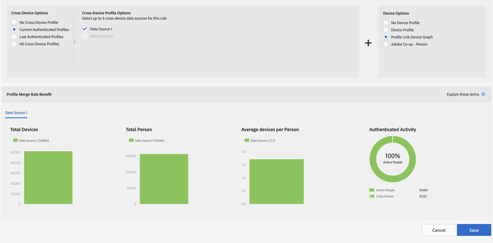

# 配置文件合并规则的报表量度 {#report-metrics-for-profile-merge-rules}

[!UICONTROL Profile Merge Rule] 量度提供有关对您的网站进行身份验证的人员和设备的数据。当您创建合并规则或单击[!UICONTROL Profile Merge Rules]功能板中的现有规则时，[!UICONTROL Profile Merge Rule Reports]中的数据和图形会动态更新。 这些量度可以包含[!DNL Adobe Experience Cloud Device Co-op]或其他第三方设备图源中的设备图。

## 合并规则量度{#merge-rule-metrics}

当您的合并规则使用[Adobe Experience Cloud设备协作](https://docs.adobe.com/content/help/en/device-co-op/using/about/overview.html)或您在[!DNL Audience Manager]中可能有权访问的其他第三方设备图中的数据时，报表会在并排条形图中返回数据。 这可让您将经过身份验证的第一方数据与[!UICONTROL Experience Cloud Device Co-op]或其他第三方设备图提供的跨设备数据进行比较。 有关[!UICONTROL Device Co-op]返回的数据的信息，请参阅[设备图：内部进程和输出](https://docs.adobe.com/content/help/en/device-co-op/using/device-graph/device-graph-overview.html)。 此数据每天更新。

<table id="table_A7FB2F9804F84AC8A6DD05C0E6EE7555"> 
 <thead> 
  <tr> 
   <th colname="col1" class="entry"> 量度 </th> 
   <th colname="col2" class="entry"> 描述 </th> 
  </tr> 
 </thead>
 <tbody> 
  <tr> 
   <td colname="col1"> 
 <b> 已验证的活动</b> 
 </td> 
   <td colname="col2"> 
显示： 
 
    <ul id="ul_7F7373919A4A49028EF4BF7B28D9F8E9"> 
     <li id="li_FE2F93C496D64ED8928B3E522C9585EA">  活动人员:过去60天内通过您的网站身份验证的人数。 </li> 
     <li id="li_60CFD26EE68B442683C0ED5FED1A79C8">  跨设备:在数据源存 <a href="merge-rules-start.md#create-data-source"> 在的</a> 存留期间，存 <a href="https://docs.adobe.com/content/help/en/audience-manager/user-guide/features/data-sources/manage-datasources.html"> 储在选定</a> 已验证 <a href="merge-rule-definitions.md"> 配置文件</a> 的数据源中的跨设备ID总数。 </li> 
     <li id="li_F2F07B6A326C4A18B79A0CF2C47D9677">  %活动人员:显示  活动 人数a %。 </li> 
    </ul> 
  通过 身份验证的活动允许您按活动、数量和百分比比较数据源。它可以帮助您找到拥有大量人员和高比例活动用户的数据源。 或者，在比较与活跃用户比例较高的数据源与总受众规模相比，您可能会发现有价值。 例如，有时，总生命周期数和活动次数较低的数据源比具有较高生命周期结果和活动次数较低的数据源更有价值。 
 
 
注意：已验证的活动量度仅包含配置文件链接数据。 此报表不包括设备图数据。 
 
 </td> 
  </tr> 
  <tr> 
   <td colname="col1"> 
 <b> 每人平均设备数</b> 
 </td> 
   <td colname="col2"> 
 显示已通过您网站身份验证的访客使用的所选数据源的平均设备数。 
 </td> 
  </tr> 
  <tr> 
   <td colname="col1"> 
 <b> 设备总数</b> 
 </td> 
   <td colname="col2"> 
显示用户对所选数据源进行身份验证时所使用的设备总数。 
 </td> 
  </tr> 
  <tr> 
   <td colname="col1"> 
 <b> 人员总数</b> 
 </td> 
   <td colname="col2"> 
显示为选定数据源确定性地标识的人员总数。 
 </td> 
  </tr> 
 </tbody> 
</table>

## 设备图量度{#device-graph-metrics}

[!UICONTROL Merge Rules]报表还显示有关已访问您网站的选定数据源和设备图的人员和设备总数的数据。 这些量度根据预设的时间间隔（回顾时间段）返回数据，这些时间段因您在创建规则时选择的设备选项而异。 下表列出了每个设备图选项的这些报告间隔。

<table id="table_038983EBC71F4A55BBCA99212AC5DEE6"> 
 <thead> 
  <tr> 
   <th colname="col1" class="entry"> 设备图选项 </th> 
   <th colname="col2" class="entry"> 报表回顾间隔 </th> 
  </tr>
 </thead>
 <tbody> 
  <tr> 
   <td colname="col1"> 
 配置文件链接 
 </td> 
   <td colname="col2"> 
 
     <ul id="ul_B2FF2341573840549FFB96579F537082"> 
      <li id="li_B37323C2F2434F41B407500AC5C15447">总人数：60天 </li> 
      <li id="li_08D911224A60418BBB3CFB4E70CE73D4">设备总数：120天 </li> 
     </ul> 
 </td> 
  </tr> 
  <tr> 
   <td colname="col1"> 
 协作设备图 
 </td> 
   <td colname="col2"> 
 
     <ul id="ul_64AD1DD89DF64703B70B973A463BA020"> 
      <li id="li_D7D3A3871F434CBFA71BE8929EB41648">总人数：180天 </li> 
      <li id="li_125D387986B2463EB310203CE5857EDA">设备总数：180天 </li> 
     </ul> 
 </td> 
  </tr> 
  <tr> 
   <td colname="col1"> 
 LiveRamp 
 </td> 
   <td colname="col2"> 
 
     <ul id="ul_2772F3AD7E1440789B635794ECDE8DFB"> 
      <li id="li_1432363829D64615B1D349A3722D6268">总人数：180天 </li> 
      <li id="li_D5C0E3CE92524B54BBD36C73A326292B">设备总数：180天 </li> 
     </ul> 
 </td> 
  </tr> 
  <tr> 
   <td colname="col1"> 
 塔帕德 
 </td> 
   <td colname="col2"> 
 
     <ul id="ul_274529DB58E6442E95C6AD89BECB1362"> 
      <li id="li_67102211A72A4E47AACFE5E369793C17">总人数：60天 </li> 
      <li id="li_3E8F3DA6A7B5487895A626674DA363A5">设备总数60天 </li> 
     </ul> 
 </td> 
  </tr> 
 </tbody> 
</table>

## 示例报表{#sample-reports}

### 标准配置文件链接报表

标准[!UICONTROL Profile Link]报表如以下示例所示。 使用多个数据源（最多3个）的合并规则会在每个数据源的单独选项卡中显示图形。 此合并规则不包含[!UICONTROL Device Co-op]数据。

### 使用设备图数据的配置文件链接报表

[!UICONTROL Profile Link Device Graph]报表包含来自[!UICONTROL Adobe Experience Cloud Device Co-op]或第三方设备图的设备图数据，其中显示了[!UICONTROL Profile Link]和具有并排条形图的设备图数据。 通过将这些图表彼此相邻放置，您可以单独评估与[!UICONTROL Profile Link]相比使用[!UICONTROL Experience Cloud Device Co-op]的好处。 使用多个数据源（最多3个）的合并规则会在每个数据源的单独选项卡中显示图形。 请注意，[!UICONTROL Authenticated Activity]图表和量度不会返回[!DNL Adobe]设备图或您在[!DNL Audience Manager]中可能有权访问的其他第三方设备图中的数据。

## 配置文件链接趋势图{#profile-link-trend}

除了其他数据可视化之外，[!UICONTROL Profile Link]报表还包含折线图。 折线图旨在显示配置文件规则随时间变化的趋势。 当您单击[!UICONTROL Profile Merge Rules]登陆页面(**[!UICONTROL Audience Data > Profile Merge Rules]**)中的规则时，可以使用趋势图（和其他报表）。 如果您是[!UICONTROL Device Co-op]的成员，则这些图表包括设备图数据，或者您可以在[!DNL Audience Manager]中访问的其他第三方设备图。 单击趋势线可查看基础数据。

>[!MORELIKETHIS]
>
>* [配置文件合并规则常见问题解答](../../faq/faq-profile-merge.md)

