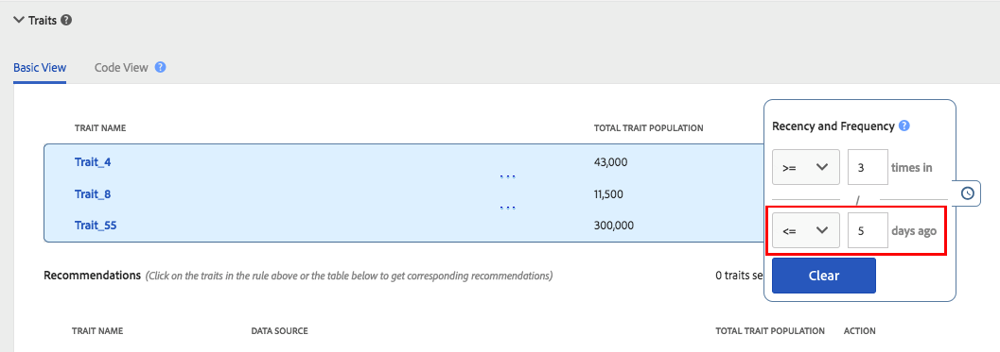

# 回访间隔和频度 {#recency-and-frequency}

在[!UICONTROL Segment Builder]中，回访间隔和频度允许您根据在设置的每日间隔内发生或重复的操作，对访客进行分段。

Audience Manager按如下方式定义[!DNL recency]和[!DNL frequency]:

* **[!UICONTROL Recency]:** 用户最近查看或符合一个（或多个）条件的时间 [!UICONTROL traits]。
* **[!UICONTROL Frequency]:** 用户查看或符合一个（或多个）条件的速率 [!UICONTROL traits]。

[!UICONTROL Recency] 和设 [!UICONTROL Frequency] 置可帮助您根据访客对网站、区域或特定创作元素的真实（或感知）兴趣级别对访客进行分段。例如，符合最近/频度要求较高区段资格的用户对网站或产品的兴趣，可能高于访问频率较低或访问频率较低的用户。

## [!UICONTROL Recency and Frequency]设置的位置 {#location}

在[!UICONTROL Segment Builder]中，[!UICONTROL Recency]和[!UICONTROL Frequency]设置位于[!UICONTROL Traits]面板的[!UICONTROL Basic View]部分。 单击时钟图标以显示这些控件。

## 限制和规则{#limitations-rules}

当您想要将回访间隔和频度应用于区段中的特征时，请查看并了解这些限制和规则。

### [!UICONTROL Recency] {#recency}

<table id="table_026064124C694D75B7A960457D50170B"> 
 <thead> 
  <tr> 
   <th colname="col1" class="entry"> 限制或规则 </th> 
   <th colname="col2" class="entry"> 描述 </th> 
  </tr> 
 </thead>
 <tbody> 
  <tr> 
   <td colname="col1"> 
 <b>最小值</b> 
 </td> 
   <td colname="col2"> 
回访间隔必须大于0。 
 </td> 
  </tr>
  <tr> 
   <td colname="col1"> 
 <b>特征类型</b> 
 </td> 
   <td colname="col2"> 
您只能将回访间隔控件应用于基于规则的特征和文件夹特征。 
 </td> 
  </tr> 
  <tr> 
   <td colname="col1"> 
 <b>第三方特征</b> 
 </td> 
   <td colname="col2"> 
您无法对包含第三方特征的单个第三方特征或特征组设置回访间隔规则。 回访间隔和频度仅适用于您自己的特征。 
 </td> 
  </tr> 
 </tbody> 
</table>

### [!UICONTROL Frequency] {#frequency}

<table id="table_EBD621D26C8B4D03933E8C0753C892A7"> 
 <thead> 
  <tr> 
   <th colname="col1" class="entry"> 限制或规则 </th> 
   <th colname="col2" class="entry"> 描述 </th> 
  </tr> 
 </thead>
 <tbody> 
  <tr> 
   <td colname="col1"> 
 <b>第三方特征</b> 
 </td> 
   <td colname="col2"> 
您无法对包含第三方特征的单个第三方特征或特征组设置频率规则。 回访间隔和频度仅适用于您自己的特征。 
 </td> 
  </tr> 
  <tr> 
   <td colname="col1"> 
 <b>特征类型</b> 
 </td> 
   <td colname="col2"> 
您只能将频率控件应用于基于规则的特征和文件夹特征。 
 </td> 
  </tr> 
  <tr> 
   <td colname="col1"> 
 <b>回访间隔要求</b> 
 </td> 
   <td colname="col2"> 
您可以配置频率要求<i>，而不配置新近度要求。 </i>只需设置一个频度值，并将“回访间隔”字段留空即可。 
 </td> 
  </tr> 
  <tr> 
   <td colname="col1"> 
<b>配置文件合并规则</b> 
 </td> 
   <td colname="col2"> 
请参阅<a href="../../faq/faq-profile-merge.md#trait-freq-device-rules">特征频度、外部设备图和配置文件合并规则</a>。 
 </td> 
  </tr> 
 </tbody> 
</table>

## 回访间隔示例{#recency-examples}

以下是两个新近度工作方式的示例，具体取决于您在UI中的选择：

### 使用小于或等于运算符(&lt;=)

在此示例中，您选择&lt;=运算符，如屏幕截图所示。 如果用户在过去五天内至少三次符合三个[!UICONTROL traits]中任一项的资格，则此选项会使他们符合[!UICONTROL segment]的条件。 以下时间轴显示了在创建[!UICONTROL segment]时（即10月1日和10天后）的[!UICONTROL segment]资格。

### 使用大于或等于运算符(=>)

在此示例中，您选择=>运算符，如屏幕截图所示。 如果用户符合[!UICONTROL segment]的条件，则从Audience Manager平台上的首次资格鉴定到五天前的截止时间，每次都至少有三次符合[!UICONTROL traits]中任何一项的资格。 以下时间轴显示了在创建[!UICONTROL segment]时（即10月1日和10天后）的[!UICONTROL segment]资格。

## 频度上限示例{#frequency-capping}

频度上限表达式包括实现次数低于所需值的所有用户。 [!UICONTROL trait]以下是一些正确和错误的示例：

* 错误 — 表达式`frequency([1000T]) <= 5`包含ID为“1000”的所有已实现[!UICONTROL trait]的用户，但也包含尚未实现[!UICONTROL trait]的用户。 因此，由于性能原因，Audience Manager不会验证此表达式，因为它会使太多用户符合[!UICONTROL segment]的条件。

* 右侧 — 如果要包含ID为“1000”的[!UICONTROL trait]的所有已实现用户，最多五次，请向表达式中添加其他条件，以确保用户至少符合[!UICONTROL trait]的条件： `frequency([1000T]) >= 1  AND  frequency([1000T]) <= 5`

* 右 — 当需要回访间隔/频度要求小于特定次数或天数时，请使用`AND`运算符将该[!UICONTROL trait]连接到另一个。 使用第一个项目符号点中的示例，此表达式在与另一个[!UICONTROL trait]连接时将生效，如下所示：`frequency([1000T]) <= 5 AND isSiteVisitorTrait`。

* 右侧 — 对于广告频度上限用例，您可以创建类似于以下内容的[!UICONTROL segment]规则：`(frequency([1000T] <= 2D) >= 5)`。 此表达式包含在过去2天内至少五次实现ID为“1000”的[!UICONTROL trait]的所有用户。 通过将此[!UICONTROL segment]发送到广告服务器，并在广告服务器的[!UICONTROL segment]中设置`NOT`，来设置频率上限。 此方法在[!DNL Audience Manager]中实现了更高的性能，同时仍用于频率上限的相同用途。

>[!MORELIKETHIS]
>
>* [区段生成器控件：特征部分](../../features/segments/segment-builder.md#segment-builder-controls-traits)
* [区段表达式编辑器中使用的代码语法](../../features/segments/segment-code-syntax.md)

