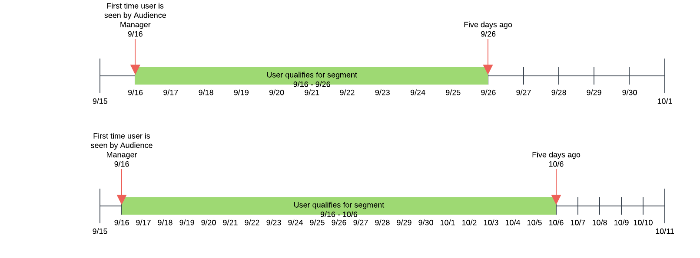

# 回访间隔和频度 {#recency-and-frequency}

在[!UICONTROL Segment Builder]中，回访间隔和频率允许您根据在设置的每日间隔内发生或重复执行的操作来细分访客。

Audience Manager按如下方式定义[!DNL recency]和[!DNL frequency]：

* **[!UICONTROL Recency]：**&#x200B;用户查看或符合一个（或多个） [!UICONTROL traits]资格的最近时间。
* **[!UICONTROL Frequency]：**&#x200B;用户查看或符合一个（或多个） [!UICONTROL traits]资格的速率。

[!UICONTROL Recency]和[!UICONTROL Frequency]设置可帮助您根据访客在网站、区域或特定创意中的实际（或感知）兴趣级别划分访客。 例如，符合高回访间隔/频繁度要求区段资格的用户可能比访问频率较低或不太频繁的用户对网站或产品更感兴趣。

## [!UICONTROL Recency and Frequency]设置的位置 {#location}

在[!UICONTROL Segment Builder]中，[!UICONTROL Recency]和[!UICONTROL Frequency]设置位于[!UICONTROL Basic View]面板的[!UICONTROL Traits]部分。 单击时钟图标以显示这些控件。

## 限制和规则 {#limitations-rules}

当您想要将回访间隔和频率应用于区段中的特征时，请查看并了解这些限制和规则。

### [!UICONTROL Recency] {#recency}

<table id="table_026064124C694D75B7A960457D50170B"> 
 <thead> 
  <tr> 
   <th colname="col1" class="entry"> 限制或规则 </th> 
   <th colname="col2" class="entry"> 描述 </th> 
  </tr> 
 </thead>
 <tbody> 
  <tr> 
   <td colname="col1"> 
 <b>最小值</b> 
 </td> 
   <td colname="col2"> 
回访间隔必须大于0。 
 </td> 
  </tr>
  <tr> 
   <td colname="col1"> 
 <b>特征类型</b> 
 </td> 
   <td colname="col2"> 
只能将回访间隔控件应用于基于规则的特征和文件夹特征。 
 </td> 
  </tr> 
  <tr> 
   <td colname="col1"> 
 <b>第三方特征</b> 
 </td> 
   <td colname="col2"> 
您无法为单个第三方特征或包含第三方特征的特征组设置回访间隔规则。 回访间隔和频度仅适用于您自己的特征。 
 </td> 
  </tr> 
 </tbody> 
</table>

### [!UICONTROL Frequency] {#frequency}

<table id="table_EBD621D26C8B4D03933E8C0753C892A7"> 
 <thead> 
  <tr> 
   <th colname="col1" class="entry"> 限制或规则 </th> 
   <th colname="col2" class="entry"> 描述 </th> 
  </tr> 
 </thead>
 <tbody> 
  <tr> 
   <td colname="col1"> 
 <b>第三方特征</b> 
 </td> 
   <td colname="col2"> 
您无法为单个第三方特征或包含第三方特征的特征组设置频率规则。 回访间隔和频度仅适用于您自己的特征。 
 </td> 
  </tr> 
  <tr> 
   <td colname="col1"> 
 <b>特征类型</b> 
 </td> 
   <td colname="col2"> 
频率控件只能应用于基于规则的特征和文件夹特征。 
 </td> 
  </tr> 
  <tr> 
   <td colname="col1"> 
 <b>回访间隔要求</b> 
 </td> 
   <td colname="col2"> 
您可以配置频率要求<i>，而无需</i>配置回访间隔要求。 只需设置一个频率值，并将回访间隔字段留空即可。 
 </td> 
  </tr> 
  <tr> 
   <td colname="col1"> 
<b>配置文件合并规则</b> 
 </td> 
   <td colname="col2"> 
查看<a href="../../faq/faq-profile-merge.md#trait-freq-device-rules">特征频率、外部设备图和配置文件合并规则</a>。 
 </td> 
  </tr> 
 </tbody> 
</table>

## 回访间隔示例 {#recency-examples}

以下是“回访间隔”如何工作的两个示例，具体取决于您在UI中所做的选择：

### 使用小于或等于运算符(&lt;=)

在本例中，您选择&lt;=运算符，如屏幕快照中所示。 这将使您的用户符合[!UICONTROL segment]的条件（如果他们在最近五天内至少三次符合三个[!UICONTROL traits]中的任意一个）。 以下时间线显示了在创建[!UICONTROL segment]时、10月1日以及十天后的[!UICONTROL segment]资格。

### 使用大于或等于运算符(=>)

在本例中，您选择=>运算符，如屏幕快照中所示。 这样可使您的用户符合[!UICONTROL segment]的条件，前提是他们在从Audience Manager平台的第一次资格到五天前的截止时间之间的任意时间有资格获得三个[!UICONTROL traits]的任意一个，且至少可达到三次。 以下时间线显示了在创建[!UICONTROL segment]时、10月1日以及十天后的[!UICONTROL segment]资格。

## 频率上限示例 {#frequency-capping}

频率上限表达式包括[!UICONTROL trait]实现次数低于所需值的所有用户。 以下是一些对错的示例：

* 错误 — 表达式`frequency([1000T]) <= 5`包括最多实现5次ID为“1000”的[!UICONTROL trait]的所有用户，但也包括尚未实现[!UICONTROL trait]的用户。 因此，出于性能原因，Audience Manager不验证此表达式，因为它将为[!UICONTROL segment]限定太多的用户。

* 右 — 如果要包括已实现ID为“1000”的[!UICONTROL trait]最多五次的所有用户，请向表达式添加其他条件，以确保用户至少有一次符合[!UICONTROL trait]的条件： `frequency([1000T]) >= 1  AND  frequency([1000T]) <= 5`

* 右 — 当您需要回访间隔/频率要求小于特定次数或天数时，请使用[!UICONTROL trait]运算符将该`AND`加入另一个回访间隔/频率要求。 使用第一个项目符号中的示例，此表达式在与另一个[!UICONTROL trait]连接时生效，如下所示： `frequency([1000T]) <= 5 AND isSiteVisitorTrait`。

* 右 — 对于广告频度上限用例，您可以创建类似于以下内容的[!UICONTROL segment]规则： `(frequency([1000T] <= 2D) >= 5)`。 此表达式包括过去2天内至少五次实现ID为“1000”的[!UICONTROL trait]的所有用户。 通过将此[!UICONTROL segment]发送到广告服务器（在广告服务器的`NOT`上设置了[!UICONTROL segment]）来设置频率上限。 此方法在[!DNL Audience Manager]中实现了更好的性能，同时仍服务于相同的频率封顶目的。

>[!MORELIKETHIS]
>
>* [区段生成器控件：特征部分](../../features/segments/segment-builder.md#segment-builder-controls-traits)
>* [区段表达式编辑器中使用的代码语法](../../features/segments/segment-code-syntax.md)
