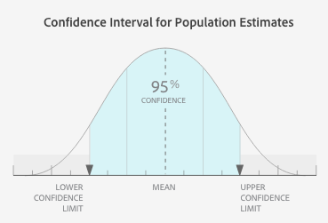

# [!UICONTROL Segment Builder]中的[!UICONTROL Trait]和[!UICONTROL Segment]填充数据 {#trait-and-segment-population-data-in-segment-builder}

在[!UICONTROL Segment Builder]中添加和删除[!UICONTROL traits]以查看实际[!UICONTROL trait]群体以及实际和预计的区段群体数据。 预计群体规模数据可帮助您为营销活动构建正确的区段。

## [!UICONTROL Trait]群体数据 {#trait-population-data}

当您向区段添加[!UICONTROL trait]时，[!UICONTROL Segment Builder]显示您[!UICONTROL Total Trait Population]的最后一天。 此数据显示在[!UICONTROL Basic View]部分中选定[!UICONTROL trait]周围的蓝色字段中。

下表定义了特征填充量度：

| 量度 | 描述 |
|---------|----------|
| [!UICONTROL Total Trait Population] | 配置文件中具有选定特征的唯一ID的数量。 |

## 计算实际和预计区段人口 {#calculating-real-estimated-populations}

创建新区段或更改现有区段时，最多需要24小时Audience Manager才能显示实际实时区段人口和总区段人口的结果。

但是，Audience Manager可以立即估计区段的实时人口大小和总人口大小。 这些估计值基于样本历史数据和95%置信区间下的返回结果。

在[!UICONTROL Segment Builder]中，预计的群体图表上的蓝色条表示区段大小的可能上范围和下范围。 尽管过去的性能并不保证将来的结果，但估计的数据可以帮助您了解新区段或编辑后的区段的潜在大小。

## 区段人口数据概述 {#segment-populations}

[!UICONTROL Segment Builder]在您创建和编辑区段时显示区段人口数据。

* 对于估算的区段人口数据（实时和总计），在区段中添加或删除特征时，[!UICONTROL Segment Builder]不会自动更新图形。 单击&#x200B;**[!UICONTROL Calculate Estimates]**&#x200B;查看（或刷新）预计的群体数量。

* 对于实际（实时）区段人口数据（实时和总计），[!UICONTROL Segment Builder]会在您加载现有区段时自动更新区段图。 对于新区段，或向现有区段添加新特征时，实际群体数据要在创建区段后24小时内才会更新。

有关预计和实际区段人口数据的更多信息，请参阅下面的定义。

## 定义的预计区段人口数据 {#estimated-segment-population}

下表定义了预计的群体量度。

<table id="table_B24503F372E34B6BBDF5204181701A59"> 
 <thead> 
  <tr> 
   <th colname="col1" class="entry"> 量度 </th> 
   <th colname="col2" class="entry"> 描述 </th> 
  </tr>
 </thead>
 <tbody> 
  <tr> 
   <td colname="col1"> 
 预计的实时人口（潜在） 
 </td> 
   <td colname="col2"> 
在指定时间范围内实时查看的估计独特访客数，以及在Audience Manager看到这些访客时符合区段资格条件的访客数。 
 
在区段生成器中，特征的最后30天群体（总特征群体）对于实时评估的特征和区段可能不同。 
 

     <ul id="ul_CAE803D09913462CAD413A665D85C1A2"> 
      <li id="li_3E64330D6F5B4D2F8F3456730A86894F">对于特征，过去30天的量度会计算过去30天内符合该特征条件的独特用户数。 </li>
      <li id="li_FF3CACD0B6C742CDB94D66200D77CE06">对于实时评估的区段，“最近30天”量度计算过去某个时间点符合某个特征（位于该区段中）并在30天内被Audience Manager再次查看的用户数量。 例如，假设您的某个用户在60天前符合某个特征的条件，但在10天前再次出现。 在该数据中，此用户不会被添加到特征计数，因为他们首次符合特征是在30多天前。 但是，它们将被纳入实时评估的区段的最后30天计数中。 这是因为他们已在30天时间间隔内符合区段的条件。 </li>
     </ul> 
 
 
注意： 估计实时人口量度不包括已根据由使用<a href="../../features/profile-merge-rules/merge-rule-definitions.md#device-options">设备图选项</a>的配置文件合并规则提供的连接符合区段资格条件的设备。 
 
 </td> 
  </tr> 
  <tr> 
   <td colname="col1"> 
 估计的总人口（潜在） 
 </td> 
   <td colname="col2"> 
新区段或修改后的区段中的预计独特访客数。 与几乎任何估计一样，过去的性能并不能保证未来的结果，但您可以使用估计的总数来： 
 
 
     <ul id="ul_0490DD08C7C8493DADFB11B5872A73BC"> 
      <li id="li_AE38C8C8A4B24021BAC724B51A4799E2">查看在构建区段时，新区段或修订区段可以联系的人数。 </li> 
      <li id="li_E830EC2B12DC46D4B0A4DD807A8936F6">根据您的目标调整区段。 例如，大区段对于品牌认知活动很有用，而小区段对于重点定位或重新定位活动很有用。 </li> 
     </ul> 
 
 
注意： 估计总人口量度不包括已根据由使用<a href="../../features/profile-merge-rules/merge-rule-definitions.md#device-options">设备图形选项</a>的配置文件合并规则提供的连接而符合区段资格条件的设备。 
 
 </td> 
  </tr> 
 </tbody> 
</table>

## 定义的现有（实际）区段人口数据 {#existing-segment-population}

[!UICONTROL Profile Merge Rules]会影响实际的实时和总人口数。 这些总数取决于区段所属的[!UICONTROL Profile Merge Rule]是否使用设备图选项。 另请参阅[定义的配置文件合并规则选项](../../features/profile-merge-rules/merge-rule-definitions.md)。

### 不带[!UICONTROL Device Graph Option]的[!UICONTROL Merge Rules]的区段人口数据

下表定义了当您的区段由创建时没有[!UICONTROL device graph]选项的[!UICONTROL Profile Merge Rule]使用时，实际的实时和总人口量度。 设备选项设置&#x200B;**[!UICONTROL No Device Options]**&#x200B;和&#x200B;**[!UICONTROL Current Device Proflie]**。

<table id="table_A18C973855DB46A0B39B81F32E0E7540"> 
 <thead> 
  <tr> 
   <th colname="col1" class="entry"> 量度 </th> 
   <th colname="col2" class="entry"> 描述 </th> 
  </tr> 
 </thead>
 <tbody> 
  <tr> 
   <td colname="col1"> 
 实时人口（现有） 
 </td> 
   <td colname="col2"> 
在指定时间范围内实时查看的实际独特访客数，以及在Audience Manager看到这些访客时符合区段资格条件的访客数。 
 
在区段生成器中，特征的最后30天群体（总特征群体）对于实时评估的特征和区段可能不同。 
 
 
     <ul id="ul_50D1528DDDF347858F17DA3C033B0E3F"> 
      <li id="li_ABA2BFE68FF4430DBB425C4661E1836A">对于特征，过去30天的量度会计算过去30天内符合该特征条件的独特用户数。 </li> 
      <li id="li_1519068CBB1445E893657D12E8FE42AC">对于实时评估的区段，“最近30天”量度计算过去某个时间点符合某个特征（位于该区段中）并在30天内被Audience Manager再次查看的用户数量。 例如，假设您的某个用户在60天前符合某个特征的条件，但在10天前再次出现。 在该数据中，此用户不会被添加到特征计数，因为他们首次符合特征是在30多天前。 但是，它们将被纳入实时评估的区段的最后30天计数中。 这是因为他们已在30天时间间隔内符合区段的条件。 </li> 
     </ul> 
 </td> 
  </tr> 
  <tr> 
   <td colname="col1"> 
 总人口（现有） 
 </td> 
   <td colname="col2"> 
截至昨天符合区段资格条件的独特访客的实际数量。 
 </td> 
  </tr> 
 </tbody> 
</table>

### 带[!UICONTROL Device Graph]选项的[!UICONTROL Merge Rules]的区段人口数据

下表定义了使用[!DNL device graph]选项创建的[!UICONTROL Profile Merge Rule]使用区段时的实际实时和总人口量度。 这些是您可用的[!UICONTROL Profile Link Device Graph]、[!DNL Adobe] [!DNL device graph]和其他第三方[!DNL device graph]选择的设备选项设置。

| 列A | 列B |
|---------|----------|
| [!UICONTROL Real-Time Population (Existing)] | 使用当前配置文件实时查看的实际设备数，这些当前配置文件与通过设备图连接的多达100个其他设备配置文件合并时，包含在Audience Manager看到区段时即表明其符合条件的特征。 |
| [!UICONTROL Total Population (Existing)] | 当与通过设备图连接的多达100个其他设备配置文件合并时，其配置文件均符合该区段资格条件的设备总数。 |

### 估算区段人口时，由于回访间隔和频率表达式导致的限制

[!UICONTROL Segment Builder]支持对最多包含4个回访间隔和频率表达式的区段规则进行区段大小估计。 在构建区段规则时选择4个以上的回访间隔和频率表达式，会导致区段估算器在估算群体时显示错误。

### 估算区段人口时因[!UICONTROL Merge Rules]导致的限制

目前存在一个已知限制，因为我们的区段大小估算器未考虑[!UICONTROL profile merge rules]。 例如，查看具有&#x200B;**[!UICONTROL No Authenticated Profile + Current Device Profile]** [合并规则](../../features/profile-merge-rules/merge-rule-definitions.md)的区段。 由于我们当前计算区段估计数字的方式，估计人口将包含已验证的用户档案。 但是，现有的区段群体将正确地忽略已验证的用户档案。

>[!MORELIKETHIS]
>
>* [配置文件合并规则和设备图常见问题解答](../../faq/faq-profile-merge.md)
>* [配置文件链接](../profile-merge-rules/merge-rules-overview.md)
