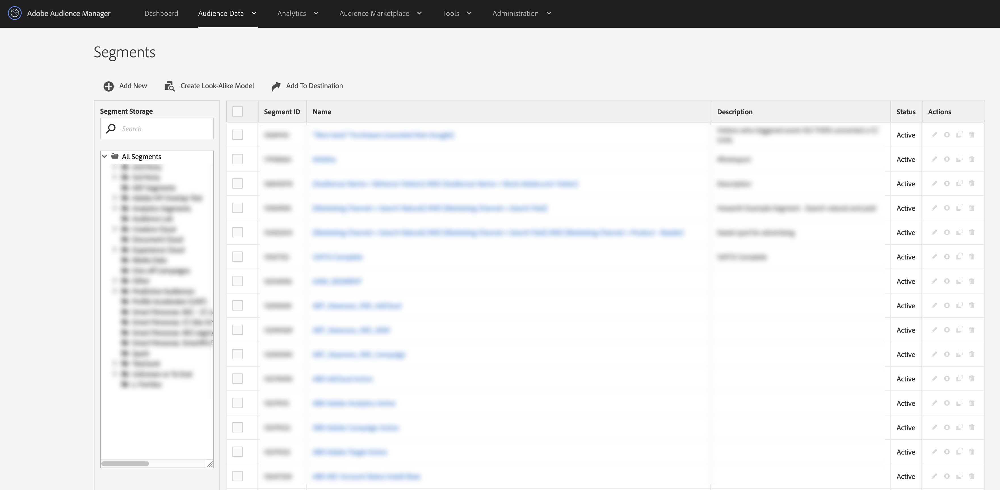

# 区段列表视图 {#segments-list-view}

[!UICONTROL Segments dashboard]是用于管理受众区段的集中工作区。 您可以通过导航到[!UICONTROL Segments] > **[!UICONTROL Audience Data]**&#x200B;查看&#x200B;**[!UICONTROL Segments]**&#x200B;仪表板。

[!UICONTROL Segments]页面包含可帮助您：

* 创建新区段；
* 编辑和删除区段；
* 克隆（复制）现有区段；
* 在具有可排序列的表中查看您的所有区段；
* 管理区段存储；
* 按名称搜索区段。
