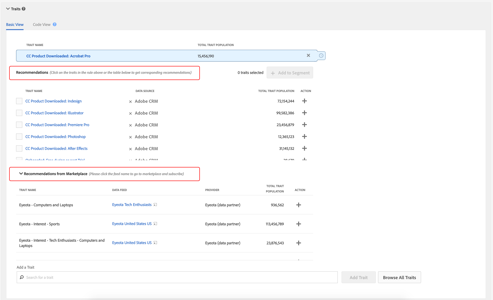
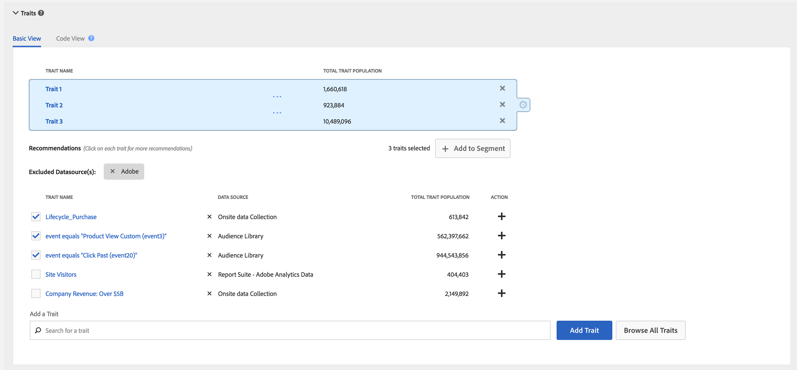

# 特征推荐

根据您自己的第一方特征和[!UICONTROL Audience Marketplace]数据源构建细分时获取实时特征推荐。

## 视频演示

开始，观看下面的[!UICONTROL Trait Recommendations]视频，然后阅读以了解详细信息。 该视频演示向您展示如何处理您自己的第一方特征的建议，以及[!UICONTROL Audience Marketplace]数据服务中您已订阅&#x200B;*的特征建议。*

>[!VIDEO](https://video.tv.adobe.com/v/26228/)

下一个视频概述了[!UICONTROL Marketplace Recommendations]的工作流程，其中显示了如何根据[!UICONTROL Audience Marketplace]中数据服务的推荐将特征添加到区段。 这些建议基于您未订阅&#x200B;*的数据服务。*

>[!VIDEO](https://video.tv.adobe.com/v/29363/)

## 概述

[!UICONTROL Trait Recommendations]在您的支 [!DNL Adobe Sensei]持下，将数据科学引入Audience Manager的日常工作流。在[!UICONTROL Trait Recommendations]中，当您在[区段生成器](segment-builder.md)中构建或编辑区段时，您会获得有关可包含的其他特征的建议，这些特征与区段规则中的特征相似。

Audience Manager显示您的特征推荐，包括来自您的第一方特征（在&#x200B;**[!UICONTROL Recommendations]**&#x200B;部分）和来自&#x200B;**[!UICONTROL Audience Marketplace]**&#x200B;的来自&#x200B;**[!UICONTROL Recommendations from Marketplace]**&#x200B;部分。

将推荐的特征添加到区段中，可增加目标受众。

**简而言之：**

* Audience Manager在[!UICONTROL Recommendations]部分显示第一方特征。 您未订阅的公共和私有源的市场推荐显示在[!UICONTROL Recommendations from Marketplace]部分。 单击源名称以转到[!UICONTROL Audience Marketplace]并订阅。
* Audience Manager显示最多50个与段规则中的特征相似的特征。
* 您可以过滤掉不想从中看到任何推荐的数据源。
* 在计算相似性时，Audience Manager会考虑过去30天内限定该特征的[ UUID](../../reference/ids-in-aam.md)。
* 如果看到错误消息“未找到类似特征。 特征可能太新。”，这意味着在过去30天内没有该特征的活动，或者Audience Manager尚未更新该特征的建议。 请在24小时后重试。

## 用例

使用[!UICONTROL Trait Recommendations]，您可以改进工作流，具体取决于您使用Audience Manager的方式：

* 作为营销人员，您可以借助相似特征快速找到对补充产品感兴趣的受众，从而扩大触及范围。
* 如果您以Audience Manager为发布者，使用[!UICONTROL Trait Recommendations]，您可以了解受众行为并为广告销售或用户赢取建立更好的细分。
* 作为[!UICONTROL Audience Marketplace]数据购买者，我希望无需浏览大量源即可发现相关的第三方数据。
* 作为[!UICONTROL Audience Marketplace]数据提供者，我希望向购买者推荐相关数据，以便能够从最优和相关订阅中受益。

## 特质Recommendations与算法模型的差异

### 算法模型

[!UICONTROL Algorithmic Models] 不仅可以找到最具影响力的特征，还可以根据这些特征对用户进行评分，并为每个用户分配一个个人得分。然后，便可以通过创建算法特征来定位用户。借助[!UICONTROL Trait Builder]中的准确性和范围控件，您可以指定所有具有您想要目标的影响特征的用户中的哪些用户。

[!UICONTROL Algorithmic Models] 使您能够选择不同准确度级别的用户，并测试哪 [!UICONTROL Audience Lab] 组用户转换效果更好。有关详细用例，请参阅[在 Audience Lab 中比较模型](../../features/audience-lab/audience-lab-use-cases.md#compare-models)。

在[!UICONTROL Algorithmic Models]中，该模型每8天运行一次，并刷新符合算法特征条件的用户。

### 特征推荐

[!UICONTROL Trait Recommendations] 是一种快速的方法，可让您深入了解与您在区段中使用的特征相似的其他特征。

应在以下情况下使用[!UICONTROL Trait Recommendations]:

* 构建区段时需要快速获取信息；
* 要将区段用于短期促销活动，或者希望快速抑制转化的受众；
* 想要最大化范围。

## 工作流

在[区段生成器](segment-builder.md)中构建或编辑区段时，您可以探索与区段规则中的特征相似的特征。 [区段生成器](segment-builder.md)工作流对于新区段和现有区段非常相似：

### 新细分

1. 转到&#x200B;**受众数据>区段**，然后单击&#x200B;**添加新**。
1. 在&#x200B;**Traits**&#x200B;下拉框中，向段规则添加至少一个特征。
1. 您可以在&#x200B;**[!UICONTROL Recommendations]**&#x200B;部分查看您订阅的源的第一方推荐特征和[!UICONTROL Audience Marketplace]特征推荐。 **[!UICONTROL Recommendations from Marketplace]**&#x200B;部分显示您未订阅源的特征推荐。 所有这些建议都与您添加到区段规则的特征相似。 向下滚动以查看所有推荐特征。
1. （可选）要从某些数据源中排除推荐的第一方特征，请单击要排除的数据源的&#x200B;**X**&#x200B;符号。

   >[!NOTE]
   >
   >被排除的数据源显示在建议特征列表的正上方。 单击灰色框中的&#x200B;**X**&#x200B;以删除排除项，并再次查看各个数据源的结果。
1. 要向段规则添加推荐特征，请单击&#x200B;**+**&#x200B;符号。

>[!IMPORTANT]
>
>在将[!UICONTROL Marketplace]特征添加到区段时，这些特征仅用于区段估计，直到您订阅相应的数据源。 来自您未订阅的数据源的特征在特征列表中标有购物车图标。 单击特征名称可转到数据源页面并订阅它。
>
>
>
>仅在订阅相应数据服务后，才能保存具有第三方特征的区段。

### 现有细分

1. 转到&#x200B;**[!UICONTROL Audience Data]>[!UICONTROL Segments]**，选择要编辑的区段，然后单击。
1. 向下滚动到[!UICONTROL Traits]下拉框。
1. 您可以看到推荐的特征，这些特征与段规则中已有的特征相似。 向下滚动以查看所有推荐特征。
1. （可选）要从某些数据源中排除推荐的特征，请单击要排除的数据源的&#x200B;**X**&#x200B;符号。

   >[!NOTE]
   >
   >被排除的数据源显示在建议特征列表的正上方。 单击灰色框中的&#x200B;**X**&#x200B;以删除排除项，并再次查看各个数据源的结果。
1. 要向段规则添加推荐特征，请单击&#x200B;**+**&#x200B;符号。

在创建或编辑区段并向区段规则添加特征时，最多可看到50个推荐特征，与您添加的特征相似。 如果区段规则包含多个特征，则Audience Manager使用循环法来显示每个特征的最佳匹配，然后在每个特征中显示每个特征的次佳匹配，依此类推，在区段规则中按人口划分的最大50个特征。

例如，当区段规则中有三个特征时，建议的特征为：

1. 最适合特征3（人口最多的特征）;
1. 特征1的最佳匹配；
1. 特征2的最佳匹配；
1. 特征3次优匹配；
1. 特征1的次优匹配，等等，直到你达到50个特征。

要获取特定特征的推荐，您可以单击段规则(1)或推荐特征视图(2)中的特征。

单击第一方特征可打开一个弹出窗口，如下图所示。 如果建议的特征不是区段的一部分，可以按&#x200B;**+**&#x200B;将其添加到区段。

>[!TIP]
>
>在特征信息弹出窗口中生成推荐时，会考虑主页中被排除的数据源。 此外，如果在此视图中排除数据源，则排除将应用于主页。

>[!NOTE]
>
>建议的特征可以是您在[!UICONTROL Audience Marketplace]中订阅的数据源中的第一方特征或第三方特征。

## 工作原理

要生成特征推荐，Audience Manager计算目标特征和您的帐户有权访问的所有其他特征（包括第三方数据）之间的[Jaccard相似性](https://en.wikipedia.org/wiki/Jaccard_index)。 Audience Manager显示最多50个相似性最高的特征。

## 特征相似性得分{#trait-similarity-score}

Audience Manager计算两个特征之间的[!UICONTROL Trait Similarity Score]，方法是根据[!UICONTROL UUID]s的数量计算交集和合并，然后将这两个特征相除。 对于两个特征A和B，计算如下所示：

另请参见下面的两个示例。

### 示例1 —— 低特征相似性得分

假设给定两个特征A和B，假设每个特征的人口数为1,000,000 [!UICONTROL UUID]s, 25,000 [!UICONTROL UUID]s，其中两个特征均符合。
使用上述公式，这将导致：25,000 / 1,975,000 = 0.012。这是一个低[!UICONTROL Trait Similarity Score]，这两个特征非常不同。

### 示例2 —— 特征相似性得分

如果相同的特征A和B具有400,000个[!UICONTROL UUID]s，则[!UICONTROL Trait Similarity Score]要高得多：
400,000 / 1,600,000 = 0.25

### 如何解读特质相似性评分

使用下表作为特征相似性的粗略指南。 本指南基于在大多数特征上观察到的相似性得分。

| [!UICONTROL Trait Similarity Score] | 意义 |
---------|----------|
| 0.1及更高版本 | 特征之间的高相似性 |
| 0.03 - 0.1 | 特征之间的中等相似性 |
| 0.01 - 0.03 | 特征之间的低相似性 |
| 0 - 0.01 | 特征之间的相似性很低 |

## 基于角色的访问控制(RBAC)

对于使用[!UICONTROL Role-Based Access Controls]([!UICONTROL RBAC])的公司，您需要具有创建和编辑区段的权限才能查看推荐的特征。 您看到的特征建议只是您有权通过[!UICONTROL RBAC]访问的数据源中的建议。

>[!IMPORTANT]
>
>要将[!UICONTROL Marketplace Recommendations]添加到区段，用户必须先订阅相应的数据服务。 只有具有管理员权限的用户才能订阅[!UICONTROL Audience Marketplace]数据服务。

请阅读有关[!UICONTROL RBAC]控件[的更多信息，此处为](../administration/administration-overview.md)。

## 限制

* 目前，Audience Manager不将文件夹特征显示为推荐特征。 请阅读有关文件夹特征[的更多信息，此处为](../traits/manage-folder-traits.md)。
* 显示特征Recommendations时，Audience Manager不考虑段规则中的[!DNL Boolean]运算符([!DNL AND]、[!DNL OR]、[!DNL NOT])。
