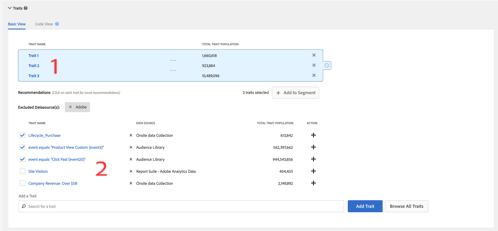

# 特征推荐

在构建区段时，从您自己的第一方特征和[!UICONTROL Audience Marketplace]数据馈送中获取实时特征推荐。

## 视频演示

首先观看下面的[!UICONTROL Trait Recommendations]视频，然后阅读以了解更多信息。 该视频演示向您展示了如何使用您自己的第一方特征中的推荐，以及[!UICONTROL Audience Marketplace]数据馈送中已订阅&#x200B;*的特征推荐。*

>[!VIDEO](https://video.tv.adobe.com/v/26228/)

下一个视频概述了[!UICONTROL Marketplace Recommendations]的工作流程，其中显示了如何根据[!UICONTROL Audience Marketplace]中数据馈送的推荐，将特征添加到区段。 这些建议基于您未订阅&#x200B;*的数据馈送。*

>[!VIDEO](https://video.tv.adobe.com/v/29363/)

## 概述

[!UICONTROL Trait Recommendations]由提供支 [!DNL Adobe Sensei]持，将数据科学融入到您的Audience Manager日常工作流程中。对于[!UICONTROL Trait Recommendations]，在[区段生成器](segment-builder.md)中构建或编辑区段时，您会获得可包含的其他推荐特征（与区段规则中的特征类似）。

Audience Manager会从第一方特征、**[!UICONTROL Recommendations]**&#x200B;部分和&#x200B;**[!UICONTROL Audience Marketplace]**&#x200B;部分的&#x200B;**[!UICONTROL Recommendations from Marketplace]**&#x200B;部分显示推荐的特征。

将推荐的特征添加到区段中，可增加目标受众。

**一言以蔽之：**

* Audience Manager在[!UICONTROL Recommendations]部分中显示第一方特征。 您未订阅的公共和私人馈送的市场推荐显示在[!UICONTROL Recommendations from Marketplace]部分。 单击信息源名称以转到[!UICONTROL Audience Marketplace]并订阅。
* Audience Manager最多显示50个与区段规则中类似的特征。
* 您可以过滤掉不希望从中看到任何推荐的数据源。
* 在计算相似性时，Audience Manager会考虑过去30天内符合特征的[UUID](../../reference/ids-in-aam.md)。
* 如果您看到错误消息“未找到类似特征。 特征可能太新。”这表示过去30天内该特征没有活动，或者Audience Manager尚未更新该特征的推荐。 请在24小时内重试。

## 用例

通过[!UICONTROL Trait Recommendations]，您可以根据使用Audience Manager的方式改进工作流：

* 作为营销人员，您可以借助相似特征快速找到对补充产品感兴趣的受众，从而扩大访问范围。
* 如果您将Audience Manager用作发布者，并且[!UICONTROL Trait Recommendations]，则可以了解受众行为并为广告销售或用户获取构建更好的区段。
* 作为[!UICONTROL Audience Marketplace]数据购买者，我希望无需浏览大量信息源即可发现相关的第三方数据。
* 作为[!UICONTROL Audience Marketplace]数据提供商，我希望向购买者推荐相关数据，以便从最佳且相关的订阅中受益。

## 特征Recommendations与算法模型之间的差异

### 算法模型

[!UICONTROL Algorithmic Models] 不仅可以找到最具影响力的特征，还可以根据这些特征对用户进行评分，并为每个用户分配一个得分。然后，便可以通过创建算法特征来定位用户。借助[!UICONTROL Trait Builder]中的精度和范围控件，您可以指定要定位具有影响力特征的用户中的哪些用户。

[!UICONTROL Algorithmic Models] 允许您选择不同准确度级别的用户，并测试哪 [!UICONTROL Audience Lab] 组用户转化得更好。有关详细用例，请参阅[在 Audience Lab 中比较模型](../../features/audience-lab/audience-lab-use-cases.md#compare-models)。

在[!UICONTROL Algorithmic Models]中，模型每8天运行一次，并刷新符合算法特征的用户。

### 特征推荐

[!UICONTROL Trait Recommendations] 是一种快速了解与您在区段中使用的特征类似的其他特征的方法。

在以下情况下，应使用[!UICONTROL Trait Recommendations]:

* 构建区段时需要快速获取信息；
* 要将区段用于短期促销活动，或者希望快速抑制转化的受众；
* 想要最大化范围。

## 工作流

在[区段生成器](segment-builder.md)中构建或编辑区段时，您可以浏览与区段规则中的特征类似的特征。 对于新区段和现有区段， [区段生成器](segment-builder.md)工作流非常相似：

### 新区段

1. 转到&#x200B;**受众数据>区段**，然后单击&#x200B;**新增**。
1. 在&#x200B;**特征**&#x200B;下拉框中，至少向区段规则添加一个特征。
1. 您可以在&#x200B;**[!UICONTROL Recommendations]**&#x200B;部分中，查看您订阅的动态消息的第一方推荐特征和[!UICONTROL Audience Marketplace]特征推荐。 **[!UICONTROL Recommendations from Marketplace]**&#x200B;部分显示您未订阅的馈送的特征推荐。 所有这些推荐都与您添加到区段规则的特征类似。 向下滚动以查看所有推荐的特征。
1. （可选）要从某些数据源中排除推荐的第一方特征，请单击要排除的数据源的&#x200B;**X**&#x200B;符号。

   >[!NOTE]
   >
   >排除的数据源显示在推荐特征列表的正上方。 单击灰色框中的&#x200B;**X**&#x200B;以删除排除项，并再次查看来自相应数据源的结果。
1. 要向区段规则添加推荐特征，请单击&#x200B;**+**&#x200B;符号。

>[!IMPORTANT]
>
>在向区段添加[!UICONTROL Marketplace]特征时，该特征仅用于区段估计，直到您订阅了相应的数据馈送为止。 您未订阅的数据馈送中的特征在特征列表中带有购物车图标。 单击特征名称以转到数据馈送页面并订阅该页面。
>
>
>
>只有在订阅相应的数据馈送后，才能保存具有第三方特征的区段。

### 现有区段

1. 转到&#x200B;**[!UICONTROL Audience Data]>[!UICONTROL Segments]**，选择要编辑的区段，然后单击。
1. 向下滚动到[!UICONTROL Traits]下拉框。
1. 您可以看到推荐的特征，这些特征与区段规则中已有的特征类似。 向下滚动以查看所有推荐的特征。
1. （可选）要从某些数据源中排除推荐的特征，请单击要排除的数据源的&#x200B;**X**&#x200B;符号。

   >[!NOTE]
   >
   >排除的数据源显示在推荐特征列表的正上方。 单击灰色框中的&#x200B;**X**&#x200B;以删除排除项，并再次查看来自相应数据源的结果。
1. 要向区段规则添加推荐特征，请单击&#x200B;**+**&#x200B;符号。

创建或编辑区段并将特征添加到区段规则时，您最多会看到50个推荐特征，与已添加的特征类似。 如果区段规则包含多个特征，则Audience Manager会使用轮循方法来显示每个特征的最佳匹配项，然后显示区段规则中每个特征的次最佳匹配项，依此类推，对于按群体划分的最大50个特征。

例如，当区段规则中有三个特征（如下所示）时，推荐的特征为：

1. 最适合特征3（人口最多的特征）；
1. 最适合特征1;
1. 最适合特征2;
1. 特征3的次佳匹配；
1. 特征1的次佳匹配，依此类推，直到您获得50个特征。

要获取特定特征的推荐，您可以单击区段规则(1)或推荐特征视图(2)中的特征。

单击第一方特征会打开一个弹出窗口，如下图所示。 如果推荐的特征不属于区段的一部分，则可以按&#x200B;**+**&#x200B;将其添加到区段。

>[!TIP]
>
>在特征信息弹出窗口中生成推荐时，会考虑从主页中排除的数据源。 此外，如果在此视图中排除数据源，则排除项将应用于主页。

>[!NOTE]
>
>推荐特征可以是您在[!UICONTROL Audience Marketplace]中订阅的数据馈送的第一方特征或第三方特征。

## 工作原理

要生成特征推荐，Audience Manager会计算目标特征与您的帐户有权访问的每个其他特征（包括第三方数据）之间的[Jaccard相似度](https://en.wikipedia.org/wiki/Jaccard_index)。 然后，Audience Manager会显示最多50个相似度最高的特征。

## 特征相似度分数{#trait-similarity-score}

Audience Manager计算两个特征之间的[!UICONTROL Trait Similarity Score]，方法是根据[!UICONTROL UUID]s的数量计算交集和并集，然后将二者相除。 对于两个特征A和B，计算方式如下所示：

另请参阅下面的两个示例。

### 示例1 — 低特征相似度得分

给定两个特征A和B，假设每个特征的群体为1,000,000 [!UICONTROL UUID]s，25,000 [!UICONTROL UUID]s，这两个特征均符合条件。
使用上述公式，将导致：25,000 / 1,975,000 = 0.012。这个值很低[!UICONTROL Trait Similarity Score]，两个特征非常不同。

### 示例2 — 特征相似度得分

如果相同特征A和B具有400,000个[!UICONTROL UUID]s，且符合这两个特征的条件，则[!UICONTROL Trait Similarity Score]的值要高得多：
400,000 / 1,600,000 = 0.25

### 如何解读特征相似度得分

使用下表粗略指导特征相似度。 本指南基于在大多数特征中观察到的相似度得分。

| [!UICONTROL Trait Similarity Score] | 显着性 |
---------|----------|
| 0.1及更高版本 | 特征之间的高度相似性 |
| 0.03 - 0.1 | 特征之间的中等相似度 |
| 0.01 - 0.03 | 特征之间的低相似度 |
| 0 - 0.01 | 特征之间的相似性很低 |

## 基于角色的访问控制(RBAC)

对于使用[!UICONTROL Role-Based Access Controls]([!UICONTROL RBAC])的公司，您需要拥有创建和编辑区段的权限，才能查看推荐的特征。 您看到的特征推荐仅是您有权通过[!UICONTROL RBAC]访问的数据源中的推荐。

>[!IMPORTANT]
>
>要向区段添加[!UICONTROL Marketplace Recommendations]，用户必须首先订阅相应的数据馈送。 只有具有管理员权限的用户才能订阅[!UICONTROL Audience Marketplace]数据馈送。

有关[!UICONTROL RBAC]控件[的更多信息，请参阅此处](../administration/administration-overview.md)。

## 限制

* 目前，Audience Manager未将文件夹特征显示为推荐特征。 有关文件夹特征[的更多信息，请参阅此处](../traits/manage-folder-traits.md)。
* 显示特征Recommendations时，Audience Manager不考虑区段规则中的[!DNL Boolean]运算符([!DNL AND]、[!DNL OR]、[!DNL NOT])。
