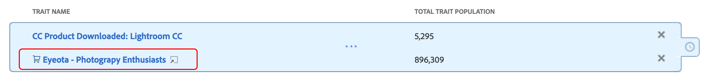

# 特征Recommendations

在构建区段时，从您自己的第一方特征和[!UICONTROL Audience Marketplace]数据馈送获得实时特征推荐。

## 视频演示

首先观看下面的[!UICONTROL Trait Recommendations]视频，然后阅读以了解更多信息。 此视频演示向您展示了如何使用来自您自己的第一方特征的推荐，以及来自[!UICONTROL Audience Marketplace]数据馈送（您&#x200B;*已订阅*）的特征推荐。

>[!VIDEO](https://video.tv.adobe.com/v/40843?captions=chi_hans)

下一个视频概述了[!UICONTROL Marketplace Recommendations]的工作流，向您展示了如何根据[!UICONTROL Audience Marketplace]中的数据馈送中的推荐向区段添加特征。 这些建议基于&#x200B;*您未订阅*&#x200B;的数据馈送。

>[!VIDEO](https://video.tv.adobe.com/v/32753?captions=chi_hans)

## 概述

由[!DNL Adobe Sensei]提供支持的[!UICONTROL Trait Recommendations]将数据科学融入到您的Audience Manager日常工作流程中。
使用[!UICONTROL Trait Recommendations]，在[区段生成器](segment-builder.md)中生成或编辑区段时，您能够获得可包含的其他推荐特征（与区段规则中的特征类似）。

Audience Manager会在&#x200B;**[!UICONTROL Recommendations]**&#x200B;部分和&#x200B;**[!UICONTROL Recommendations from Marketplace]**&#x200B;部分分别显示来自第一方特征和&#x200B;**[!UICONTROL Audience Marketplace]**&#x200B;的特征推荐。

将推荐的特征添加到区段中，可增加目标受众。

**简而言之：**

* Audience Manager显示[!UICONTROL Recommendations]部分中的第一方特征。 来自您未订阅的公开和私有信息源的Marketplace建议将显示在[!UICONTROL Recommendations from Marketplace]部分中。 单击馈送名称以转到[!UICONTROL Audience Marketplace]并订阅。
* Audience Manager最多可显示50个与区段规则中特征相似的特征。
* 您可以过滤掉不想查看任何推荐的数据源。
* 计算相似性时，Audience Manager会考虑过去30天内符合特征条件的[个UUID](../../reference/ids-in-aam.md)。
* 如果您看到错误消息“未找到类似的特征。 特征可能太新。”，这表示该特征在过去30天内没有活动，或者Audience Manager尚未更新该特征的推荐。 请在24小时后重试。

## 用例

使用[!UICONTROL Trait Recommendations]，您可以根据使用Audience Manager的方式改进工作流：

* 作为营销人员，您可以借助相似的特征，快速找到对互补产品感兴趣的受众，以便扩大您的影响力。
* 如果您使用Audience Manager作为具有[!UICONTROL Trait Recommendations]的发布者，则可以了解受众行为并为广告销售或用户获取构建更好的区段。
* 作为[!UICONTROL Audience Marketplace]数据购买者，我希望在不浏览大量馈送的情况下发现相关的第三方数据。
* 作为[!UICONTROL Audience Marketplace]数据提供商，我想向购买者推荐相关数据，以便我从最佳和相关订阅中受益。

## 特征Recommendations和算法模型之间的差异

### 算法模型

[!UICONTROL Algorithmic Models]不仅会找到最具影响力的特征，还会根据这些特征对用户进行评分，并为每个用户分配一个得分。 然后，便可以通过创建算法特征来定位用户。利用[!UICONTROL Trait Builder]中的精度和范围控件，您可以指定哪些用户具有要定位的有影响力特征。

[!UICONTROL Algorithmic Models]允许您选择不同精度级别的用户，并在[!UICONTROL Audience Lab]中测试哪组用户的转化率更高。 有关详细用例，请参阅[在 Audience Lab 中比较模型](../../features/audience-lab/audience-lab-use-cases.md#compare-models)。

在[!UICONTROL Algorithmic Models]中，模型每8天运行一次，并刷新符合算法特征的用户。

### 特征Recommendations

[!UICONTROL Trait Recommendations]是一种快速了解与您在区段中使用的特征相似的其他特征的方法。

您应在以下情况下使用[!UICONTROL Trait Recommendations]：

* 构建区段时需要快速获取信息；
* 要将区段用于短期促销活动，或者希望快速抑制转化的受众；
* 想要最大化范围。

## 工作流

在[区段生成器](segment-builder.md)中生成或编辑区段时，您可以浏览与区段规则中的特征相似的特征。 [区段生成器](segment-builder.md)工作流与新区段和现有区段非常相似：

### 新区段

1. 转到&#x200B;**受众数据>区段**，然后单击&#x200B;**新增**。
1. 在&#x200B;**特征**&#x200B;下拉框中，向区段规则至少添加一个特征。
1. 您可以在&#x200B;**[!UICONTROL Recommendations]**&#x200B;部分中查看来自您订阅的馈送的第一方推荐特征和[!UICONTROL Audience Marketplace]特征推荐。 **[!UICONTROL Recommendations from Marketplace]**&#x200B;部分显示来自您未订阅的源的特征推荐。 所有这些推荐都与您添加到区段规则的特征类似。 向下滚动查看所有推荐的特征。
1. （可选）要从特定数据源中排除推荐的第一方特征，请为要排除的数据源单击&#x200B;**X**&#x200B;符号。

   >[!NOTE]
   >
   >排除的数据源会显示在推荐特征列表的正上方。 单击灰色框中的&#x200B;**X**&#x200B;可删除排除项并再次查看相应数据源的结果。
1. 要将推荐的特征添加到区段规则，请单击&#x200B;**+**&#x200B;符号。

>[!IMPORTANT]
>
>将[!UICONTROL Marketplace]特征添加到区段时，这些特征仅用于区段估计，直到您订阅相应的数据馈送为止。 来自您未订阅的数据馈送的特征会在特征列表中标记为购物车图标。 单击特征名称以转到数据馈送页面并订阅它。
>
>
>
>只有在订阅了相应的数据馈送后，才能保存具有第三方特征的区段。

### 现有区段

1. 转到&#x200B;**[!UICONTROL Audience Data]>[!UICONTROL Segments]**，选择要编辑的区段并单击。
1. 向下滚动到[!UICONTROL Traits]下拉框。
1. 您可以看到推荐的特征，这些特征与区段规则中已存在的特征类似。 向下滚动查看所有推荐的特征。
1. （可选）要从特定数据源中排除推荐的特征，请为要排除的数据源单击&#x200B;**X**&#x200B;符号。

   >[!NOTE]
   >
   >排除的数据源会显示在推荐特征列表的正上方。 单击灰色框中的&#x200B;**X**&#x200B;可删除排除项并再次查看相应数据源的结果。
1. 要将推荐的特征添加到区段规则，请单击&#x200B;**+**&#x200B;符号。

创建或编辑区段并将某个特征添加到区段规则时，您最多会看到50个推荐特征，与添加的特征类似。 如果区段规则包含多个特征，Audience Manager会使用循环方法为每个特征显示最佳匹配，然后为每个特征显示次最佳匹配，依此类推，对于区段规则中按人口统计的最大50个特征。

例如，区段规则中有三个特征时（如下所示），建议的特征包括：

1. 特征3（人口最多的特征）的最佳匹配；
1. 特征1的最佳匹配；
1. 特征2的最佳匹配；
1. 特征3次优匹配；
1. 在获得50个特征之前，该特征会一直排在第二位，与特征1匹配，以此类推。

要获取特定特征的推荐，您可以在区段规则(1)或推荐的特征视图(2)中单击特征。

单击第一方特征会打开一个弹出窗口，如下图所示。 如果推荐的特征不是区段的一部分，则可以按&#x200B;**+**&#x200B;将其添加到区段。

>[!TIP]
>
>在特征信息弹出窗口中生成推荐时，会考虑从主页排除的数据源。 此外，如果在此视图中排除数据源，则排除项将应用于主页。

>[!NOTE]
>
>推荐的特征可以是您在[!UICONTROL Audience Marketplace]中订阅的数据馈送中的第一方特征或第三方特征。

## 工作原理

为了生成特征推荐，Audience Manager将计算Target特征与您帐户有权访问的所有其他特征（包括第三方数据）之间的[Jaccard相似度](https://en.wikipedia.org/wiki/Jaccard_index)。 然后，Audience Manager会显示最多五十个具有最高相似度的特征。

## 特征相似度分数 {#trait-similarity-score}

Audience Manager通过计算[!UICONTROL UUID]个数的交集和并集来计算两个特征之间的[!UICONTROL Trait Similarity Score]，然后将两个特征相除。 对于两个特征A和B，计算方式如下所示：

另请参阅下面的两个示例。

### 示例1 — 低特征相似度分数

给定两个特征A和B，假设每个特征都有一个人口1,000,000个[!UICONTROL UUID]，其中25,000个[!UICONTROL UUID]同时符合这两个特征。
使用上面的公式，其结果为：25,000 / 1,975,000 = 0.012。[!UICONTROL Trait Similarity Score]较低，两个特征非常不同。

### 示例2 — 特征相似度分数

如果相同的特征A和B具有400,000个同时符合两个特征的[!UICONTROL UUID]，则[!UICONTROL Trait Similarity Score]要高得多：
400,000 / 1,600,000 = 0.25

### 如何解释特征相似度得分

使用下表作为特征相似度的粗略指南。 此指南基于在大多数特征中观察到的相似性得分。

| [!UICONTROL Trait Similarity Score] | 重要性 |
|---------|----------|
| 0.1及更高版本 | 特征之间的高度相似性 |
| 0.03 - 0.1 | 特征之间的Medium相似度 |
| 0.01 - 0.03 | 特征之间的相似度较低 |
| 0 - 0.01 | 特征之间的相似度很低 |

## 基于角色的访问控制(RBAC)

对于使用[!UICONTROL Role-Based Access Controls] ([!UICONTROL RBAC])的公司，您需要具有创建和编辑区段的权限才能查看推荐的特征。 您看到的特征推荐只是您通过[!UICONTROL RBAC]有权访问的数据源中的特征推荐。

>[!IMPORTANT]
>
>要将[!UICONTROL Marketplace Recommendations]添加到区段，用户必须首先订阅相应的数据馈送。 只有具有管理员权限的用户才能订阅[!UICONTROL Audience Marketplace]数据馈送。

在[此处](../administration/administration-overview.md)阅读有关[!UICONTROL RBAC]控件的更多信息。

## 限制

* 目前，Audience Manager不会将文件夹特征显示为推荐的特征。 在[此处](../traits/manage-folder-traits.md)阅读有关文件夹特征的更多信息。
* 显示特征Recommendations时，Audience Manager在区段规则中未考虑[!DNL Boolean]运算符([!DNL AND]、[!DNL OR]、[!DNL NOT])。
