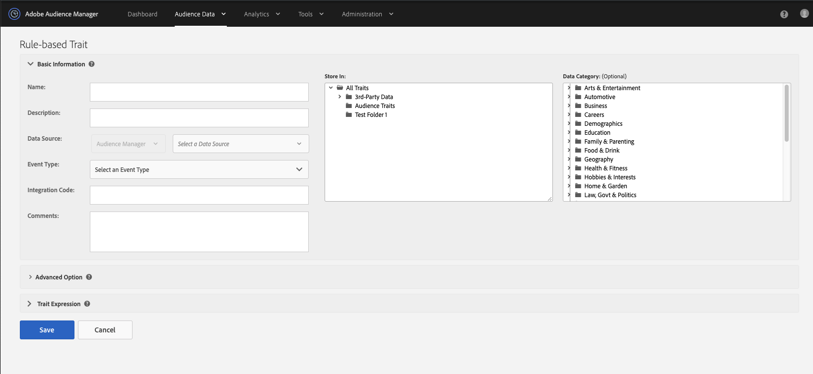

# 创建[!UICONTROL Rules-Based]或[!UICONTROL Onboarded Traits] {#create-rules-based-or-onboarded-traits}

介绍特定于[!UICONTROL rules-based]和[!UICONTROL onboarded]特征创建过程的设置步骤和功能。

<!-- c_tb_rules_traits.xml -->

## 特征的基本信息 {#basics}

在[!UICONTROL Trait Builder]中，[!UICONTROL Basic Information]设置允许您创建新设置，或编辑现有[!UICONTROL traits]。 [!UICONTROL Basic Information]、[!UICONTROL rules-based]和[!UICONTROL onboarded]的[!UICONTROL algorithmic traits]设置相同。 要创建新[!UICONTROL trait]，请提供名称（避免使用特殊字符）、[!UICONTROL data source]并选择[!UICONTROL storage folder]。 其他[!UICONTROL Basic Information]字段是可选的。

<!-- c_tb_basics.xml -->

### 定义的基本信息字段

<table id="table_42AEC7A5B22346C5BB996D2D36C56229"> 
 <thead> 
  <tr> 
   <th colname="col1" class="entry"> 界面元素 </th> 
   <th colname="col2" class="entry"> 说明 </th> 
  </tr> 
 </thead>
 <tbody> 
  <tr> 
   <td colname="col1"> <b>名称</b> </td> 
   <td colname="col2"> 
特征名称。 必需。 
 
最大长度：255个字符。 
 
 
注意：在命名特征时，请避免使用以下特殊字符： 
      <ul id="ul_AB38A333F21A4AA9B5656CBA69BA65E3"> 
       <li id="li_0E5033B540BC41E799075845388E85A7">逗号 </li> 
       <li id="li_B1A6C3E3FB98473A91E4675EE09460F0">短划线 </li> 
       <li id="li_579302FE34B64FE0AE3C751012839229">连字符 </li> 
       <li id="li_44890F738CC64E449CC2545D701ECBC7">选项卡 </li> 
       <li id="li_C203837501A94342923C99A7DAD1ED61">竖条或管道符号 </li> 
      </ul> 
 
 
当您设置<a href="../../integration/sending-audience-data/batch-data-transfer-explained/inbound-file-contents.md">入站数据文件传输</a>时，这有助于减少处理错误。 
 </td> 
  </tr> 
  <tr> 
   <td colname="col1"> <b> 描述</b> </td> 
   <td colname="col2"> 用几个词来帮助描述特征的用途或功能。 可选。 </td> 
  </tr> 
  <tr> 
   <td colname="col1"> <b>数据Source</b> </td> 
   <td colname="col2"> 将特征与特定数据提供程序关联。 必需。 
使用第一个下拉菜单在Audience Manager数据源、Adobe Analytics报表包或两者之间筛选。 然后，使用第二个下拉菜单选择数据源。

 如果您未使用Adobe Analytics报表包，则数据源类型选择器会处于禁用状态，并且仅默认为Audience Manager数据源。
  </td> 
  </tr>
   <tr> 
   <td colname="col1"> <b>事件类型</b> </td> 
   <td colname="col2"> 通常根据功能（例如，转化、网站访客、合作伙伴、页面查看等）将特征分配给类型或类别。 可选。 
 要了解如何创建转化特征，请参阅<a href="https://experienceleague.adobe.com/docs/audience-manager-learn/tutorials/build-and-manage-audiences/traits-and-segments/creating-conversion-traits.html?lang=zh-Hans">在Audience Manager中创建转化特征视频</a>。 
</td> 
  </tr> 
  <tr> 
   <td colname="col1"> <b>集成代码</b> </td> 
   <td colname="col2"> 供内部业务流程使用的ID、SKU或其他值的字段。 可选。 </td> 
  </tr> 
  <tr> 
   <td colname="col1"> <b>个评论</b> </td> 
   <td colname="col2"> 有关特征的常规注释。 可选。 </td> 
  </tr> 
  <tr> 
   <td colname="col1"> <b>存储于</b> </td> 
   <td colname="col2"> 确定特征属于哪个存储文件夹。 必需。 </td> 
  </tr> 
  <tr> 
   <td colname="col1"> <b>数据类别</b> </td> 
   <td colname="col2"> 根据通常理解的类别对特征进行分类。 
注意：特征仅属于单个类别。 可选。 
 </td> 
  </tr> 
 </tbody> 
</table>

## 设置[!UICONTROL Trait]过期时间间隔 {#set-expiration-interval}

在[!UICONTROL Trait Builder]中，[!UICONTROL Advanced Options]允许您设置[!DNL TTL]的生存时间([!UICONTROL trait])间隔。 [!DNL TTL]定义符合条件的访客在[!UICONTROL trait]内停留的天数（默认为120天）。 当设置为0时，[!UICONTROL trait]成员资格永不过期。

<!-- t_tb_ttl.xml -->

### 为[!UICONTROL trait]设置TTL

1. 展开[!UICONTROL Advanced Options]部分并输入一个数字以为[!DNL TTL]设置[!UICONTROL trait]值。
1. 单击 **[!UICONTROL Save]**。

   

>[!MORELIKETHIS]
>
>* [区段存留时间说明](../../features/traits/segment-ttl-explained.md)
