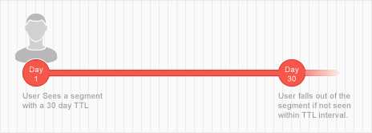

# Segment and Trait Time-to-Live Explained {#segment-time-to-live-explained}

How trait [!UICONTROL time-to-live] ([!DNL TTL]) interval affects segment membership.

<!-- segment-ttl-explained.xml -->

## 实时到实时

[!DNL TTL] 定义在上一特征资格资格活动后站点访客保留在区段中的时间。[!DNL TTL] 设置在特征而不是区段上。Visitors fall out of a segment if they do not see a qualifying trait before the end of the [!DNL TTL] interval. The default [!DNL TTL] for new traits is 120 days. 设置为天后，特征永不过期。[在特征创建](../../features/traits/create-onboarded-rule-based-traits.md#set-expiration-interval) 界面的 [!UICONTROL Advanced Options] 部分创建或编辑特征时，设置TTL值。

## [!DNL TTL] 并退出区段

A user falls out of a segment if they do not see any of its traits within the [!DNL TTL] interval. For example, if you have a 1-trait segment with a 30 days [!DNL TTL], the user will drop out of that segment if they do not see the trait again within the 30 days.

## [!DNL TTL] 和细分续订

[!DNL TTL] 重置后，用户将保留区段，如果他们在该 [!DNL TTL] 段内看到该区段的特征。Also, because most segments contain multiple traits with their own [!DNL TTL] periods, a user can remain in a segment (and reset the [!DNL TTL] interval) as long as they keep seeing any traits associated with a segment. For example, say you have Segment 1 composed of Trait A (30 day [!DNL TTL]) and Trait B (15 day [!DNL TTL]). Assuming the user sees each trait only once, the illustration below outlines the [!DNL TTL] renewal process and total in-segment duration.

## [!DNL Audience Manager] TTL独立于第三方TTL设置

Remember, the [!DNL TTL] set on your [!DNL Audience Manager] pixel operates independently from the [!DNL TTL] set on other pixels used by third parties ([!DNL DSP]s, ad networks, etc.).

>[!MORE_ LIKE_ This]
>
>* [设置特征到期间隔](../../features/traits/create-onboarded-rule-based-traits.md#set-expiration-interval)

