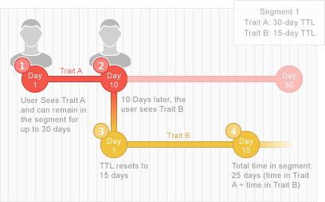

# 细分和特征的生效时间说明 {#segment-time-to-live-explained}

特征( [!UICONTROL time-to-live][!DNL TTL])间隔如何影响区段成员关系。

<!-- segment-ttl-explained.xml -->

## 停留时间

[!DNL TTL] 定义网站访客在最后一个特征资格事件后在区段中停留的时间。 [!DNL TTL] 是根据特征而非区段设置的。 如果访客在间隔结束前没有看到符合条件的特征，则访客会从区段中 [!DNL TTL] 流失。 新特 [!DNL TTL] 征的默认值为120天。 设置为0天时，特征永不过期。 [在特征创建界面的](../../features/traits/create-onboarded-rule-based-traits.md#set-expiration-interval) “部分”中创建或编辑特征 [!UICONTROL Advanced Options] 时，设置TTL值。

## [!DNL TTL] 和从区段中退出

如果用户在时间间隔内未看到其任何特征，则会从区段中掉 [!DNL TTL] 出。 例如，如果您有一个30天的1个特征段，则如果用户在30天内再次看不到该特征，则该用户将从该段中删除。 [!DNL TTL]

## [!DNL TTL] 和细分续订

如果 [!DNL TTL] 用户在时间段内看到该区段的特征，则会重置该区段，并且该用户仍保留在该区 [!DNL TTL] 段中。 此外，由于大多数区段包含具有其自身句点的多个特征， [!DNL TTL][!DNL TTL] 因此只要用户继续看到与区段关联的任何特征，就可以保留在区段中（并重置间隔）。 例如，假设您的区段1由特征A（30天）和特征B(15 [!DNL TTL]天)组成 [!DNL TTL]。 假设用户只看到每个特征一次，下图将概述续订 [!DNL TTL] 过程和总的段内持续时间。

## [!DNL Audience Manager] TTL与第三方TTL设置无关

请记住， [!DNL TTL] 像素上的集 [!DNL Audience Manager] 合独立于第三方( [!DNL TTL] 或广告网络等)使用的其[!DNL DSP]他像素上的集合。

>[!MORE_LIKE_THIS]
>
>* [设置特征到期间隔](../../features/traits/create-onboarded-rule-based-traits.md#set-expiration-interval)

