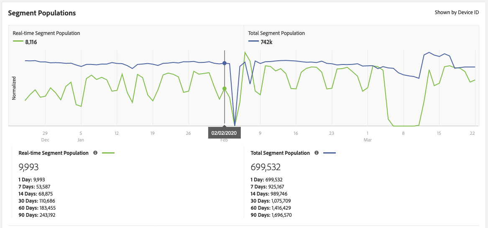

# 特征和区段资格参考 {#trait-qualification-reference}

根据特征类型，特征限定或特征实现在Audience Manager中处理不同。 有关特征类型限定的详细信息，请参阅[按特征类型划分的特征限定](#trait-type)。

此外，请参阅[实时区段填充和总区段填充](#real-time-segment)以了解有关区段资格的详细信息。

## 按特征类型{#trait-type}列出的特征限定

| 特征类型 | 资格标准 |
|---|---|
| 基于规则的特征 | 特征资格会实时发生，因为用户在其浏览器中有资格获得特征。 在您在UI中[创建特征](create-onboarded-rule-based-traits.md#create-rules-based-or-onboarded-traits)后大约4小时，您的用户将开始对基于规则的特征的资格确认。 基于规则的特征允许您使用[最近和频率](../segments/recency-and-frequency.md)控件来设置广告频率上限和其他用例。 |
| 载入的特征 | 处理入站文件后会发生特征限定，即，入站文件[导入到Audience Manager](../../faq/faq-inbound-data-ingestion.md)中，此时正是特征限定发生。 在创建已载入的特征后，您应等待大约4小时，然后再上传入站文件以进行处理。 对于已载入的特征，用户用户档案的最大资格数为1。 |
| 算法特征 | 对于算法特征，用户用户档案的最大资格数为1。 |
| 文件夹特征 | 文件夹特征会总结它包含的特征的特征资格。 阅读[文件夹特征：关于](about-folder-traits.md)以了解详细信息。 |
| 活动受众特征和数据源同步特征 | [!UICONTROL Active Audience]特征包含您的Audience Manager帐户中管理的所有设备。 [!UICONTROL Data Source Synced Traits] 跟踪与数据源关联的所有用户。阅读有关[活动受众特征和数据源同步特征](client-activity-synced-audience-traits.md)的更多信息。 |

## 唯一特征实现和总特征人口{#unique-trait-realizations}

根据您希望图表显示的结果类型（按[!UICONTROL Device ID]或[!UICONTROL Cross-Device ID]筛选），量度具有不同的含义：

按[!UICONTROL Device ID]筛选结果时：

* [!UICONTROL Unique Trait Realizations] 是已在不同时间范围内将特征添加到其用户档案的匿名设备访客的数量。
* [!UICONTROL Total Trait Population] 是您的匿名设备访客在其用户档案上具有此特征的数量。

按[!UICONTROL Cross-Device ID]筛选结果时：

* [!UICONTROL Unique Trait Realizations] 是已验证的访客在不同时间范围内向其用户档案添加特征的数量。
* [!UICONTROL Total Trait Population] 是已验证的访客在其用户档案上具有此特征的数量。

用这个方式来考虑数字。 在上图的[特征详细信息](../../features/traits/trait-details-page.md)视图中，90,173表示昨天访问您的属性的活动设备数。 55,757中的[!UICONTROL Total Trait Population]表示当前符合此特征条件的用户数。 [!UICONTROL Total Trait Population]图旨在显示可用于分段/定位的用户总数。 通常，用户在120天内将保留某个特征的一部分。

由于我们运行两个不同的计算作业来计算这两个种群，因此[!UICONTROL Total Trait Population]总是滞后于[!UICONTROL Unique Trait Realizations]24小时。 在上图中，2月5日可看到大约90,400 [!UICONTROL Unique Trait Realizations]和大约90,300 [!UICONTROL Total Trait Population]。 在次日，将向[!UICONTROL Total Trait Population]添加90,400个用户档案。

为了进一步推动这一点，如果您现在体验到10,000个访客的激增，它们将出现在明天的[!UICONTROL Unique Trait Realizations]中，但仅在24小时后出现在[!UICONTROL Total Trait Population]中。

特征实现的任何更改都反映在细分群体中。

## 实时区段人口和总区段人口{#real-time-segment}

[!UICONTROL Real-time Segment Population]在选定时间间隔内计算符合选定区段并已到达您属性的设备数。

[!UICONTROL Total Segment Population]会计算在选定时间范围内符合选定区段的设备数。 [!UICONTROL 1 Day]报表表示最新区段人口计数。

用这个方式来考虑数字。 在上图的[区段详细信息](../../features/segments/segment-summary-view.md)视图中，9,993表示昨天访问了您的属性并符合区段条件的活动设备的数量。 699,532的[!UICONTROL Total Segment Population]表示当前符合此区段条件的设备总数。 [!UICONTROL Total Segment Population]图旨在显示可用于分段/定位的设备总数。

由于我们运行两个不同的计算作业来计算这两个种群，因此[!UICONTROL Total Segment Population]总是滞后于[!UICONTROL Real-time Segment Population]24小时。 在上图中，您可以看到2月2日的8,116 [!UICONTROL Real-time Segment Population]和[!UICONTROL Total Segment Population]为742,000。 将在次日将8,116个用户档案添加到[!UICONTROL Total Segment Population]。

为了进一步推动这一点，如果您现在体验到10,000个访客的激增，它们将出现在明天的[!UICONTROL Real-time Segment Population]中，但仅在24小时后出现在[!UICONTROL Total Segment Population]中。

## 特征限定限制{#trait-qualification-limit}

我们对每个用户用户档案强制实施150,000个特征条件限制，无论是经过身份验证的用户档案([DPUUID](../../reference/ids-in-aam.md))还是设备ID([UUID](../../reference/ids-in-aam.md))。 请注意，虽然DPUUID对于[!DNL Audience Manager]的特定实例是唯一的，但UUID是跨[!DNL Audience Manager]平台共享的。 对于[!UICONTROL UUID]s，我们在存储特征资格时实施公平策略。 算法确保[!UICONTROL UUID]用户档案的每个实例都有相同份额的[!DNL Audience Manager]。
