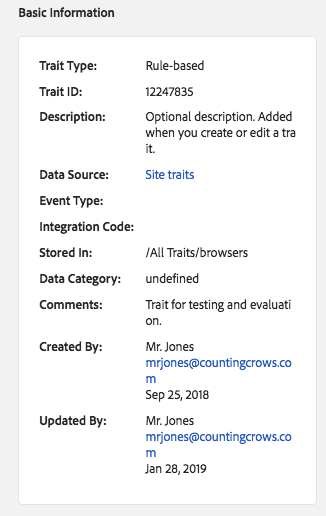

# 特征详细信息页面 {#trait-details-page}

个人特征的详细信息页面提供了以下信息概述：特征名称、ID、性能指标、定义特征的表达式、它属于的区段以及特征审计日志。要查看这些详细信息，请转到 [!UICONTROL Audience Data > Traits] 并单击要处理的特征的名称。

## 基本信息 {#basics}

[!UICONTROL Basic Information] 该部分显示了构建特征时完成的必填字段和可选字段的详细信息。其中包括特征类型、特征ID、描述、数据源和其他元数据等内容。这些详细信息因特征类型(文件夹、载入或基于规则)而异。

## 特征图 {#trait-graph}

为 [!UICONTROL Trait Graph] 您所选的特征提供一览表性能指标。将光标停留在趋势线上，可查看所选特征的其他数据。

[!UICONTROL Unique Trait Realizations] 表示在给定时间段内将此特征添加到其配置文件的唯一用户计数。表示 [!UICONTROL Total Trait Population] 当前符合此特征的唯一用户的数量。

* 对于基于规则的特征，特征资格符合实时条件，因为用户可以在浏览器中获得特征。
* 对于载入的特征，特征资格资格会在处理入站文件后发生，即将入站文件 [送入Audience Manager](../../faq/faq-inbound-data-ingestion.md) ，这就是特征资格资格。
* **独特特征真实性**：在给定时间段内将此特征添加到其配置文件的唯一用户计数。
* **特征总数**：当前符合此特征的唯一用户的数量。

   

* **标识类型划分**：前三个条目显示具有符合特征的最高三个跨设备数据源的前三个跨设备数据源，按降序排列。第四个条目显示了符合特征的所有其他 [!DNL DPUUIDs] ([!DNL CRM IDs])的所有其他数据源的总和，这些数据源不在前三个数据源中。仅当您在页面右上方的 [!UICONTROL Show Results By] 下拉菜单中选择跨设备ID时，才会显示此报告。默认下拉选项是未 [!UICONTROL Device ID]显示此报告的位置。

   

## 特征表达式 {#trait-expression}

[!UICONTROL Trait Expression] 此部分显示用户必须达到的条件才能达到特征的条件。这些规则在 [您创建或编辑特征](../../features/traits/about-trait-builder.md)时设置。

## 特征段 {#trait-segments}

[!UICONTROL Segments with this Trait] 该部分列出所选特征所属的所有区段。您可以单击区段名称以查看该区段的详细信息。

## 特征审核/历史记录日志 {#trait-audit-history}

对于基于规则和载入的特征，显示 [!UICONTROL Trait Expression Change History] 了对特征表达式规则和制作规则的最近10次更改。如果您的特征有超过10项更改，请单击 **[!UICONTROL Export to CSV]** 以下载整个审核日志。审核日志不适用于文件夹或算法特征。

>[!NOTE]
>
>[!UICONTROL Not Available] 列 [!UICONTROL By User] 中表示该用户的帐户已被删除。

