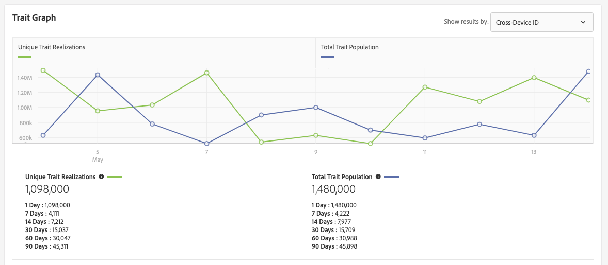

# “特征详细信息”页 {#trait-details-page}

单个特征的详细信息页面提供了特征详细信息的概述，如特征名称、ID、性能度量、定义特征的表达式、其所属的段和特征审核日志。 要视图这些详细信息，请转 **[!UICONTROL Audience Data]** 到> **[!UICONTROL Traits]** 并单击要处理的特征的名称。

## 特征管理工具 {#trait-management-tools}

特征详细信息页面的顶部包含可用于管理特征的工具：

1. **[!UICONTROL Add New]**:使用此选项可创建新的基于规则、算法或载入的特征。
2. **[!UICONTROL Edit]**:使用此选项可更改当前特征的配置。
3. **[!UICONTROL Delete]**:使用此选项可从受众管理器帐户中删除当前特征。
4. **[!UICONTROL Marketplace Recommendations]**:使用此选项，您可以根据未订阅的数据费 [!UICONTROL Audience Marketplace] 用找到与您查看的相似的特征。 请参 [阅数据购买者的受众市场](../audience-marketplace/marketplace-data-buyers/marketplace-data-buyers.md) ，了解如何导航市场并查找类似特征。

## 特征信息 {#basics}

此部 [!UICONTROL Trait Information] 分显示构建特征时完成的必填字段和可选字段的详细信息。 这包括特征类型、特征ID、描述、数据源和其他元数据等内容。 这些详细信息因特征类型（文件夹、已载入或基于规则）而异。

## 特征图 {#trait-graph}

该 [!UICONTROL Trait Graph] 软件提供所选特征的一览表性能指标。 将光标悬停在趋势线上可查看所选特征的其他数据。

[!UICONTROL Unique Trait Realizations] 表示在给定时间范围内将此特征添加到其用户档案的唯一用户计数。 指 [!UICONTROL Total Trait Population] 示当前符合此特征的唯一用户数。

* 对于基于规则的特征，特征资格会实时发生，因为用户在其浏览器中有资格获得特征。
* 对于已载入的特征，特征资格在处理入站文件后发生，即将入站文件馈送到 [受众管理器](../../faq/faq-inbound-data-ingestion.md) ，即在特征资格发生时。
* **[!UICONTROL Unique Trait Realizations]**:在给定时间范围内将此特征添加到其用户档案的唯一用户计数。
* **[!UICONTROL Total Trait Population]**:当前符合此特征的唯一用户数。

   

* **[!UICONTROL Identity Type Breakdown]**:前三个条目以降序显示符合特征的具有最高人口计数的前三个跨设备数据源。 第四个条目显示符合该特征的所有其他 [!DNL DPUUIDs] ([!DNL CRM IDs])项的总和，这些值来自不在前三个跨设备数据源。 仅当在页面右上方的下拉菜单中选择“ [!UICONTROL Show Results By] 跨设备ID”时，才会显示此报告。 默认的下拉选项为， [!UICONTROL Device ID]其中不显示此报告。

   

   >[!NOTE]
   >
   >受众管理器仅在 [!UICONTROL Identity Type Breakdown] 您具有符合特征的跨设备ID时显示报告。

   >[!VIDEO](https://video.tv.adobe.com/v/27977/)

## 特征表达式 {#trait-expression}

该部 [!UICONTROL Trait Expression] 分向您显示用户必须满足的条件才能符合特征。 这些规则是在您创建或编 [辑特征时设置的](../../features/traits/about-trait-builder.md)。

## 特征段 {#trait-segments}

该部 [!UICONTROL Segments with this Trait] 分列表选定特征所属的所有段。 您可以单击区段名称来查看该区段的详细信息。

## 特征审核／历史记录日志 {#trait-audit-history}

对于基于规则和已载入的特征， [!UICONTROL Trait Expression Change History] 显示对特征表达式规则进行的最近10次更改以及更改的对象。 如果您的特征有10项以上的更改，请单 **[!UICONTROL Export to CSV]** 击以下载整个审核日志。 审计日志不可用于文件夹或算法特征。

>[!NOTE]
>
>[!UICONTROL Not Available] 在列中 [!UICONTROL By User] 表示该用户的帐户已被删除。

