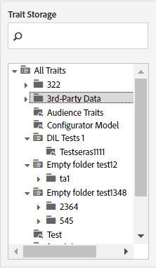

# 特征存储 {#trait-storage}

特徵儲存資料夾可儲存並協助您組織特徵。

<!-- c_tb_storage.xml -->

## 特徵儲存資料夾的用途

在 [!UICONTROL Trait Builder]，特徵儲存資料夾是存放特徵並將特徵組織成您建立之邏輯群組的目錄。 從存取儲存資料夾 [!UICONTROL Traits] 儀表板或建立新特徵時。 請記住，您必須將新特徵指派至儲存資料夾，才能建立新特徵。

## 建立特徵儲存資料夾 {#create-trait-storage-folder}

此程式說明如何為特徵建立儲存資料夾。

<!-- t_tb_create_storage.xml -->

您可以在「 」中建立新的儲存資料夾 [!UICONTROL Basic Information] 區段來設定新特徵。 此外，您也可以在下列位置建立資料夾： [!UICONTROL Trait Storage] 主專案的區段 [!UICONTROL Traits] 清單儀表板。

若要建立新的儲存資料夾：

1. 在 [!UICONTROL Trait Storage] 視窗，暫留在：
   * **[!UICONTROL All Traits]** 以新增根層級資料夾。
   * 現有的父資料夾，用來新增從屬資料夾。
1. 单击“+”图标可创建此文件夹。
1. 為資料夾命名，然後按一下 **[!UICONTROL Save]**.

## 重新命名或刪除特徵儲存資料夾 {#rename-delete-trait-storage-folder}

此程式說明如何重新命名或刪除儲存資料夾。

<!-- t_tb_rename_delete_storage.xml -->

您可以重新命名儲存資料夾，或從以下位置刪除儲存資料夾： [!UICONTROL Trait Storage] 主專案的區段 [!UICONTROL Traits] 清單儀表板。

* 將滑鼠懸停在資料夾上並按一下鉛筆圖示，即可重新命名資料夾。
* 將滑鼠懸停在資料夾上並按一下 **X** 圖示。
