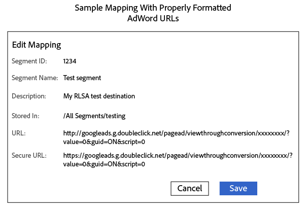

# 将区段发送到Google Ads再营销列表 {#send-segments-to-a-google-adwords-remarketing-list}

此过程需要[!DNL Google Ads]再营销列表、像素代码和Audience Manager[!DNL URL] [!DNL destination]。 它也称为搜索广告([!DNL RLSA])集成的再营销列表。 仅适用于付费搜索。

>[!IMPORTANT]
>请注意，这不是两个系统的按产品化集成。

要将[!DNL Google Ads]再营销列表设置为[!DNL Audience Manager] [!DNL URL destination]，请执行以下操作：

1. 在您的[!DNL Google Ads]帐户中， [创建网站再营销列表](https://support.google.com/adwords/answer/2454064?hl=en)并记下您的转化ID。
1. 将以下URL用作基本URL和安全URL的模板。 将xxxxxxxx部分替换为您的转化ID。

   ```
    //googleads.g.doubleclick.net/pagead/viewthroughconversion/xxxxxxxx/?value=0&guid=ON&script=0&data=%ALIAS%
   ```

1. 在Audience Manager中， [创建 [!DNL URL destination]](../../features/destinations/create-url-destination.md)或编辑现有[!DNL destination]。 创建[!DNL destination]时，请使用以下设置：
   * 类型：URL
   * 序列化：已启用
   * 分隔符：分号(&amp;semi;))

1. 在[!DNL URL] [!DNL destination]的[!UICONTROL Segment Mappings]部分中，将步骤2中的代码添加到[!DNL URL]和[!DNL Secure URL]字段。 在[!DNL URL]和[!DNL Secure URL]字段中分别为`http:`和`https:`为代码添加前缀。

   >[!IMPORTANT]
   >
   >将编码的&amp;符号`&`替换为未编码的&amp;符号`&`

   [!DNL URL]代码不安全：

   ```
    http://googleads.g.doubleclick.net/pagead/viewthroughconversion/xxxxxxxx/?
    value=0&guid=ON&script=0&data=%ALIAS%
   ```

   安全[!DNL URL]代码：

   ```
    https://googleads.g.doubleclick.net/pagead/viewthroughconversion/xxxxxxxx/?
    value=0&guid=ON&script=0&data=%ALIAS%
   ```

1. 单击 **[!UICONTROL Save]**.

   >[!NOTE]
   >
   >如果您使用多个区段，请为要映射到[!DNL Google Ads] [!DNL destination]的每个区段获取一个新像素。 这可确保数据被应用到相应的再营销列表。

1. 在Audience Manager中将新区段映射到此[!DNL destination]时，将映射定义为`aam=segmentID`，并将`segmentID`替换为区段的ID。
1. 在[!DNL Google Ads]中定义存储段时，请创建与步骤6中定义的映射匹配的规则。

已完成的映射可能类似于以下内容：



>[!MORELIKETHIS]
>
>* [[!DNL Destinations]](../../features/destinations/destinations.md)
* [创建一个 [!DNL URL Destination]](../../features/destinations/create-url-destination.md)
* [关于AdWords再营销列表](https://support.google.com/adwords/answer/2472738)
* [AdWords再营销的工作原理](https://support.google.com/adwords/answer/2454000)

