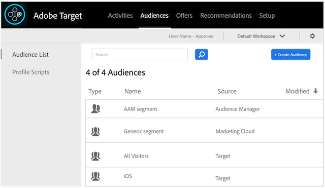

# 将Audience Manager与[!DNL Target]集成 {#integrate-audience-manager-with-target}

此集成允许您将Audience Manager区段发送到Adobe[!DNL Target]。

Audience Manager- [!DNL Target]集成需要：

* [Experience Cloud服务](https://experienceleague.adobe.com/docs/id-service/using/home.html)。 如果不使用此服务，请参阅[实施指南](https://experienceleague.adobe.com/docs/id-service/using/implementation/implementation-guides.html)以开始使用。
* [!DNL Profiles and Audiences]。如果您未配置[!DNL Profiles and Audiences]，请联系客户关怀以开始配置。

在Audience Manager过程中完成这些步骤后不久，您的所有实施区段都将出现在[!DNL Target]中。 查看&#x200B;**[!UICONTROL Audiences > Audience List]**&#x200B;以查看您在[!DNL Target]中的Audience Manager区段。 通过&#x200B;**[!UICONTROL Source]**&#x200B;列中的Experience Cloud和&#x200B;**[!UICONTROL Modified]**&#x200B;列中的`aam-integration-user@adobe.com`识别Audience Manager区段。

