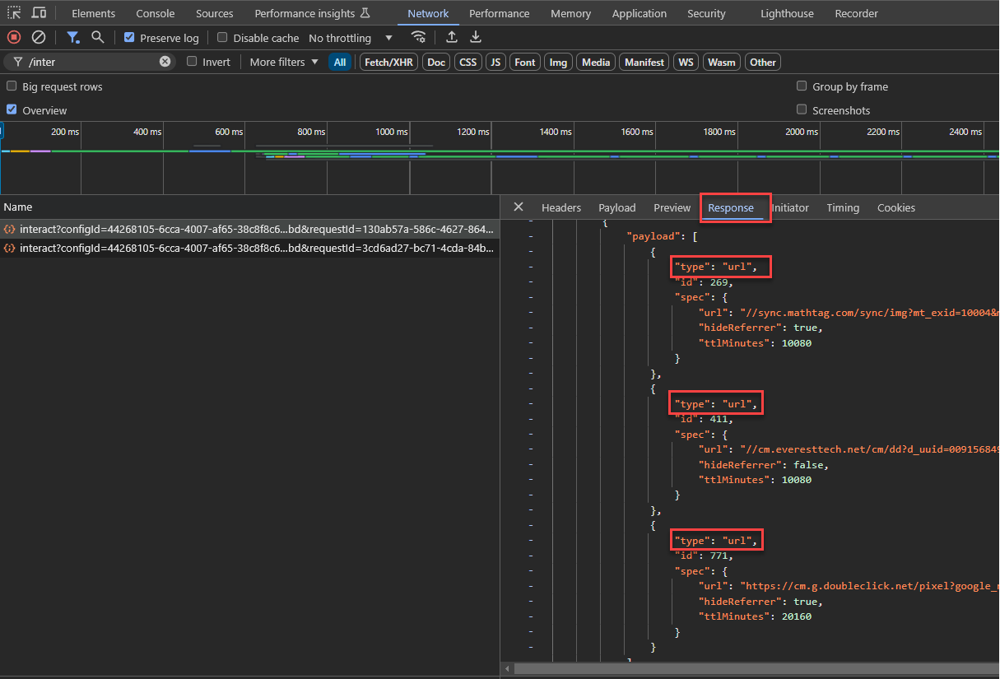

# 将您的Audience Manager数据收集库从AppMeasurement更新为Web SDK

## 目标受众 {#intended-audience}

本页适用于使用[!DNL AppMeasurement] JavaScript库将Web数据发送到Audience Manager的Audience Manager和Adobe Analytics客户。

有关迁移到Web SDK的步骤的指南，请参阅下表，具体取决于您当前的数据收集方法。

| 您现有的数据收集方法 | Web SDK迁移说明 |
|---------|----------|
| 带有AudienceManagement模块的[!DNL AppMeasurement] JavaScript库 | 按照本指南中的说明进行操作。 |
| [!DNL Audience Manager] [标记扩展](https://experienceleague.adobe.com/zh-hans/docs/experience-platform/tags/extensions/client/audience-manager/overview) | 按照[中的说明将数据收集库从Audience Manager标记扩展更新到Web SDK标记扩展](dil-extension-to-web-sdk.md)。 |
| [!DNL AppMeasurement] JavaScript库+独立[!DNL Audience Manager] [DIL库](../dil/dil-overview.md) | 按照[中的说明将数据收集库从Audience Manager标记扩展更新到Web SDK标记扩展](dil-extension-to-web-sdk.md)。 |

## 迁移概述 {#overview}

从[!DNL AppMeasurement]迁移到[Web SDK](https://experienceleague.adobe.com/zh-hans/docs/experience-platform/web-sdk/home)主要是Adobe Analytics迁移。 对于Audience Manager客户，此迁移还包括Audience Manager。 两者必须一起迁移。 如果您主要使用Audience Manager，请确保在此迁移中涉及Analytics团队。

如果您使用[!DNL AppMeasurement]进行Audience Manager数据收集，则您当前使用[!DNL Server-side Forwarding (SSF)]方法将Analytics数据发送到Audience Manager。 在此设置中，Analytics数据收集请求将转发到Audience Manager，后者还将处理Audience Manager对页面的响应。

多年来，这一直是标准方法，并且可能是您当前的设置。 如果您的[!DNL AppMeasurement]库包含`AudienceManagement`模块，并且数据收集调用在请求(`/10/`)中包含`/b/ss/examplereportsuite/10/`路径，则本指南适用于您。

## 服务器端转发(SSF)与Web SDK数据流 {#data-flows}

在迁移到Web SDK(和Edge Network)时，了解Analytics和Audience Manager之间的数据流差异对于下面的说明至关重要。

通过服务器端转发，Analytics区域数据收集节点会收集数据，将其转换为Audience Manager接受的信号，并将其发送到Audience Manager，然后将Audience Manager响应返回到页面。 然后，[!DNL AudienceManagement]库中的[!DNL AppMeasurement]模块会处理响应（例如，删除Cookie、发送URL目标）。 此过程称为服务器端转发，因为Analytics会使用Adobe服务器将数据转发到Audience Manager。

使用Web SDK时，Edge Network会通过单独的操作将数据发送到Analytics和Audience Manager。 Web SDK是一个向所有解决方案发送数据的库，而Edge Network可将与解决方案无关的数据点转换为特定于解决方案的格式。

在这个新的数据流中，所有数据都发送到Edge Network [数据流](https://experienceleague.adobe.com/zh-hans/docs/experience-platform/datastreams/overview)，您可以[配置该数据流以根据需要将数据发送到Adobe解决方案](https://experienceleague.adobe.com/zh-hans/docs/experience-platform/datastreams/configure)。 对于Audience Manager，在数据流上启用Audience Manager服务会将[!DNL XDM]和Analytics数据转换为Audience Manager接受的信号。 Edge Network还将Audience Manager响应返回到页面，Web SDK在该页面处理响应，类似于[!DNL AppMeasurement]和[!DNL AudienceManagement]模块处理响应的方式。

## 标记迁移与非标记迁移 {#tags-vs-non-tags}

无论您是使用扩展为[!DNL AppMeasurement]的标记、其他标记管理系统中的[!DNL AppMeasurement]库，还是直接将[!DNL AppMeasurement]放在页面上，将Audience Manager迁移到Web SDK的步骤都是相同的。 由于Audience Manager迁移依赖于Analytics迁移，因此从[!DNL AppMeasurement]迁移到Web SDK的步骤将在Analytics迁移期间确定。

该信息涵盖在基于[Tags](https://experienceleague.adobe.com/zh-hans/docs/analytics/implementation/aep-edge/web-sdk/analytics-extension-to-web-sdk)或[JavaScript](https://experienceleague.adobe.com/zh-hans/docs/analytics/implementation/aep-edge/web-sdk/appmeasurement-to-web-sdk)的实施的Analytics文档中。

## XDM和`data.__adobe.`节点 {#xdm-data-nodes}

[Web SDK](https://experienceleague.adobe.com/zh-hans/docs/experience-platform/web-sdk/home)的主要功能之一是将数据发送到[Real-Time Customer Data Platform (RTCDP)](https://experienceleague.adobe.com/zh-hans/docs/experience-platform/rtcdp/home)。 为了实现这一目标，并且仍然在不进行完全重新实施的情况下为其他Experience Cloud解决方案收集数据，特定于解决方案的数据将在数据收集服务器调用中进行划分。 此调用使用名为[体验数据模型(XDM)](https://experienceleague.adobe.com/zh-hans/docs/experience-platform/xdm/home)的标准化JSON架构

与解决方案无关的元素，例如有关浏览器和设备的信息，以预定的XDM结构发送到Edge Network。 Edge Network会将此数据转换为特定于解决方案的格式。 但是，特定于Target、Analytics和Audience Manager的数据存储在XDM有效负载的专用`data.__adobe`节点中。

例如：

* Analytics变量`s.eVar1`在XDM有效负载中表示为`data.__adobe.analytics.evar1`。
* 与客户忠诚度状态相关的Target参数存储为`data.__adobe.target.loyaltyStatus`。

`__adobe`节点中的数据会被发送到相应的解决方案(如Analytics和Audience Manager)，而不会发送到Experience Platform，即使数据流上启用了Experience Platform服务也是如此。 这意味着您可以保留Analytics和Audience Manager的当前配置，同时还可以灵活地将任何必要的数据元素映射到XDM架构元素，以便在Experience Platform中使用[用于数据收集的数据准备](https://experienceleague.adobe.com/zh-hans/docs/experience-platform/datastreams/data-prep)进行实时用例。

例如，在结账期间用于报告购物车内容的Analytics `s.products`字符串仍可按其原始格式发送到Analytics和Audience Manager。 同时，您可以使用此字符串的元素为Experience Platform用例创建更直观的XDM购物车架构。

由于大多数Audience Manager实施都依赖于转发到Audience Manager的Analytics数据，因此您的许多Audience Manager特征表达式可能基于Analytics变量（`c_evar#`、`c_prop#`和`c_events`）。 为避免在迁移期间使用XDM格式重建特征表达式，默认情况下，Edge Network配置为将`data.__adobe.analytics`节点中的所有Analytics变量转换为Audience Manager信号。 服务器端转发工作流中也会发生类似的转换过程。

Edge Network可以执行此转换，因为从页面发出的单个数据收集调用会被发送到馈送多个Adobe解决方案的单个数据流。 因此，从[!DNL AppMeasurement]迁移到Analytics和Audience Manager的Web SDK时，大多数都将主要使用`data.__adobe.analytics`节点。

Edge Network将设备和浏览器数据从XDM有效负载和数据包报头转换为Audience Manager信号。 这允许您继续在Audience Manager特征表达式中使用`h_`和`d_`平台键。

## `data.__adobe.audiencemanager`节点 {#data-note}

`data.__adobe.audiencemanager`节点用于不依赖于Analytics的Audience Manager实施。 它存储了先前通过[Audience Manager库](../dil/dil-overview.md)发送的自定义DIL键/值对，如[标记扩展迁移指南](dil-extension-to-web-sdk.md)中所述。

虽然本指南中概述的迁移不需要`data.__adobe.audiencemanager`节点，但此处介绍的新数据流允许将数据发送到Audience Manager，而无需在Analytics中记录。

如果您需要向Audience Manager发送自定义键/值对，而不将其包含在Analytics中，则可以使用`data.__adobe.audiencemanager`节点。 此节点中的任何数据集都将附加到数据收集服务器调用中由Audience Manager转换的Analytics数据中。

## 此实施路径的优缺点

使用此迁移方法既有优点，也有缺点。 仔细权衡每个选项，以确定哪种方法最适合您的组织。

| 优势 | 缺点 |
| --- | --- |
| <ul><li>**使用您现有的实施**：虽然此方法需要一些实施更改，但它不需要从头开始的全新实施。 您可以使用现有的数据层和代码，只需对实施逻辑进行最低限度的更改即可。</li><li>**不需要架构**：对于迁移到Web SDK的这一阶段，您不需要XDM架构。 相反，您可以填充`data`对象，这会将数据直接发送到Audience Manager。 迁移到Web SDK完成后，您可以为组织创建架构，并使用数据流映射填充适用的XDM字段。 如果在迁移过程的此阶段需要架构，则贵组织将被强制使用Audience Manager XDM架构。 使用此架构会使贵组织将来更难以使用自己的架构。</li></ul> | <ul><li>**实施技术债务**：由于此方法使用现有实施的修改形式，因此将来需要跟踪实施逻辑和执行更改会更加困难。</li><li>**需要映射才能将数据发送到Platform**：当您的组织准备好使用Real-Time CDP时，您必须将数据发送到Adobe Experience Platform中的数据集。 此操作要求`data`对象中的每个字段都必须是数据流映射工具中的条目，以便将其分配给XDM架构字段。 此工作流的映射只需执行一次，并且不涉及对实施进行更改。 但是，这是一个额外的步骤，在XDM对象中发送数据时不需要执行此步骤。</li></ul> |

Adobe建议在以下情况下遵循此实施路径：

* 您已有使用Adobe Analytics AppMeasurement JavaScript库的实施。 如果您的实施使用Audience Manager标记扩展，请改为遵循[从Audience Manager标记扩展迁移到Web SDK标记扩展](dil-extension-to-web-sdk.md)。
* 您打算在将来使用Real-Time CDP，但不希望从头开始使用Web SDK实施来替换Audience Manager实施。 使用Web SDK从头开始替代实施的替代方法需要您尽最大努力，因为您需要重建所有Audience Manager特征以查找XDM格式的数据。 但是，它也是最可行的长期实施架构。 如果您的组织愿意进行干净的Web SDK实施，请参阅[Web SDK文档](https://experienceleague.adobe.com/zh-hans/docs/experience-platform/web-sdk/home)而不是使用本指南，以了解更多详细信息。

## 迁移到Web SDK所需的步骤

请按照以下步骤将数据收集集成迁移到Web SDK。

+++**1. 规划Analytics迁移**。

与您的Analytics团队合作，按照基于[Tags](https://experienceleague.adobe.com/zh-hans/docs/analytics/implementation/aep-edge/web-sdk/analytics-extension-to-web-sdk)或[JavaScript](https://experienceleague.adobe.com/zh-hans/docs/analytics/implementation/aep-edge/web-sdk/appmeasurement-to-web-sdk)的实施中的Analytics迁移步骤操作。 在规划Analytics迁移后，请返回本指南并继续执行Audience Manager步骤以确定需要为Audience Manager执行哪些操作，以使您能够同时部署Analytics和Audience Manager迁移。

+++

+++**2. 将Audience Manager服务添加到数据流**

将Audience Manager服务添加到您在步骤1中提到的Analytics迁移中使用的数据流。

1. 导航到[experience.adobe.com](https://experience.adobe.com)并使用您的凭据登录。
1. 使用右上角的主页或产品选择器导航到&#x200B;**[!UICONTROL Data Collection]**。
1. 在左侧导航中，选择&#x200B;**[!UICONTROL Datastreams]**。
1. 选择您在步骤1中作为Analytics迁移的一部分创建的数据流。
1. 选择&#x200B;**[!UICONTROL Add Service]**。
1. 在服务下拉菜单中，选择&#x200B;**[!UICONTROL Audience Manager]**。
1. 检查&#x200B;**[!UICONTROL Cookie Destinations Enabled]**&#x200B;和&#x200B;**[!UICONTROL URL Destinations Enabled]**&#x200B;选项。 这些选项允许Edge Network将这些Audience Manager目标类型返回到页面。
1. 确保&#x200B;**[!UICONTROL Enable XDM Flattened Fields]**&#x200B;已禁用。 此选项禁用将Analytics变量自动转换为Audience Manager信号。 此选项旨在为Edge Network自动将Analytics数据转换为Audience Manager信号之前迁移到Web SDK的用户保持向后兼容性。

   >[!NOTE]
   >
   >迁移到启用了&#x200B;**[!UICONTROL Enabled XDM Flattened Fields]**&#x200B;选项的Web SDK时，需要更新Audience Manager中格式化为XDM的任何数据，以及使用prop、eVar或事件的所有Audience Manager特征，以查找XDM格式的数据。 Adobe建议保留禁用此选项。

    {style="border:1px solid lightslategray"}

1. 选择&#x200B;**[!UICONTROL Save]**&#x200B;以保存数据流配置。

您的数据流现在可以接收数据并传递给Audience Manager。 请记下数据流ID，因为在代码中配置Web SDK时需要此ID。

+++

+++**3. 启用第三方ID同步并设置Audience Manager容器ID**

1. 导航到[experience.adobe.com](https://experience.adobe.com)并使用您的凭据登录。
1. 使用右上角的主页或产品选择器导航到&#x200B;**[!UICONTROL Data Collection]**。
1. 在左侧导航中，选择&#x200B;**[!UICONTROL Datastreams]**。
1. 选择您在步骤1中作为Analytics迁移的一部分创建的数据流。
1. 选择数据流配置页面右上角的&#x200B;**[!UICONTROL Edit]**。
1. 展开&#x200B;**[!UICONTROL Advanced Options]**&#x200B;下拉菜单并启用&#x200B;**[!UICONTROL Third Party ID Sync]**&#x200B;功能（如果尚未启用）。 此选项会告知Edge Network返回Audience Manager和Experience Platform数据合作伙伴的合作伙伴ID同步。

    {style="border:1px solid lightslategray"}

1. 在大多数情况下，您可以将&#x200B;**[!UICONTROL Third Party ID Sync Container ID]**&#x200B;字段留空。 它将默认为`0`。 但是，如果您希望确保使用正确的容器ID，请按照以下步骤操作：
   * 以无痕模式或专用模式打开浏览器窗口，然后导航到作为迁移一部分的页面。
   * 使用浏览器的开发人员工具筛选对`dpm.demdex.net/id`的网络调用。 此调用仅在首次访问的第一个页面上触发，因此需要无痕浏览器或专用浏览器。
   * 查看请求的有效负载。 如果`d_nsid`参数不是零，请将其复制到&#x200B;**[!UICONTROL Third Party ID Sync Container ID]**&#x200B;字段。

1. 选择&#x200B;**[!UICONTROL Save]**。

您的数据流现在已准备好将数据发送到Audience Manager，并将Audience Manager响应传递到Web SDK。

+++

+++**4. 将客户ID添加到标识映射**

大多数Audience Manager实施在跨设备个性化方案中使用[配置文件合并规则](../features/profile-merge-rules/merge-rules-overview.md)，以帮助控制访客可以根据其身份验证状态（登录或注销）而符合条件的区段。 配置文件合并规则要求在身份验证后的每次数据收集调用中将客户拥有的标识符（CRM ID、帐号等）发送到Audience Manager。 以前，访客ID服务(`setCustomerIDs`)的[!DNL visitor.js]函数用于将客户ID附加到每个Analytics数据收集调用，然后将这些调用转发到Audience Manager。

使用Web SDK时，现在需要使用名为[IdentityMap](https://experienceleague.adobe.com/zh-hans/docs/experience-platform/xdm/field-groups/profile/identitymap)的特殊XDM构造将这些标识发送到Edge Network。

在标识映射中正确传递标识需要了解[标识命名空间](https://experienceleague.adobe.com/zh-hans/docs/experience-platform/identity/features/namespaces)并仔细考虑要传递的标识，特别是在将数据发送到Experience Platform沙盒时。 [本文](https://experienceleague.adobe.com/zh-hans/docs/experience-cloud-kcs/kbarticles/ka-21305)概述了这些注意事项和说明。

确定要传递的标识以及传递时间，请按照Tags中使用[!UICONTROL Identity map] **[!UICONTROL Identity map]** [数据元素](https://experienceleague.adobe.com/zh-hans/docs/experience-platform/tags/extensions/client/web-sdk/data-element-types#identity-map)的指南操作，或按照[标识数据概述](https://experienceleague.adobe.com/zh-hans/docs/experience-platform/web-sdk/identity/overview)中所述手动进行设置，以符合您的Web SDK部署策略。

+++

+++**5. （可选）设置第一方`aam_uuid` Cookie**

多年来的标准做法是将Audience Manager UUID（第三方Demdex Cookie中的值）放置在通常名为`aam_uuid`的第一方Cookie中。

要设置Cookie，您必须在配置&#x200B;**[!UICONTROL Name]**&#x200B;时，在Analytics标记扩展的&#x200B;**[!UICONTROL Unique User ID Cookie]**&#x200B;部分的`uuidCookie`字段或`audienceManagementModule`字段中输入Cookie名称。 虽然通常在代码中进行配置，但很少使用Cookie，因为Audience Manager UUID值是广告平台使用的设备特定的跨域标识符，并且几乎没有提供作为第一方标识符的值。

如果您发现，在迁移到Web SDK后，您的实施要求继续设置此`aam_uuid` Cookie，您可以通过两种方式检索Audience Manager UUID。

1. 来自[Edge Network交互终结点](https://developer.adobe.com/data-collection-apis/docs/endpoints/interact/)的每个响应都包含具有`id`个节点的负载。 `id`命名空间有效负载的`CORE`节点包含Audience Manager UUID。

2. 使用Web SDK的[getIdentity](https://experienceleague.adobe.com/zh-hans/docs/experience-platform/web-sdk/commands/getidentity)命令检索它。 使用文档中所述的`CORE`命名空间，并从响应中的`identity.CORE`字段中检索值。

无论用于检索Audience Manager UUID的方法如何，都由您的开发团队负责解析响应、检索UUID并设置Cookie。 无法通过Web SDK自动设置此Cookie。

+++

## 在Analytics报表包管理器UI中配置服务器端转发和Audience Analytics {#configure-ssf-analytics}

Audience Manager如果您熟悉Analytics [服务器端转发](https://experienceleague.adobe.com/zh-hans/docs/analytics/admin/admin-tools/manage-report-suites/edit-report-suite/report-suite-general/server-side-forwarding/ssf)功能，您可能会想知道：“*是否应在Analytics报表包管理器UI中禁用服务器端转发设置，以防止将Analytics数据发送两次？*”。

答案为否，由于以下原因，您不应禁用此设置：

1. 在数据流上启用Audience Manager服务后，Edge Network会将`cm.ssf`变量附加到发送到Analytics的所有数据收集请求。 这样还可防止将Analytics数据发送到Audience Manager。 当数据流上启用了Assurance服务时，用于验证Analytics迁移的任何Audience Manager日志都将显示`cm.ssf=1`变量。 有关更多详细信息，请参阅服务器端转发的[Analytics和GDPR合规性页面](https://experienceleague.adobe.com/zh-hans/docs/analytics/admin/admin-tools/manage-report-suites/edit-report-suite/report-suite-general/server-side-forwarding/ssf-gdpr)。

1. 此设置还为[!DNL Audience Analytics]集成启用数据流。 如[Audience Analytics概述](https://experienceleague.adobe.com/zh-hans/docs/analytics/integration/audience-analytics/mc-audiences-aam)中所述，此集成需要服务器端转发，因为对Analytics数据收集服务器的Audience Manager响应在处理之前已添加到Analytics点击。 Edge Network中也存在类似的过程。 启用服务器端转发后，Edge Network会将必要区段从Audience Manager响应添加到发送到Analytics的数据。

总之，必须保持启用此设置，以便Audience Analytics能够继续在Web SDK实施中正常运行，并且没有任何数据将在Audience Manager中重复计数。

## 验证迁移 {#validation}

现在，所有Adobe解决方案都通过一次Web SDK调用提供服务，因此，验证步骤可能会因Web SDK提供的解决方案而异。

如果Adobe Target或Adobe Journey Optimizer（包括[!DNL Decisioning]）是由您的实施提供服务的解决方案栈栈的一部分，则您将在页面上多次对Edge Network进行网络调用。 其中一些用于检索个性化和选件，而其他则用于数据收集和报表。

无论您的实施如何，以下一般原则均适用于验证数据是否通过Web SDK正确流入和流出Audience Manager。

1. 首次访问访客的第一个网络调用将指向`adobedc.demdex.net`域和`/interact`端点。 您可以查看由Web SDK发出的网络调用，方法是打开Web浏览器上的“开发人员”选项卡，单击“网络”选项卡，然后筛选`/interact`。
还有其他类型的Web SDK调用，但只有`interact`个调用将数据发送到Edge Network并从获取响应有效负载。

   

1. 对第一个网络调用的响应具有多个负载。 这些有效负载节点之一包含多个类型为`url`的子节点。 这些`url`节点是以前由[!DNL Visitor ID]服务触发的第三方ID同步。 在您的容器中配置的每个第三方ID同步应有一个`url`节点（请参阅上面的步骤3）。

   

   此外，您可以按`demdex`进行筛选，并发现有效负载中引用的每个URL都触发了自己的ID同步网络请求，就像[!DNL Visitor ID]服务所做的那样。 这些ID同步应该仅在首次访客的第一个页面上触发，并且其后每14天只触发一次。

1. 用于Analytics和Audience Manager数据收集的任何后续`/interact`请求都应包含有效负载中的`data.__adobe.analytics`节点。

   

   应继续填充依赖这些Analytics变量的Audience Manager特征以及使用`h_`或`d_`平台键的特征。

   >[!TIP]
   >
   >您可能希望使用规则表达式创建测试特征，该规则表达式只能在收集Web SDK数据时表达。 由于没有开发Audience Manager环境，并且多个网站可能会向同一Audience Manager实例发送数据，因此，仅查看总人口计数可能无法为您提供所需的验证。

1. 在传递Analytics变量的同一`/interact`调用中，可以在响应的有效负荷节点中找到任何Cookie或URL目标。 URL目标将位于类型为`url`的有效负载中（就像第三方ID同步中一样），Cookie目标将位于类型为`cookie`的有效负载中。

   

   您还应确保Cookie被放入浏览器的Cookie存储中。

   >[!TIP]
   >
   >与上一个验证步骤类似，确定应返回Cookie目标的区段资格是确保数据流入和流出Audience Manager的一种方法。

1. 如果您需要通过身份映射传递其他客户ID，请在站点中进行身份验证，并确保身份及其关联参数在请求有效负载的身份映射节点中传递。

   

   >[!TIP]
   >
   >如果Adobe Target是接收解决方案之一，并且存在依赖于Audience Manager区段的Target活动，这些活动要求传递正确的身份，请确保在用于检索个性化的`/interact`调用中传递身份映射，而不仅仅是在数据收集调用中传递。 在检索区段信息时，Adobe Target将在对Audience Manager的服务器端调用中使用这些标识。

