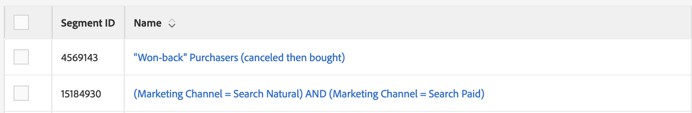

# Audience Manager中的辅助功能 {#accessibility}

## 概述 {#overview}

辅助功能是指使软件产品可用的一系列功能，并且尽可能少地让患有各种残疾（如视觉、听觉、认知、运动或其他残疾）的用户使用这些功能。

Adobe在辅助功能方面处于行业领先地位，它通过鼓励开发人员制作可供所有用户访问的丰富而引人入胜的内容，支持创建优秀的Web体验。 有关Adobe对辅助功能的承诺的更多详细信息，请参阅[Adobe辅助功能](https://www.adobe.com/accessibility.html)。

软件产品中最常见的辅助功能包括：键盘导航、语义结构、前景元素与背景元素之间的充分对比度、辅助技术支持、清晰的元素标签等。

为了使[!DNL Audience Manager]更易于每个人使用，我们开发了对多个辅助功能功能的支持。

## 键盘导航 {#keyboard-navigation}

[!DNL Audience Manager]支持完整的键盘辅助功能：

* `Tab`键和箭头可在用户界面的各个元素之间移动。

  

* `Return` (`Enter`)和`Space`键激活所选项目。

## 可访问的表排序 {#table-sorting}

通过`Tab`键导航时，表标题是可选的，您可以按`Space`更改排序顺序。

## 支持辅助技术 {#assistive-technologies}

通过使用语义代码和[ARIA](https://www.w3.org/WAI/standards-guidelines/aria/)，[!DNL Audience Manager]用户界面中的交互式元素包括相应的标签、可访问名称和角色，它们标识了它们的用途及其当前状态。

这可确保辅助技术（如屏幕阅读器）可以向用户朗读标签和其他信息，以便他们能够轻松地与应用程序控件交互。

Audience Manager用户界面中的所有交互式元素都包含相应的标签。 这可确保屏幕阅读器等辅助技术可以向用户朗读标签。

## 颜色和对比度 {#colors-contrast}

[!DNL Audience Manager]用户界面努力在应用程序中提供足够的对比度，以确保视力低下或色觉缺失的用户有可访问的观看体验。

例如，加载屏幕包括一个白色模式框内的加载旋转器，全部位于深灰色叠加的顶部。

## 进一步阅读 {#further-reading}

[!DNL Audience Manager]努力提供不断增强的辅助功能，使产品对每个人都易于使用。

我们建议您使用[Adobe辅助功能反馈表](https://www.adobe.com/accessibility/feedback.html)向我们发送改进建议和您遇到的辅助功能问题。 我们非常高兴将您的反馈考虑在内并改进[!DNL Audience Manager]。
