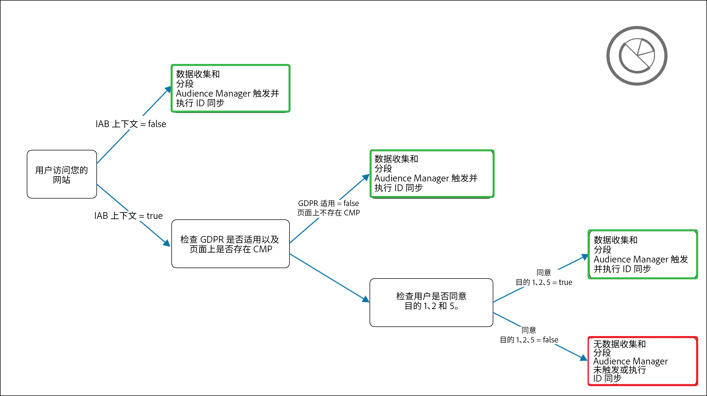

# [!DNL Audience Manager Plug-in for IAB TCF] {#aam-iab-plugin}

## 概述

您可能对用户承担的隐私义务的一个重要方面是获取和传递用户对个人数据的使用方式（即“用途”）和用户(即“公司”)的选择。

Adobe 通过[选择加入功能](https://docs.adobe.com/content/help/zh-Hans/id-service/using/implementation/opt-in-service/optin-overview.html)和 [IAB 透明度与同意框架 (TCF)](https://iabtechlab.com/standards/gdpr-transparency-and-consent-framework/) 支持，为您提供用于管理和传达用户所做的隐私选择的方法。

本文介绍了支持 IAB TCF 的 Audience Manager 用例，以及在 Audience Manager 中实施 IAB TCF 支持的方法。

>[!IMPORTANT]
>
>Audience Manager在[IAB TCF](https://iabeurope.eu/tcf-for-vendors/)中注册，供应商ID为565。

适用于 IAB TCF 的 Audience Manager 插件利用了[选择加入功能](https://docs.adobe.com/content/help/zh-Hans/id-service/using/implementation/opt-in-service/iab.html)，而该功能又是 [ Experience Platform Identity Service (ECID)](https://docs.adobe.com/content/help/zh-Hans/id-service/using/home.html) 库的一部分。

## 范围和限制 {#scope-and-limitations}

作为使用 Audience Manager 的出版商或广告商，您可以根据 IAB TCF 向 Audience Manager 传达用户所做的选择。

>[!IMPORTANT]
>
>IAB TCF条例仅适用于位于欧洲经济区的访客。

Audience Manager可以帮助您尊重用户的隐私权选择，并为您提供一种轻松的方式，让您与与您合作的所有合作伙伴交流这些选择。

目前，Audience Manager 不支持：

* 移动设备工作流程；
* 在细分出口后附加同意。

## 将 升级至 [!DNL IAB TCF v2.0] {#upgrading}

将其[!DNL Audience Manager Plug-in for IAB TCF]实施从[!DNL IAB TCF] v1.1升级到[!DNL IAB TCF] v2.0，或首次启用[!DNL IAB TCF] v2.0的客户，应按照如下所述在先决条件和实施方面遵循相同的准则。

## 先决条件 {#prerequisites}

>[!IMPORTANT]
>
>Audience Manager支持IAB TCF v2.0。
>
>IAB TCF v1.1支持将于2020年8月15日终止。
>
> 希望继续使用IAB TCF的Audience Manager插件进行同意管理的客户应升级到最新版[ECID](https://github.com/Adobe-Marketing-Cloud/id-service/releases)以继续支持。
>
> 升级到最新的[ECID](https://github.com/Adobe-Marketing-Cloud/id-service/releases)版本后，将不再支持IAB TCF v1.1同意字符串，因此请确保在升级到最新的ECID版本之前更新您的CMP。

要将IAB TCF的Audience Manager插件与Audience Manager一起使用，您必须满足以下先决条件：

1. 您必须使用 Adobe Experience Platform Identity Service (ECID) 版本 5 或更高版本。[下载](https://github.com/Adobe-Marketing-Cloud/id-service/releases) ECID 的最新版本。
2. 您必须使用Audience Manager[!DNL Data Integration Library](DIL)9.0版或更高版本，可从[此处](https://github.com/Adobe-Marketing-Cloud/dil/releases)下载。 请阅读 [Audience Manager 中的 DIL 文档](../..//dil/dil-overview.md)。我们建议使用[Adobe启动](https://docs.adobe.com/content/help/zh-Hans/launch/using/extensions-ref/adobe-extension/adobe-audience-manager-extension.html)来实现最简单的Audience Manager实现。
3. 或者，如果使用[!DNL Server-Side Forwarding](SSF)将数据导入Audience Manager，则必须升级到最新版AppMeasurement。 使用 [Analytics 代码管理器](https://docs.adobe.com/content/help/zh-Hans/analytics/admin/admin-tools/code-manager-admin.html)下载 AppMeasurement。
4. 您必须使用与IAB TCF v2.0集成并在IAB TCF中注册的商业类或您自己的同意管理平台(CMP)。 请参阅[在 IAB 框架内注册的 CMP](https://iabeurope.eu/cmp-list/)。

>[!WARNING]
>
>如果您使用的是不支持IAB TCF v.2.0的同意管理平台(CMP),Audience Manager将自动以ID同步形式发送`gdpr=0`参数，即使您的访客是欧洲合并。 要确定您的GDPR验证是否处于活动状态，我们建议您通过同意管理平台(CMP)确认他们支持IAB TCF v2.0。

## 建议和实施方式 {#recommendations}

要在 Audience Manager 中启用 IAB TCF 支持，请阅读我们关于[如何通过选择加入来设置 IAB](https://docs.adobe.com/content/help/en/id-service/using/implementation/opt-in-service/iab.html) 的文档。

执行此操作的最简单方法是使用[Adobe Experience Platform Launch](https://docs.adobe.com/content/help/en/launch/using/overview.html)在属性中添加[!DNL ECID Opt-in]。 请阅读有关 [ECID 选择加入扩展](https://docs.adobe.com/content/help/en/launch/using/extensions-ref/adobe-extension/id-service-extension/overview.html)的文档，了解如何设置 Launch 扩展。

## 使用 IAB 框架时的用户选择工作流程 {#user-choice-workflow}

在访问 Web 资产时，用户可以选择出版商以及与之合作的第三方供应商如何使用其数据。

用户以&#x200B;*同意*&#x200B;和&#x200B;*合法利益*&#x200B;的形式向在全球供应商列表注册的&#x200B;*第三方供应商*&#x200B;提供他们的选择。

下图是向首次访问网站的访客显示的 CMP 对话框的一个示例。请记住，根据客户实施情况，此对话框可能会大不相同。


[IAB欧洲透明度和同意框架政策](https://iabeurope.eu/iab-europe-transparency-consent-framework-policies/#A_Purposes)中介绍了IAB TCF v2.0中包含的各种用途和权限的详细信息。

用户可以出于多种目的和供应商的考虑授予其同意或合法权益（如果可用）。 例如，用户可以同意在设备上存储信息、开发和改进产品，并同意CMP显示的所有第三方供应商。

或者，在另一个例子中，它们可以出于所有目的同意或合法利益，但只准许《议定书》/《公约》缔约方会议所显示的少数供应商同意或合法利益。

用户选择其隐私选择后，用户选择将记录在IAB TC字符串中。 IAB TC字符串存储已批准用途和供应商的组合以及其他元数据信息（有关详细信息，请参见[IAB页面](https://github.com/InteractiveAdvertisingBureau/GDPR-Transparency-and-Consent-Framework/blob/master/TCFv2/IAB%20Tech%20Lab%20-%20Consent%20string%20and%20vendor%20list%20formats%20v2.md#about-the-transparency--consent-string-tc-string)）。

在IAB TCF中注册的每个供应商都评估IAB TC字符串并根据用户的隐私选择做出决策。 请记住，用户的隐私权选择在所有注册IAB TCF的供应商中均有效。

## Audience Manager{#aam-standard-purposes}所需的用途

Audience Manager根据以下用途评估存储在IAB TC字符串中的用户选择，如[IAB欧洲透明度和同意框架策略](https://iabeurope.eu/iab-europe-transparency-consent-framework-policies/#A_Purposes)中所定义。 此外，您还可以在[全局供应商列表](https://vendorlist.consensu.org/vendorlist.json)中找到用途。

* **目的1**:在设备上存储和／或访问信息；
* **目的十**:开发和改进产品；
* **特殊目的1**:确保安全、防止欺诈和调试。

>[!IMPORTANT]
>
>Audience Manager需要获得用途1和用途10的同意以及供应商的同意，才能部署Cookies并启动或遵守ID同步。
>
>根据[IAB规章](https://iabeurope.eu/iab-europe-transparency-consent-framework-policies/#Special_Purpose_1__Ensure_security_prevent_fraud_and_debug_)，特殊用途1（确保安全、防止欺诈和调试）始终得到同意，用户不能反对。

## Audience Manager 的行为取决于用户是否授予同意 {#aam-behavior-consent}

Audience Manager的工作方式取决于IAB TC字符串是否包含用户同意（存储和／或访问设备上的信息，以及开发和改进产品）。

我们还会检查您在Audience Manager下处理的所有目的地是否获得用户同意，只要这些目的地是在IAB TCF中注册的。

| 当用户&#x200B;*表示同意*&#x200B;时，Audience Manager： | 当用户&#x200B;*拒绝同意*&#x200B;时，Audience Manager： |
|---|---|
| <ul><li>执行您请求的所有 Audience Manager 用例。</li><li>在ID同步调用中将`gdpr = 1`和同意字符串作为`gdpr_consent`传递给ID同步中的第三方。</li><li>评估并遵循通过广告服务器像素传递的同意。</li><li>执行合作伙伴启动的 ID 同步。</li></ul> | <ul><li>在您的实例中不存储任何新的用户数据。这包括合作伙伴 ID、信号、特征或像素数据。</li><li>不启动第三方 ID 同步。</li><li>不执行合作伙伴启动的 ID 同步。</li><li>从进一步的数据收集中选择用户。</li></ul> |

## 出版商用例 {#publisher-use-case}

通过为IAB TCF实施Audience Manager插件，您无需通过与Adobe或其他第三方供应商的不同机制为您的Web属性维护用于同意管理的自定义代码。 下面的图像和步骤中介绍了相关用例。我们将从图像左侧开始介绍：

1. 用户访问您的某个 Web 资产。只要您使用最新版的 ECID 和 DIL 库（请参阅[先决条件](/help/using/overview/data-security-and-privacy/aam-iab-plugin.md#prerequisites)），就会触发选择加入流程。
2. Audience Manager 检查 IAB 流程是否适用 (`isIabContext=true`)。请参阅[建议和实施方式](aam-iab-plugin.md#recommendations)。
3. Audience Manager检查GDPR是否适用(`gdpr = 1`)以及您的Web属性上是否存在已向IAB TCF注册的CMP。 例如，这将适用于从欧洲合并访问的用户。 请注意，作为出版商，您有责任设置GDPR标志。
4. 如果GDPR适用，Audience Manager将检查在`gdpr_consent`参数中传递的IAB TC字符串是否获得所需的同意。 Audience Manager需要同意在设备上存储和／或访问信息（[IAB TCF用途1](https://iabeurope.eu/iab-europe-transparency-consent-framework-policies/#A_Purposes)）、开发和改进产品（[IAB TCF用途10](https://iabeurope.eu/iab-europe-transparency-consent-framework-policies/#A_Purposes)），以及Audience Manager供应商同意存储、处理或激活数据。
5. 如果IAB TC字符串存在且包含必需的同意，Audience Manager会将IAB TC字符串传递到我们的[数据收集服务器](../../reference/system-components/components-data-collection.md)(DCS)。
6. Audience Manager通过在浏览器上设置[demdex cookie](https://docs.adobe.com/content/help/zh-Hans/core-services/interface/ec-cookies/cookies-am.html)来做出响应，并启动并接受第三方ID同步。
7. 或者，如果在步骤4中传递的IAB TC字符串不包含所有所需的权限，Audience Manager不会收集、处理或激活任何用户数据，也不会执行或启动ID同步。 此外，它还会从您处理的目标中选择用户。

>[!IMPORTANT]
>
>如果您与需要IAB TCF参数的Audience Manager目标合作伙伴合作，但您的网站上没有支持IAB TCF的CMP，则Audience Manager会以ID同步方式发送`gdpr=0`。 这意味着GDPR不适用于这些用户。
>
> 如果不需要，您应启用Audience Manager中的IAB TCF功能，将适当的IAB TC字符串发送到目标合作伙伴。




## 广告商用例 {#advertiser-use-case}

Audience Manager 根据 IAB TCF 评估并遵循在[像素调用](../../integration/sending-audience-data/real-time-data-integration/pixel-based-data-transfer.md)中传递的同意。

Audience Manager客户可以将像素放置在其合作伙伴页面上，也可以将像素放置在广告服务器中以包含在广告响应中。 对于第一种情况，您的合作伙伴必须以编程方式检索同意参数并将其添加到像素，然后才能触发。对于第二种情况，广告服务器会将从供应方平台 (SSP) 或出版商广告服务器接收的同意参数附加到所有像素，这种情况较为常见，详细描述如下。

Audience Manager 在像素调用中使用两个参数传递用户同意：

* `gdpr` 可以为 0（GDPR 不适用）或 1（GDPR 适用）；
* `gdpr_consent` 是 URL 安全的 base64 编码 GDPR 同意字符串（请参阅[规范](https://github.com/InteractiveAdvertisingBureau/GDPR-Transparency-and-Consent-Framework/blob/master/TCFv2/IAB%20Tech%20Lab%20-%20Consent%20string%20and%20vendor%20list%20formats%20v2.md#about-the-transparency--consent-string-tc-string)）。对展示像素的示例调用（其中包含这两个参数）如下所示：

```
http://yourcompany.demdex.net/event?d_event=imp&gdpr=1&gdpr_consent=consentstring&d_src=datasource_id&d_site=siteID&d_creative=creative_id&d_adgroup=adgroup_id&d_placement=placement_id
```

下面的图像和步骤中介绍了相关用例。我们将从图像左侧开始介绍：

1. 通过广告服务器向您的用户提供一次展示。这转换为对我们的数据收集服务器(DCS)的[像素调用](../../integration/media-data-integration/impression-data-pixels.md)。
2. Audience Manager 检查 GDPR 标记是否适用。否则，Audience Manager会在像素调用中存储在`gdpr`和`gdpr_consent`变量中传递的数据。
3. 如果IAB TC字符串存在且包含所需权限，则Audience Manager会在像素调用中存储在`gdpr`和`gdpr_consent`变量中传递的数据。
4. 如果IAB TC字符串缺失或缺少所需的权限，Audience Manager会删除像素调用中在`gdpr`和`gdpr_consent`变量中传递的数据。


## 支持 IAB TCF 的激活合作伙伴 {#aam-activation-partners}

IAB TCF的Audience Manager插件允许您将IAB TC字符串转发给激活合作伙伴，同时尊重用户的隐私选择。 有关哪些激活合作伙伴支持 IAB TCF 的信息，请参阅我们[基于设备的目标列表](/help/using/features/destinations/device-based-destinations-list.md)。

## 将同意附加到发送到URL目标的URL

与IAB TCF v2.0的Audience Manager集成支持对发送到与IAB TCF v2.0集成的[URL目标](../../features/destinations/create-url-destination.md)的信息附加同意。但是，此过程不是由Audience Manager自动完成的，以避免破坏特定的URL格式。

希望将同意书附加到发送到[!DNL URL destinations]的数据的客户必须手动将`${GDPR}`和`${GDPR_CONSENT_XXXX}`宏添加到其URL格式，用目标合作伙伴ID替换`XXXX`。

示例: `http://yourdomain.com?gdpr=${GDPR}&gdpr_consent=${GDPR_CONSENT_1234}`.

有关支持的目标宏的详细信息，请参阅[目标宏定义](../../features/destinations/destination-macros.md)。

## 跨设备同意管理

当您的站点Audience Manager不提供适当的权限时，IAB TCF的访客插件会自动选择请求中显示的ID。 如果请求包含[跨设备ID(CRM ID)](../../reference/ids-in-aam.md)，则Audience Manager将输出该ID，以及链接到该[跨设备ID(CRM ID)](../../reference/ids-in-aam.md)的最后一个设备。

## 测试 IAB 实施 {#test-iab-implementation}

要测试您是否正确实现了IAB TCF的Audience Manager插件，请阅读验证参与服务](https://docs.adobe.com/content/help/zh-Hans/id-service/using/implementation/opt-in-service/testing-optin-and-iab-plugin.html#section-64331998954d4892960dcecd744a6d88)中的[用例4。

## Audience Manager 中的 IAB 和选择退出。优先级顺序。{#iab-and-optout}

用户可以选择的另一个隐私选项是选择退出所有数据收集。Adobe 在[隐私选择](https://www.adobe.com/cn/privacy/opt-out.html#customeruse)页面中为用户提供了相应的操作方法。

Audience Manager 在[我们文档中的单独文章](data-privacy-requests.md#opt-out-requests)中介绍了选择退出请求。

>[!IMPORTANT]
>
>拒绝同意后选择退出所有数据收集的用户无法重新加入。

>[!NOTE]
>
>**优先级顺序** - 如果用户使用全局选择退出工具选择退出数据收集（如上面的链接所述），则此选项优先于选择加入和 IAB 验证。

## 其他资源 {#additional-resources}

* [Adobe Experience Platform Identity Service 选择加入](https://docs.adobe.com/content/help/en/id-service/using/implementation/opt-in-service/optin-overview.html)
* [IAB 欧洲 GDPR 透明度与同意框架](https://iabtechlab.com/standards/gdpr-transparency-and-consent-framework/)
* [IAB 欧洲 GDPR 透明度与同意框架技术规范](https://github.com/InteractiveAdvertisingBureau/GDPR-Transparency-and-Consent-Framework/blob/master/Consent%20string%20and%20vendor%20list%20formats%20v1.1%20Final.md)
* [IAB TCF 插件 - 视频演示](https://helpx.adobe.com/cn/audience-manager/kt/using/iab-tcf-support-audience-manager-technical-video-implement.html)