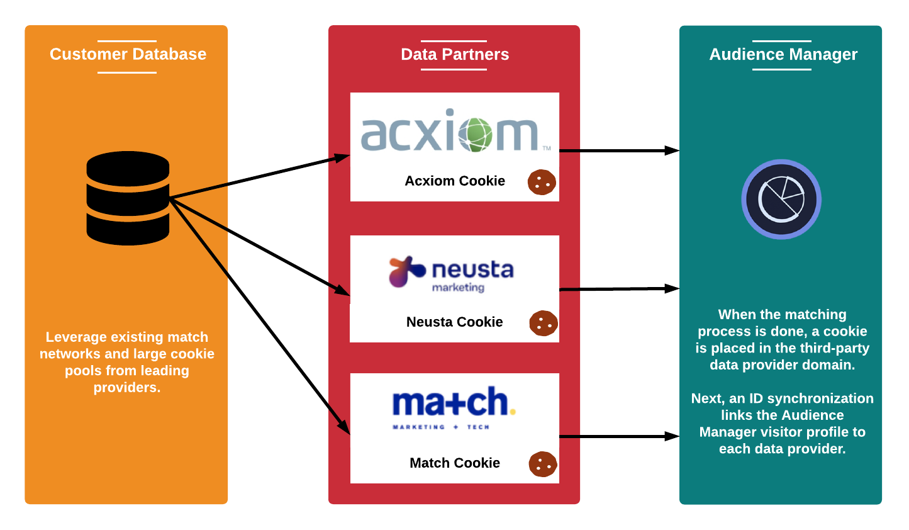

# 收集的数据类型 {#types-of-data-collected}

[!DNL Audience Manager] 帮助您收集和管理第一方、第二方和第三方数据。

解锁存储在多个孤岛中的客户信息资产是当今公司面临的最大数据挑战之一。 从数 [!DNL CRM] 据库、注册系统、广告服务器等，公司都需要工具来帮助将有价值的数据集中化，并将客户/受众信息作为单一的战略数据资产进行管理。 [!DNL Audience Manager] 帮助您解锁孤立的客户信息并管理来自多个来源的数据收集。 收集的数据可以基于数据元素的实时()值进行管[!DNL TTL]理，这有助于发布者控制所有来源的数据过期。 [!DNL Audience Manager] 旨在帮助您管理以下类型的数据：

| 数据类型 | 数据来源 |
|---|---|
| **第一方** | 客户. 数据是在线（从网站上的消费者互动中）或离线收集的。 |
| **第二方** | 战略合作伙伴和广告商。 |
| **第三方** | 数据提供商和／或交换。 数据可以包括意图、人口统计、社交／生活方式、心理统计等信息。 |

## First-Party Data Collection {#first-party-data}

第一方数据收集是主要功 [!DNL Audience Manager] 能。 此核心能力可满足我们的客户（出版商或广告商）的需求，他们希望将专有数据用作其营销项目的基石，或针对其他数据源进行定位和建模。

<!-- 

c_1st_party_data.xml

 -->

[!DNL Audience Manager] 与客户合作，了解他们的数据策略，然后将该策略映射回自定义数据收集计划。 我们的合作伙伴解决方案团队与您合作，评估网站、原始数据信号以及您网站上的其他用户交互。 利用这些信息，我们将帮助您创建定制的数据收集战略，从库存的各个页面捕获用户级数据信号。 捕获的数据会存储并映射回预定义的分类，随着业务需求的变化，该分类可随时更新。

以下示例说明如何从示例购物页面捕获潜在数据元素。

| 项目 | 描述 |
|---|---|
| 1 | **性别**. 购物者的名字通常指明其性别。 在我们的例子中，购物者的名字是玛丽，因此我们知道购物者是女人。 名称从不通过Audience Manager存储。 |
| 2 | **兴趣**。 购物车中的物品可能表示各种兴趣。 以我们的例子来说，玛丽在健身器材上花了很多钱。 |
| 3 | **住宅类型**。 根据送货地址和／或帐单地址，您可以推断Mary是为自己购买健身设备还是为公司购买健身设备。 |
| 4 | **位置**. [!DNL ZIP] 在确定位置时，代码比IP地址更可靠。 |
| 5 | **促销关联**。 如果购物者使用促销代码或礼品卡，他们可能是寻找最佳交易的廉价买家。 |
| 6 | **消费能力**。 与代码相关的价 [!DNL ZIP+4] 格数据表示给定位置的支出能力。 |

在收集原始数据后，它会被映射回平台中由客户定义的 [!DNL Audience Manager] 特征。 可以随时调整分类和数据映射，而无需更改数据收集代码。

## 第二方数据收集 {#second-party-data}

第二方数据来自战略业务合作伙伴（它不是发布者数据）。 这些信息的收集和管理就像第一方数据一样。

<!-- 

c_2nd_party_data.xml

 -->

在第二方数据场景中，广告商会向发布者发送自己的数据资产，以便将该信息与发布者的数据相结合，然后执行更具针对性的广告项目。 此外，出版商可以与广告商合作，扩大其受众池。 在大多数情况下，这些安排涉及合同关系，仅限于将容器标签放 [!DNL Audience Manager] 在合作伙伴网站上，以便于数据收集和共享。

第二方数据收集和再营销的一个例子可能包括服装零售商收集其产品的数据，然后与主要合作伙伴共享此信息。 在这种情况下，零售商可以在合作伙伴网站上为选择各种夹克 [!DNL Audience Manager] 颜色和尺寸的消费者提供不同的广告。

## Third-Party Data Collection {#third-party-data}

第三方数据是由Audience Manager以外的供应商收集和共享的信息。

<!-- 

c_3rd_party_data.xml

 -->

第三方数据可用于确定现有数据段（例如，年龄、家庭收入等）的资格，提供有需要但不可用的数据，或用于根据来自第一方和第二方数据的已知用户群进行相似度建模。 [!DNL Audience Manager] 与许多第三方数据提供商合作，将帮助您了解这些数据提供商收集的数据类型，以便与每个提供商达成正确的战略交易。

>[!NOTE]
>
>有关受支持的第三方列表提供商的完整 [!DNL Audience Manager]，请参 [阅Adobe受众查找器](https://www.adobe-audience-finder.com/)。

[!DNL Audience Manager] 根据其他数据提供商的可用数据集 [!DNL APIs] 与其集成。 数据收集可以实时、在用户浏览您的站点时、或通过带外方法进行，在带外方法中，ID在合作伙伴之间同步，数据在用户离开您的站点后在服务器之间传输。 无论哪种情况 [!DNL Audience Manager] ，客户端都能从让第三方数据在我们的平台上同步中受益，这意味着每个客户端或域都不必执行自己的同步。 这有助于增加访问范围并减少页面中的服务器调用。

## 匹配合作伙伴 {#match-partners}

许多客户选择与第三方数据匹配合作伙伴合作。 这些实体与具有注册要求的站点有关系，并可以根据其注册网络实时匹配客户数据文件来处理客户数据文件。

