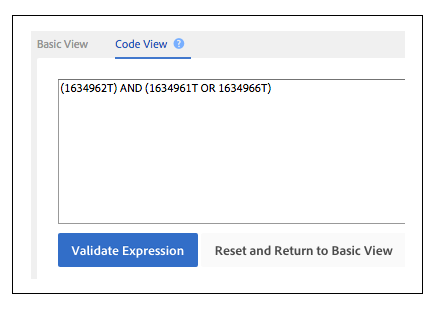

# 创建或更新特征规则和区段规则{#create-or-update-trait-rules-and-segment-rules}

创建和更新工作表接受traitRule标题，它允许您在单个操作中应用多个规则。 请按照以下说明进行批量规则请求。

<!-- 

c_bulk_rules.xml 

 -->

>[!NOTE]
>
>[在UI](../../features/administration/administration-overview.md) 中分配的RBAC [!DNL Audience Manager] 组权限在中得到保 [!UICONTROL Bulk Management Tools]留。

## 使用特征规则{#trait-rules}

在您的工作表中，特征规则列返回并接受由布尔表达式、比较运算符和常规表达式组成的规则。 您可以在[!DNL Audience Manager]中创建具有特征或区段生成器的规则，并将其复制到您的工作表。 或者，如果您熟悉规则语法，则可以直接在工作表中编写表达式。

## 规则构建器示例{#rule-builder-example}

让我们看一个示例，它演示如何使用[!UICONTROL Segment Builder]创建可以批量工作表的规则。 但是，这不是这些工具的一组分步说明。 相反，我们将用一个已经创建的简单规则进行开始。 有关如何使用规则构建器的说明，请参阅[区段构建器](../../features/segments/segment-builder.md)和[特征构建器](../../features/traits/about-trait-builder.md)。

利用可视规则构建器，我们创建了一个具有3个特征和布尔[!UICONTROL AND]运算符的细分规则。

单击&#x200B;**[!UICONTROL Code View]**&#x200B;获取此规则的文本版本。

>[!TIP]
>
>单击&#x200B;**[!UICONTROL Validate Expression]**&#x200B;检查规则逻辑。 这将有助于阻止您上传无效规则。

将规则粘贴到[!UICONTROL Bulk Management Tools]工作表中，并提交更改以批量更新段规则。

## 创建您自己的规则{#create-rules}

您可以在[!UICONTROL Rule Builder]之外编写您自己的规则。 在进行开始之前，请务必阅读涵盖操作符、表达式和必需变量等内容的文档。 我们建议您查看以下内容：

* [在特征生成器中使用比较运算符](../../features/traits/trait-comparison-operators.md)
* [运营顺序](../../features/traits/trait-operator-precedence.md)
* [关键变量的前缀要求](../../features/traits/trait-variable-prefixes.md)
* [含布尔和比较运算符的示例表达式](../../features/traits/trait-expression-samples.md)

