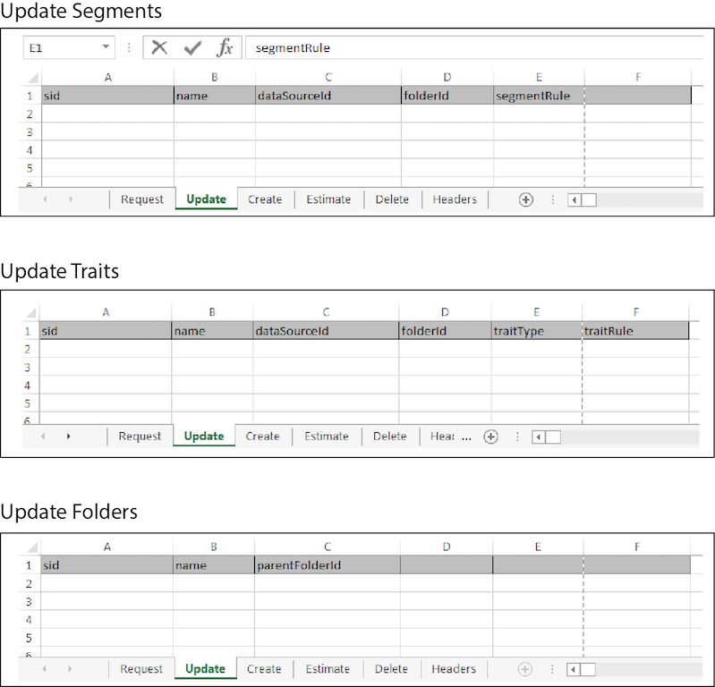

# 批量更新{#bulk-updates}

通过批量更新，您可以在单个操作中编辑多个区段、特征、模型、数据源以及区段或特征文件夹元素。 按照以下说明进行批量更新。

<!-- 

t_bulk_updates.xml

 -->

>[!NOTE]
>
>[在UI](../../features/administration/administration-overview.md) 中分配的RBAC [!DNL Audience Manager] 组权限在中得到保 [!UICONTROL Bulk Management Tools]留。

要进行批量更新，请打开[!UICONTROL Bulk Management Tools]工作表，并：

1. 单击&#x200B;**[!UICONTROL Headers]**&#x200B;选项卡并复制要编辑的项目的更新标题。
2. 单击&#x200B;**[!UICONTROL Update]**&#x200B;选项卡。
3. 将更新标题粘贴到更新工作表的第一行中。 请注意以下事项：

   * 更新文件夹时，需要所有标题。
   * 更新区段或特征时，您只需要区段ID(SID)和需要更改的标头元素。 删除未使用的标题。

4. 根据标题标签，粘贴或键入要更改的数据到相应的列。
5. 在工作表工具栏中，单击与        正在更新的项目。
此操作打开[!UICONTROL Account Information]对话框。

6. 提供所需的[登录信息](../../reference/bulk-management-tools/bulk-management-intro.md#auth-reqs)并单击&#x200B;**[!UICONTROL Submit]**。

   工作表会创建[!UICONTROL Results]列。 [!UICONTROL Results]列返回JSON响应，以获得成功的操作。 有关示例，请参见[REST API](../../api/rest-api-main/rest-api-main.md)。 在输入数据之前，批量更新工作表应类似于以下内容：

如果批量更新返回错误或失败，请参阅[批量管理工具疑难解答](../../reference/bulk-management-tools/bulk-troubleshooting.md)。
