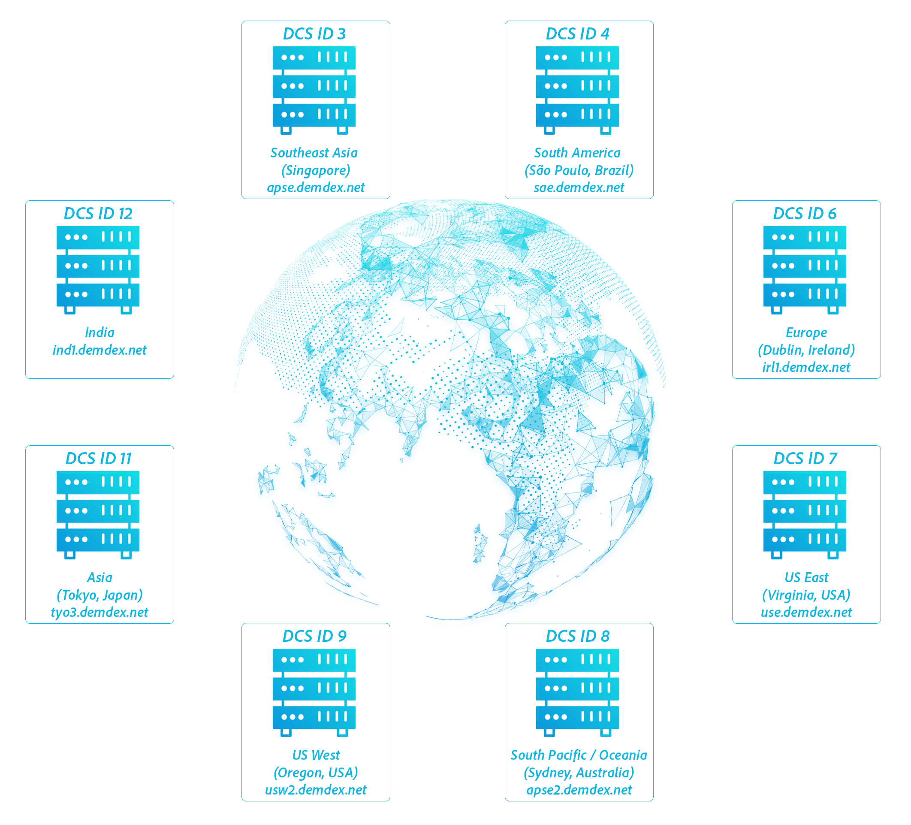

# 数据收集组件{#data-collection-components}

資料收集元件包括資料收集伺服器、DILAPI、傳入伺服器對伺服器資料傳輸，以及記錄檔。

<!-- 

c_compcollect.xml

 -->

Audience Manager包含以下資料收集元件：

* [資料收集伺服器(DCS)和設定檔快取伺服器(PCS)](../../reference/system-components/components-data-collection.md#dcs-pcs)
* [数据集成库 (DIL)](../../reference/system-components/components-data-collection.md#dil)
* [傳入伺服器對伺服器](../../reference/system-components/components-data-collection.md#inbound-outbound-server)
* [日志文件](../../reference/system-components/components-data-collection.md#log-files)

## 数据收集服务器（DC）和配置文件缓存服务器（PC） {#dcs-pcs}

DCS 和 PC 协同工作，并分别提供与特征实现、受众分段和数据存储相关的服务。

**[!UICONTROL Data Collection Servers (DCS)]函数**

在 [!DNL Audience Manager]，則DCS：

* 從事件呼叫接收及評估特徵資料。 这包括用于实时分段的信息，以及按服务器到服务器传输的计划时间间隔内传递的数据。
* 根据用户的已有特征和您使用 [ 区段生成器 ](../../features/segments/segment-builder.md) 创建的资格规则，对他们进行细分。
* 创建和管理设备 Id 和经过身份验证的用户档案 Id。 这包括标识符，如数据提供程序 Id、用户 Id、声明的 Id、集成代码等。
* 检查 PC 上的其他特征，用户已在实时事件调用之前已实现。 这样，DCS 可以根据实时数据和历史数据来限定用户。
* 写入日志文件，并将其发送到分析系统以进行存储和处理。

**[!DNL DCS]透過管理需求[!UICONTROL Global Server Load Balancing (GSLB)]**

此 [!DNL DCS] 是地理上分散且負載平衡的系統。 這表示 [!DNL Audience Manager] 可以根據網站訪客的地理位置，將請求導向與地區資料中心，以及從地區資料中心直接進行請求。 此策略有助於改善回應時間，因為 [!DNL DCS] 回應會直接傳送到包含該訪客相關資訊的資料中心。 [!UICONTROL GSLB] 讓我們的系統更有效率，因為相關資料會快取至距離使用者最近的伺服器。

>[!IMPORTANT]
>
>此 [!DNL DCS] 只會偵測源自使用IPv4之裝置的網路流量。

在事件呼叫中，地理位置是擷取到較大JSON資料內文傳回的機碼值組中。 此機碼值組是 `"dcs_region": region ID` 引數。

身為客戶，您應與 [!DNL DCS] 間接透過我們的資料收集程式碼傳遞。 您也可以直接使用 [!DNL DCS] 透過一組API。 另請參閱 [資料收集伺服器(DCS) API方法與程式碼](../../api/dcs-intro/dcs-event-calls/dcs-event-calls.md).

**[!UICONTROL Profile Cache Servers (PCS)]**

此 [!UICONTROL PCS] 是大型資料庫（基本上是大型伺服器端Cookie）。 它可以存储通过服务器到服务器传输和 [!DNL DCS] 接收的有关活动用户的数据。[!UICONTROL PCS] 数据包含设备 ID、经过验证的配置文件 ID 以及与这些 ID 关联的特征。當 [!DNL DCS] 會收到即時呼叫，並檢查 [!UICONTROL PCS] 針對使用者可能屬於或有資格使用的其他特徵。 此外，如果之後將特徵新增至區段，這些特徵ID會新增至 [!UICONTROL PCS] 而且使用者不需造訪特定網站或應用程式，即可自動符合該區段的資格。 [!UICONTROL PCS]这有助于加深 [!DNL Audience Manager] 对用户的理解，因为它可以实时或在幕后使用新的历史特征数据来匹配和区段用户。此行为为您提供了比实时限定更完整、更准确的用户头像。

没有可让我们的客户直接使用的 [!UICONTROL PCS] UI 控件。 客户通过其角色以数据商店和数据传输的方式间接访问 [!UICONTROL PCS] 。 此 [!UICONTROL PCS] 在Apache Cassandra上執行。

**正在清除非作用中ID[!UICONTROL PCS]**

如先前所述， [!UICONTROL PCS] 會儲存作用中使用者的特徵ID。 作用中使用者是指任何已檢視的使用者。 [邊緣資料伺服器](../../reference/system-components/components-edge.md) 過去14天內來自任何網域。 这些调用 [!UICONTROL PCS] 保持用户处于活动状态：

* [!DNL /event] 调用
* [!DNL /ibs] 调用（ID 同步）

<!-- 

Removed /dpm calls from the bulleted list. /dpm calls have been deprecated.

 -->

如果它们在17天内处于非活动状态，则 [!UICONTROL PCS] 会刷新特征。 但是，这些特征不会丢失。 它们存储在 Hadoop 中。 如果在其他时间再次看到用户，则 Hadoop 会将其所有特征重新推送到 [!UICONTROL PCS] ，通常在24小时内。

**其他 [!UICONTROL DCS/PCS] 程式：隱私權選擇退出**

這些伺服器系統處理隱私權和使用者選擇退出請求。 如果使用者已選擇退出資料收集，則不會收集記錄檔中的使用者Cookie資訊。 如需隱私權政策的詳細資訊，請參閱 [Adobe隱私權中心](https://www.adobe.com/cn/privacy/advertising-services.html).

## 数据集成库 (DIL) {#dil}

[!UICONTROL DIL] 是您放置在頁面上用於資料收集的程式碼。 [有关可用服务和方法的详细信息，请参阅 DIL API ](../../dil/dil-overview.md) 。

## 傳入伺服器對伺服器 {#inbound-outbound-server}

这些系统会接收通过与我们的客户进行各种服务器到服务器集成而发送的数据。 有关详细信息，请参阅发送受众数据 ](/help/using/integration/sending-audience-data/real-time-data-integration/real-time-tech-specs.md) 的相关文档 [ 。

## 日志文件 {#log-files}

[!UICONTROL PCS]会创建数据并将其写入日志文件。这些数据会被发送到其他数据库系统，以便进行处理、报告和存储。

>[!MORELIKETHIS]
>
>* [Adobe 隐私中心](https://www.adobe.com/cn/privacy.html)

